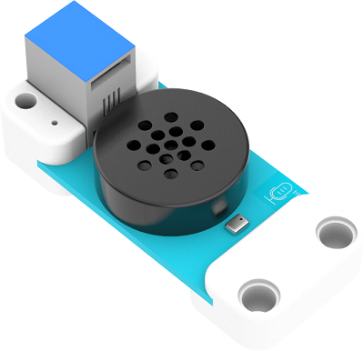

# Case 37: ASR(Automatic Speech Recognition) Module

## Introduction
It is able to control the device via your voice such as to give commands of  moving forward, reversing and starting the line-tracking mode etc.

## Characteristics
---
- Designed with RJ11 ports and easy to plug.
## Specification
---

Item | Parameter 
:-: | :-: 
SKU|EF05037
Connection|RJ11
Connection Type|IIC
Working Voltage|3.3V
Core IC|SNR3512M

## Outlook and Dimension
---

## Quick to Start
---

### Materials required and connections diagram 
---

- Connect the ASR module to the IIC port and the motor fan to J1 port on Nezha expansion board. 

## MakeCode Programming
---

### Step 1
Click "Advanced" in the drawer of the MakeCode to see more choices.

We need to add a package for programming. Click "Extensions" in the bottom of the drawer and search with "PlanetX" in the dialogue box to download it. 

Note: If you met a tip indicating that the codebase will be deleted due to incompatibility, you may continue as the tips say or build a new project in the menu. 

### Available Commands of ASR Module

### Step 2
### Code as below

### Link
Link: [https://makecode.microbit.org/_9j8UEEYi82tF](https://makecode.microbit.org/_9j8UEEYi82tF)

You may also download it directly below:

<iframe style="position:absolute;top:0;left:0;width:100%;height:100%;" src="https://makecode.microbit.org/#pub:_9j8UEEYi82tF" frameborder="0" sandbox="allow-popups allow-forms allow-scripts allow-same-origin"></iframe>
  
---

### Result
- The motor fan is controlled by the ASR module.

## Relevant File
---

## Technique File
---
