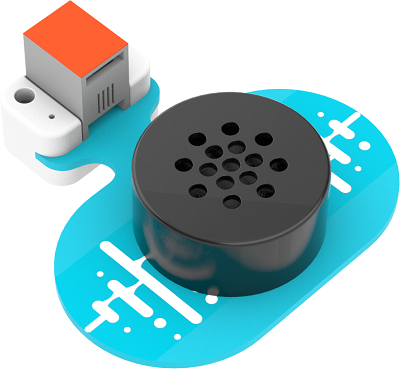

# MP3 Module(EF05038)

## Introduction
---
It is able to play the music.



## Characteristics
---

- Designed with RJ11 ports and easy to plug.

## Specification
---

Item | Parameter 
:-: | :-: 
SKU|EF05038
Connection|RJ11
Connection Type|Digital input
Working Voltage|3.3V
Core IC|YX6300


## Outlook and Dimension
---


## Quick to Start
---

### Materials Required and Connection Diagram

- Connect the ASR module to the IIC port and the MP3 module to J1 port on Nezha expansion board. 


## MakeCode Programming
---

### Step 1

Click "Advanced" in the drawer of the MakeCode to see more choices.


We need to add a package for programming. Click "Extensions" in the bottom of the drawer and search with "PlanetX" in the dialogue box to download it. 


***Note:*** If you met a tip indicating that the codebase will be deleted due to incompatibility, you may continue as the tips say or build a new project in the menu. 
### Step 2
### Code as below


### Link
Link: [https://makecode.microbit.org/_6L7Mdji6t85Y](https://makecode.microbit.org/_6L7Mdji6t85Y)

You may also download it directly below:

<div style="position:relative;height:0;padding-bottom:70%;overflow:hidden;"><iframe style="position:absolute;top:0;left:0;width:100%;height:100%;" src="https://makecode.microbit.org/#pub:_6L7Mdji6t85Y" frameborder="0" sandbox="allow-popups allow-forms allow-scripts allow-same-origin"></iframe></div>  


### Result
- The MP3 module is controlled by the ASR module. 

### Attention


## Python Programming 
---

### Step 1

Download the package and unzip it: [PlanetX_MicroPython](https://github.com/lionyhw/PlanetX_MicroPython/archive/master.zip)

Go to  [Python editor](https://python.microbit.org/v/2.0)


We need to add enum.py and mp3.py for programming. Click "Load/Save" and then click "Show Files (1)" to see more choices, click "Add file" to add enum.py and mp3.py from the unzipped package of PlanetX_MicroPython. 


### Step 2

### Reference

```
from microbit import *
from enum import *
from mp3 import *
player = MP3(J1)
while True:
    if button_a.is_pressed():
        player.exeCute(Play)
    elif button_b.is_pressed():
        player.exeCute(Pause)
```


### Result
- Press button A on the micro:bit to start playing the music; press button B to stop playing the music.

## Relevant File
---

## Technique File
---

