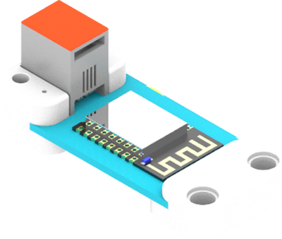
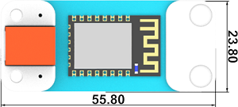
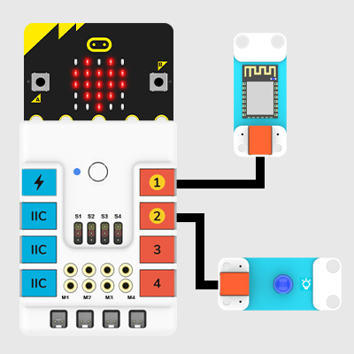

# WIFI Module

## Introduction
Based on ESP8266 module, it is able to connect the micro:bit to the IoT platform and upload the data or control the micro:bit from the platform. 

## Characteristics
---
- Designed with RJ11 ports and easy to plug. 
## Specification
---

Item | Parameter 
:-: | :-: 
SKU|EF05043
Connection|RJ11
Connection Type|Serial Communication
Core IC|ESP8266

## Outlook and Dimension
---

## Quick to Start
---

### Materials required and connections diagram 
---

- Connect the WIFI module to the J1 port and the LED to J2 port on Nezha expansion board. 

---

## Kids IoT
---
- KidsIoT is a platform for IoT(Internet of Things) produced by ELECFREAKS with only three minutues to get connected, it can achieve a remote control to the micro:bit. (Currently in English version only) link: [KidsIoT Cloud Platform: https://www.kidsiot.cn/](https://www.kidsiot.cn/)

## KidsIoT Registration

- Sign up in the website to get a new account.

- Fill in with your email address and password, and click Sign Up.

- After signing up, an email should be sent to your mailbox.

- Activate your account with the links sent to your mailbox, note the letter might be in your junk email for the first time.

- Sign Up successfully!

## KidsIoT Guidance

- Go to the log in interface by clicking Sign in.

- Click log in to enter the device manage interface, the “User Name” on the top left corner is your email address, the unique “User Token”(Currently miswritting as ID, we will correct to Token later) on the top right corner is the only indentification code for this platform which is corresponding to your account.

- Create new device, “Topic” is the only identification code(the only device in the account), and you can revise the device name(only 10 devices can be created).

- The upload data will be shown on the left, what on the right is a two-dimension line chart for data and time. You can choose the data that you want to see or export the data.
- You can use “Remote Control” to give commands to the micro:bit.

## Write Code

---

[MicroSoft MakeCode](https://makecode.microbit.org/#)

## Programme

---
### Modules Connection Diagram

Click "Advanced" in the drawer of the MakeCode to see more choices.

We need to add a package for programming. Click "Extensions" in the bottom of the drawer and search with "PlanetX" in the dialogue box to download it. 

Note: If you met a tip indicating that the codebase will be deleted due to incompatibility, you may continue as the tips say or build a new project in the menu. 

### Code Details

Connect to Kids’IoT platform, User Token is the only indentification code for the account which can not be revised.

 Topic is the only indentification code and you have to appoint the updload device when connecting. The device number(Topic) will be in sequential order.

- - - - -

Upload an integer to KidsIoT and it shows here.

- - - - -

Judge if the conection status is successful, “Ture” for success, “False” for failure. You can edit the reconnection system to ensure the stable connection.
- - - - -

When getting connected well, you can click this switch to operate these two bricks.

### Link

Link: [https://makecode.microbit.org/_4eoUoJLffWsf](https://makecode.microbit.org/_4eoUoJLffWsf)

You may also download it directly below:

<iframe style="position:absolute;top:0;left:0;width:100%;height:100%;" src="https://makecode.microbit.org/#pub:_4eoUoJLffWsf" frameborder="0" sandbox="allow-popups allow-forms allow-scripts allow-same-origin"></iframe>
  

### 现象
---
- 当开机时连接WIFI
- 循环判断是否连接WIFI，如果连接显示颗大心，如果未连接就继续连接。
- 循环判断kidsIot平台是否连接，如果连接显示一颗小心，如果未连接就继续连接。
- 循环判断如果KidsIot连接成功则上传一个数据“从0至10之间选取随机数”到平台
- 如果平台开关打开点亮LED灯
- 如果平台开关关闭熄灭LED灯
