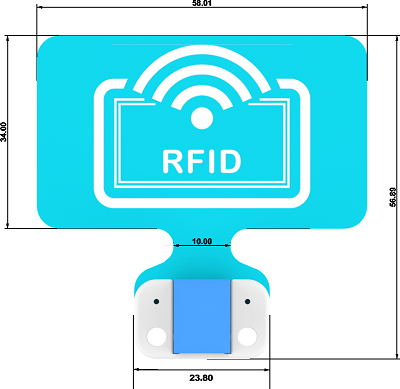
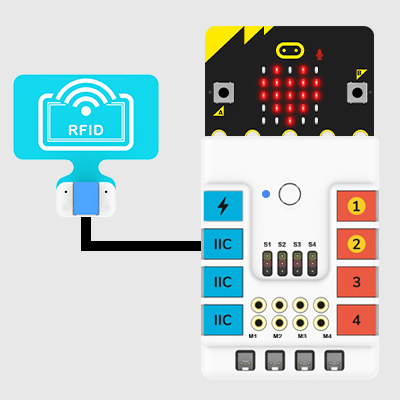
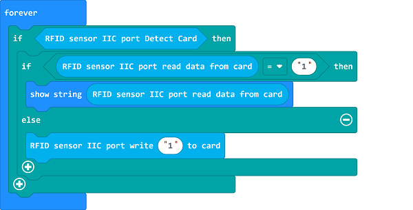

# RFID Sensor(EF05047)

## Introduction

The RFID sensor uses radio frequency to read and write the recording media (electronic tags or radio frequency cards) to achieve the purpose of identifying targets and data exchange.

## Products Link

[ELECFREAKS PlanetX RFID Sensor](https://shop.elecfreaks.com/products/elecfreaks-planetx-rfid-sensor?_pos=1&_sid=80cdc51fb&_ss=r)

## Characteristic

 Design in RJ11 connections, easy to plug.

## Specification

Item | Parameter 
:-: | :-:  
SKU|EF05047
Connections|RJ11 4P4C
Connections type|IIC
Working voltage|3.3V
Rated current|50mA
Core IC|PN5321A3

## Outlook and Dimensions 

## Quick to Start

### Materials Required and Connection Diagram

 Connect the RFID  to the IIC port on Nezha expansion board. 

## MakeCode Program

### Step 1
Click "Advanced" in the drawer of the MakeCode to see more choices.

We need to add a package for programming. Click "Extensions" in the bottom of the drawer and search with "PlanetX" in the dialogue box to download it. 

***Note:*** If you met a tip indicating that the codebase will be deleted due to incompatibility, you may continue as the tips say or build a new project in the menu. 

### Step 2
### Code as below:

Link: [https://makecode.microbit.org/_fXU8hWYc9Lhu](https://makecode.microbit.org/_fXU8hWYc9Lhu)

You may also download it directly below:

<iframe style="position:absolute;top:0;left:0;width:100%;height:100%;" src="https://makecode.microbit.org/#pub:_fXU8hWYc9Lhu" frameborder="0" sandbox="allow-popups allow-forms allow-scripts allow-same-origin"></iframe>
  

### Result

After powering on, place the electronic tag under the RFID, and the RFID writes the data into the electronic tag, then it reads the electronic tag data and displays it on the micro:bit.
