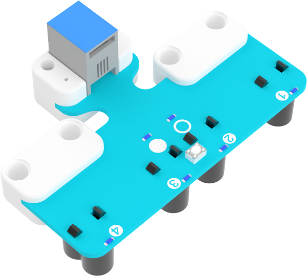
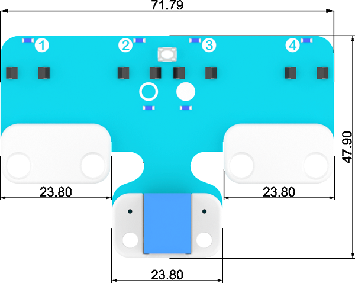
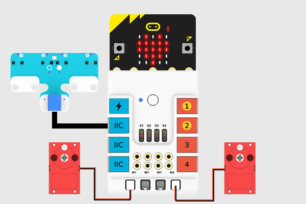
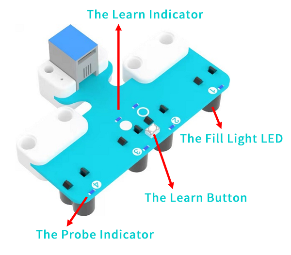
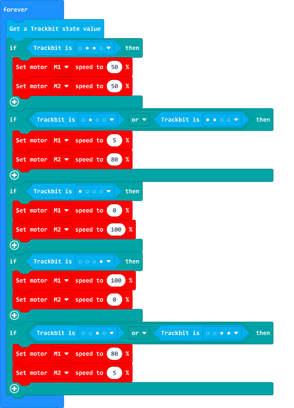
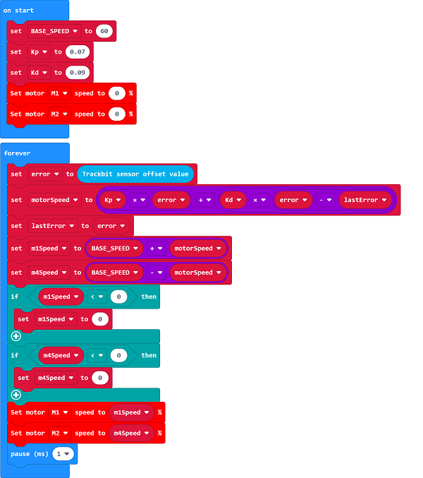

# The 4-way Line Following Sensor(EF05053)

## Introduction

The 4-way line following sensor has integrated 4 groups photocell recevier and the fill light LEDs(We call them all as the Probes). At the mean time, it is able to learn by itselft, which means it could adapt to colors in different gray levels. 

## Products Link

[ELECFREAKS PlanetX 4 Channel Tracking Sensor](https://www.elecfreaks.com/planetx-4-channel-tracking.html)

## Characteristics

RJ11 connections,  easy to plug. 

## Specification

Item | Parameter 
:-: | :-:  
SKU|EF05053
Connection|RJ11
Connection Type|IIC
Working Voltage|3.3V
Dimension|71.79 x 47.9 mm
Valid Scope|8~16 mm

## Outlook and Dimensions 

## Quick Start

### Connection Diagram 

Connect the 4 way line following sensor with the IIC port and the two motors to M1 and M4 on Nezha board. 

### The Learn Mode

Press the learn button to learn the map background and the line following path(the black track ). Follow with the following procedures to complete the learn: 

①Face the probe to the background part of the maps and press the learn button. 

②The 4 probes indicators light on in turn and the 2 learn indicators flash alternately. 

③If the fill light flahes in a high frequency with the colorful light, the line-following probe should be moved horizontally back and forth on the background map and the line-following track.

④Keep moving back and forth until the fill light of the line probe stops flashing, and the learning is completed.

***Note:*** The height of the line tracking probe from the ground should be among 8mm and 16mm.

After the learning, the two learn indicators will be off. When the probe detects the track, the corresponding probe indicator light will be on. When the learn fails, the hollow circle and solid circle LEDs flash rapidly at the same time, and the fill light RGB light goes out.

## MakeCode Programming

### Step 1
Click "Advanced" in the MakeCode to see more choices.

For programming, we need to add a package: click "Extensions" at the bottom of the MakeCode drawer and search with "PlanetX" in the dialogue box to download it. 

For programming, we need to add a package: click "Extensions" at the bottom of the MakeCode drawer and search with "nezha" in the dialogue box to download it. 

***Notice:*** If you met a tip indicating that some codebases would be deleted due to incompatibility, you may continue as the tips say or create a new project in the menu. 

### Step 2

### Code as below:

 Sample 1: Digital Line Following Program

### Reference
Link: [https://makecode.microbit.org/_URyg36djehfc](https://makecode.microbit.org/_URyg36djehfc)

You may also download it directly below:

<iframe style="position:absolute;top:0;left:0;width:100%;height:100%;" src="https://makecode.microbit.org/#pub:_URyg36djehfc" frameborder="0" sandbox="allow-popups allow-forms allow-scripts allow-same-origin"></iframe>
  

Sample 2: PID Line Following 

Blocks Info:

The return value is the offset of the center point of the four-way line following sensor from the black line, the range is -3000~3000.

Sample Program

### Reference
Link: [https://makecode.microbit.org/_8zu3d4VW5c7t](https://makecode.microbit.org/_8zu3d4VW5c7t)

You may also download it directly below:

<iframe style="position:absolute;top:0;left:0;width:100%;height:100%;" src="https://makecode.microbit.org/#pub:_8zu3d4VW5c7t" frameborder="0" sandbox="allow-popups allow-forms allow-scripts allow-same-origin"></iframe>
  

### Result
The car runs along with the black line. 

