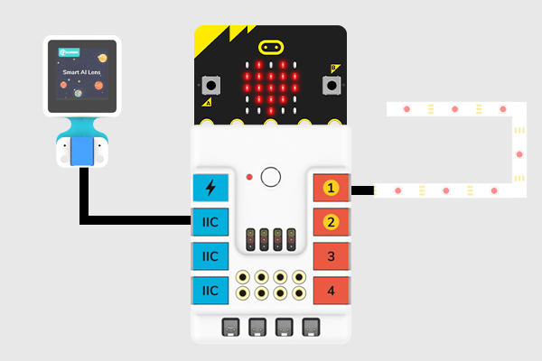
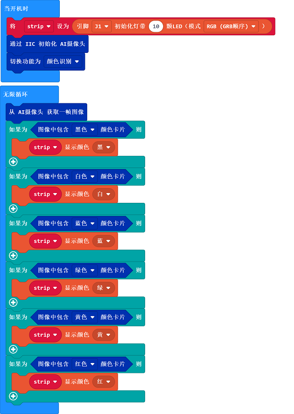

# Case 02: Color-controlled Lights

## Purpose 
---
To make the LED strip be able to adjust the color of the lights according to the recognized color from the AI Lens. 

### Materials Required and Connection Diagram

- Connect the AI Lens to the IIC port and the LED strip to the J1 port on the Nezha expansion board as the picture shows. 

## MakeCode Programming 
---

### Step 1

Click "Advanced" in the MakeCode drawer to see more choices. 

We need to add a package for programming. Click "Extensions" in the bottom of the drawer and search with "PlanetX" in the dialogue box to download it. 

Note: If you met a tip indicating that the codebase will be deleted due to incompatibility, you may continue as the tips say or build a new project in the menu. 

### Step 2

### Project 1: Card(s) Recognition

### Code as below:

### Link
Link: [https://makecode.microbit.org/_K9zFd9dEjTDY](https://makecode.microbit.org/_K9zFd9dEjTDY)

You may also download it directly below:

<iframe style="position:absolute;top:0;left:0;width:100%;height:100%;" src="https://makecode.microbit.org/#pub:_K9zFd9dEjTDY" frameborder="0" sandbox="allow-popups allow-forms allow-scripts allow-same-origin"></iframe>
  

### Result
- The LED strip displays the color in accordance with the color that is recognized from the AI Lens. 

