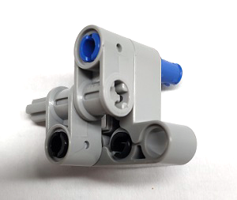
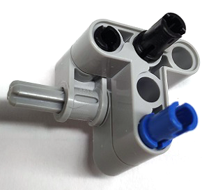
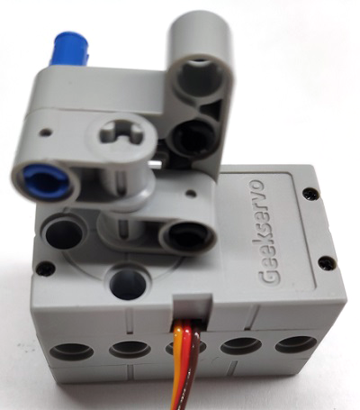
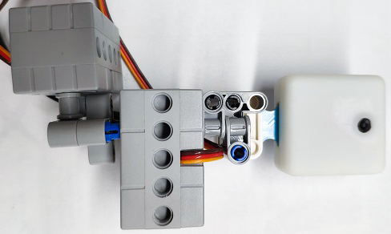
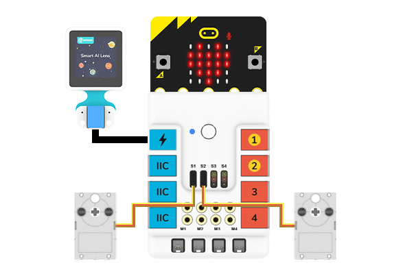
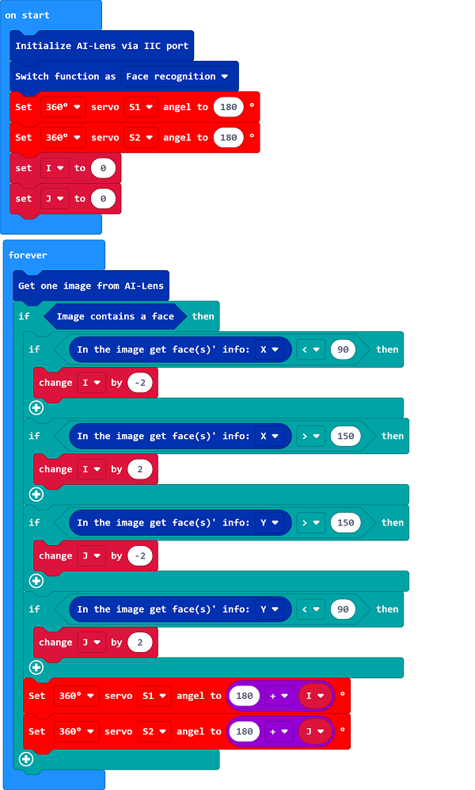

# Case 04: Face-tracked Device

## Purpose
---
To make the AI Lens be able to recognize the face and track it. 

### Materials Required and Connection Diagram

- Build a device with the bricks as below:

- Connect the device with a servo: 

- Connect the AI Lens with the device:

- Connect the AI Lens to the IIC port and the two servos to S1 and S2 separately.(Here S1 controls the movement of "X", S2 controls the movement of "Y")

## MakeCode Programming 
---

### Step 1

Click "Advanced" in the MakeCode drawer to see more choices. 

We need to add a package for programming. Click "Extensions" in the bottom of the drawer and search with "PlanetX" in the dialogue box to download it. 

***Note:*** If you met a tip indicating that the codebase will be deleted due to incompatibility, you may continue as the tips say or build a new project in the menu. 

### Step 2

### Code as below:

### Link
Link: [https://makecode.microbit.org/_Xxs0je5ERXvi](https://makecode.microbit.org/_Xxs0je5ERXvi)

You may also download it directly below:

<iframe style="position:absolute;top:0;left:0;width:100%;height:100%;" src="https://makecode.microbit.org/#pub:_Xxs0je5ERXvi" frameborder="0" sandbox="allow-popups allow-forms allow-scripts allow-same-origin"></iframe>
  

### Result
- The AI Lens would track your face(move along with your face).

