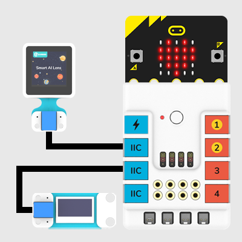
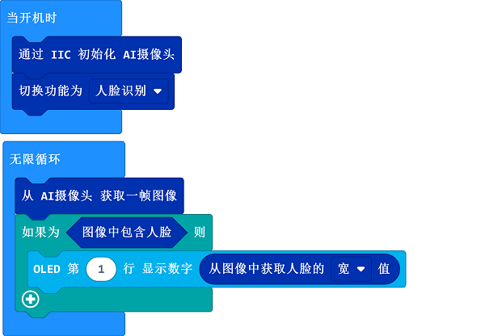

# Case 05: Find the Bigger Face

## Purpose
To make the AI Lens be able to recognize the face and display the width of the face on the OLED module. 

---

### Materials Required and Connection Diagram
---

- Connect the AI Lens and the OLED display to the IIC ports on Nezha expansion board.

## MakeCode Programming 

---

### Step 1

Click "Advanced" in the MakeCode drawer to see more choices.

We need to add a package for programming. Click "Extensions" in the bottom of the drawer and search with "PlanetX" in the dialogue box to download it. 

Note: If you met a tip indicating that the codebase will be deleted due to incompatibility, you may continue as the tips say or build a new project in the menu. 

### Step 2

### Code as below:

### Link
Link: [https://makecode.microbit.org/_RF01zfeA2VkW](https://makecode.microbit.org/_RF01zfeA2VkW)

You may also download it directly below:

<iframe style="position:absolute;top:0;left:0;width:100%;height:100%;" src="https://makecode.microbit.org/#pub:_RF01zfeA2VkW" frameborder="0" sandbox="allow-popups allow-forms allow-scripts allow-same-origin"></iframe>
  
---

### Result
- The width of the regcognized face displays on the OLED module.

