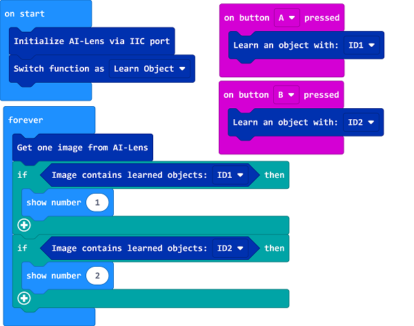

# Case 06: Characteristics Acquisition

## Purpose
---
To make the AI Lens be able to recognize and learn from the objects. 

### Materials Required and Connection Diagram

- Connect the AI Lens to the IIC port on the Nezha expansion board as the picture shows. 

## MakeCode Programming 
---

### Step 1

Click "Advanced" in the MakeCode drawer to see more choices.

We need to add a package for programming. Click "Extensions" in the bottom of the drawer and search with "PlanetX" in the dialogue box to download it. 

***Note:*** If you met a tip indicating that the codebase will be deleted due to incompatibility, you may continue as the tips say or build a new project in the menu. 

### Step 2

### Code as below:

### Link
Link: [https://makecode.microbit.org/_TrA9rr77fEEb](https://makecode.microbit.org/_TrA9rr77fEEb)

You may also download it directly below:

<iframe style="position:absolute;top:0;left:0;width:100%;height:100%;" src="https://makecode.microbit.org/#pub:_46c9WCd5oc1z" frameborder="0" sandbox="allow-popups allow-forms allow-scripts allow-same-origin"></iframe>
  

### Result
- Press button A to recognize the object and give it an ID 1; press button B to recognize the object and give it an ID 2. Then the equivalent ID number should display on the micro:bit in accordance with the object that you place in the front of the AI Lens.

