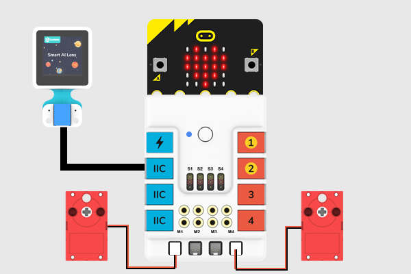
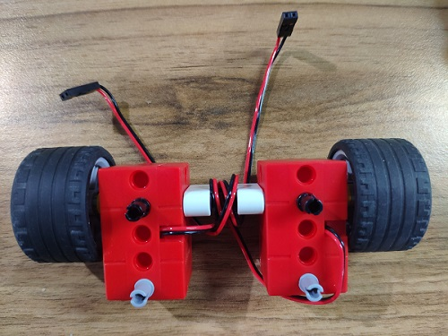
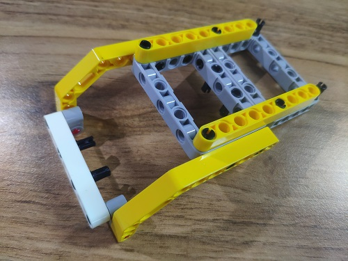
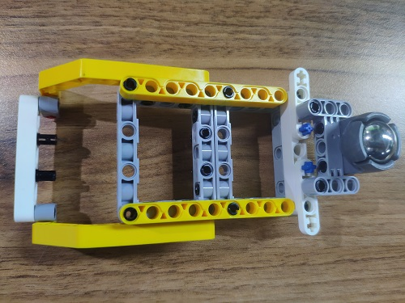
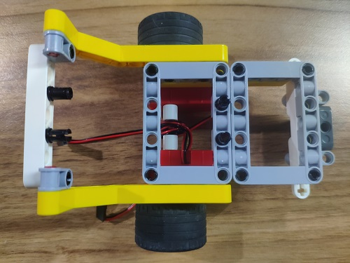
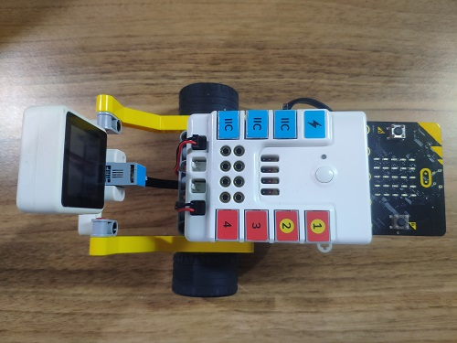
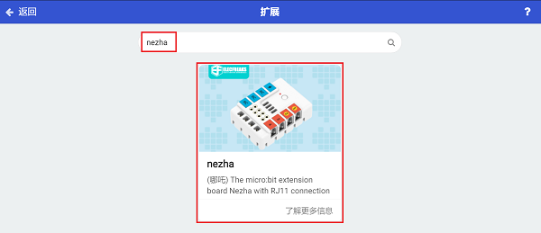
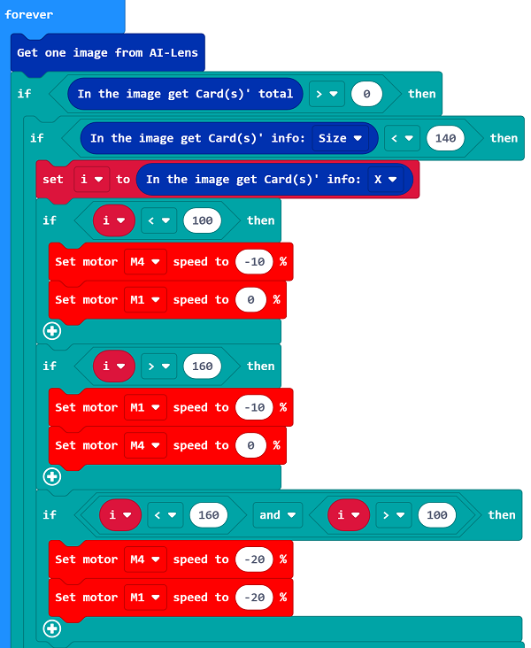
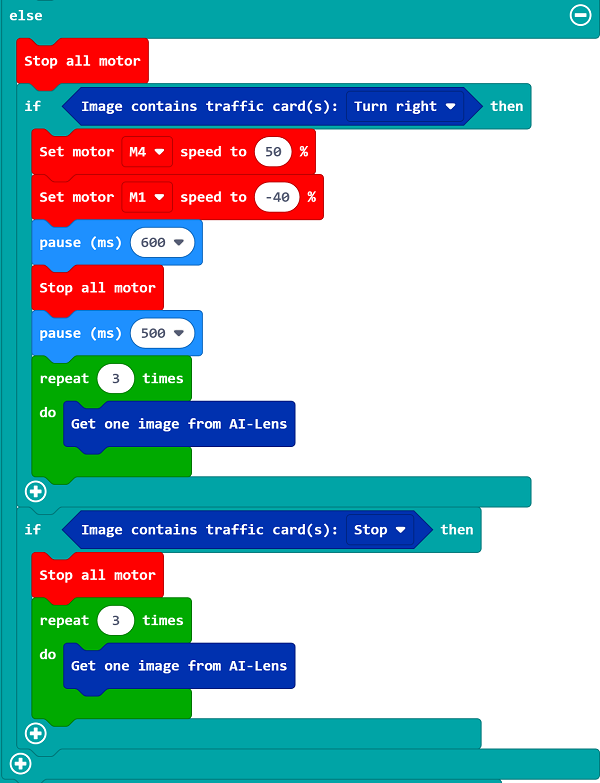
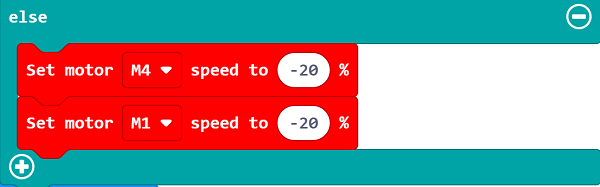

# Case 09: Control the Car with an Indicator 

## Purpose

Build a car with the bricks and control it with the AI Lens via the indicators. 

## Products Link

[ELECFREAKS Smart AI Lens Kit](https://www.elecfreaks.com/elecfreaks-smart-ai-lens-kit.html)

[ELECFREAKS Nezha Breakout Board](https://www.elecfreaks.com/nezha-breakout-board.html)

[ELECFREAKS High-Speed Building Blocks Motor](https://www.elecfreaks.com/geekservo-motor-2kg-compatible-with-lego.html)

### Materials Required and Connection Diagram

 Connect the AI Lens to the IIC port and the two motors on M1,M4 ports on the Nezha expansion board as the picture shows. 

 Build a car with the bricks below. 

## MakeCode Programming 

### Step 1

Click "Advanced" in the MakeCode drawer to see more choices.

We need to add a package for programming. Click "Extensions" in the bottom of the drawer and search with "PlanetX" in the dialogue box to download it. 

Then search with “nezha” to download this extension.

***Note:*** If you met a tip indicating that the codebase will be deleted due to incompatibility, you may continue as the tips say or build a new project in the menu. 

### Step 2

### Code as below:

 Initialize the AI lens while on start and switch its function to Card recognition.

 Get one image from the AI Lens, if the card is detected, judge the distance from the card to the car. If it is a long distance, the lens would get the value of the “X-axis”and respond it by adjusting the speed of the two motors to keep the image in the middle of the lens.

 If the car is near to the card, judge the instructions(symbols) on the card. If it is a turn-right instruction, make the car turn right by adjusting the speed of the motors, then program to get 3 images from the lens and give no instruction to these three pictures to clear the caches. If it is a stop instruction, make the car stop moving by adjusting the speed of the motors, then program to get 3 images from the lens and give no instruction to these three pictures to clear the caches. 

 If the AI Lens does not detect any image, the car moves forward.

Completed Code:

### Link
Link：[https://makecode.microbit.org/_09hHUgWMeY2o](https://makecode.microbit.org/_09hHUgWMeY2o)

You may also download it directly below:

<iframe style="position:absolute;top:0;left:0;width:100%;height:100%;" src="https://makecode.microbit.org/#pub:_09hHUgWMeY2o" frameborder="0" sandbox="allow-popups allow-forms allow-scripts allow-same-origin"></iframe>
  

### Result
 Drive the car and make it move with the instructions.

