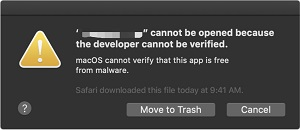

# AI Lens

## Introduction
The AI Lens is able to achieve the functions of face recognition, balls tracking, cards recognition and characteristics acquisition.

## Characteristics
---
- Designed with RJ11 connection and easy to plug.
## Specification
---

|      Item       | Parameter |
| :-------------: | :-------: |
|       SKU       |  EF05045  |
|   Connection    |   RJ11    |
| Connection Type |    IIC    |
| Working Voltage |   3.3V    |
|     Core IC     |   K210    |

## Outlook and Dimension
---

## Connection Type: RJ11 to Dupont connector
---

While the micro:bit breakout board doesn’t have the RJ11 connections, we can choose to use a Dupont wire that has the RJ11 connections. We need to connect the RJ11 to the Lens and the other ends connect to the breakout board(Black wire to GND; Red to VCC; Green to P19(SCL); Yellow to P20(SDA)). If the Lens doesn’t work from the start, please try powering it with a standalone power sourse.

Take IoT:bit for an example:

Note:

1.  If you do not use Nezha expansion board to drive the AI Lens, please search with the package through: PlanetX-AI

2. Under the one button to acquire mode,  you will have to re-learn the objects if you restart the device. 

3. After downloading the code, if the AI lens gets stuck in the starting page with an init AI Lens error instruction, please try to power off the device and restart it. (Or make sure you connect the ready-programmed micro:bit board after the AI Lens connects the breakout board well )

## AI Lens firmware update

For a better experience of the AI Lens, we are making an irregularly update for the new functions and optimization of the performance, a manually update of the firmware is required after the new version is released. 

### How to check the current version

The current version number shall be displayed on the lower right corner of the boot screen(starting-on page), if there is no prompt, it should be the oldest version, please update asap. 

### Latest version firmware

firmware v1.0.12 [click to download](https://github.com/elecfreaks/learn-cn/raw/master/microbitplanetX/ai/v1.0.12.kfpkg)。

### The newest firmware version
1. First, installation of camera serial port driver

Windows system downloading [CH341SerSetup.exe](https://github.com/elecfreaks/learn-cn/raw/master/microbitplanetX/ai/CH341SerSetup.exe)

macOS system downloading [CH34x_Install_V1.5.pkg](https://github.com/elecfreaks/learn-cn/raw/master/microbitplanetX/ai/CH34x_Install_V1.5.pkg)

2. Install “kflash” for downloading the firmware.

Windows system downloading [kflash_gui_v1.6.5_2_windows.7z](https://github.com/elecfreaks/learn-cn/raw/master/microbitplanetX/ai/kflash_gui_v1.6.5_2_windows.7z) and unzipping it. 

macOS system downloading [kflash_gui_v1.6.5_2_macOS.dmg](https://github.com/elecfreaks/learn-cn/raw/master/microbitplanetX/ai/kflash_gui_v1.6.5_2_macOS.dmg) 

For windows system, open the file folder kflash_gui and find kflash_gui.exe.

For macOS system, click the icon of kflash_gui after the downloading. 

Double click kflash_gui.exe to open the file and choose to open the newest firmware.

Connect the AI Lens with the USB wire. 

Choose the port to download it. 

### FAQ

In macOS operation system, if you fail to install the firmware because the developer cannot be verified. 

Please visit https://support.apple.com/en-us/HT202491 for solutions.

