# AI Lens

## Introduction
The AI Lens is able to achieve the functions of face recognition, balls tracking, cards recognition and characteristics acquisition.

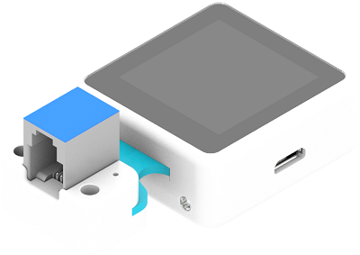

## Characteristics
---
- Designed with RJ11 connection and easy to plug.
## Specification
---

|      Item       | Parameter |
| :-------------: | :-------: |
|       SKU       |  EF05045  |
|   Connection    |   RJ11    |
| Connection Type |    IIC    |
| Working Voltage |   3.3V    |
|     Core IC     |   K210    |

## Outlook and Dimension
---


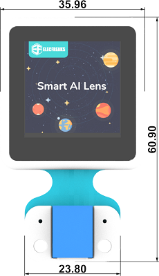


## Connection Type: RJ11 to Dupont connector
---

While the micro:bit breakout board doesn’t have the RJ11 connections, we can choose to use a Dupont wire that has the RJ11 connections. We need to connect the RJ11 to the Lens and the other ends connect to the breakout board(Black wire to GND; Red to VCC; Green to P19(SDA); Yellow to P20(SCL)). If the Lens doesn’t work from the start, please try powering it with a standalone power sourse.

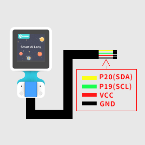

Take IoT:bit for an example:

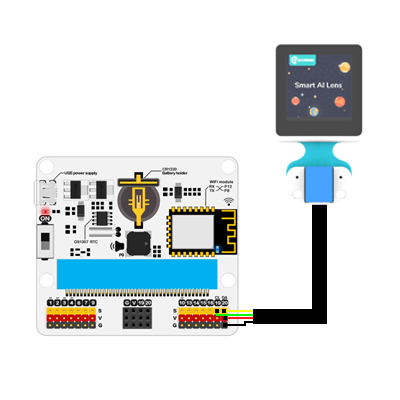

Note:

1.  If you do not use Nezha expansion board to drive the AI Lens, please search with the package through this link: https://github.com/elecfreaks/pxt-PlanetX-AI

2. Under the one button to acquire mode,  you will have to re-learn the objects if you restart the device. 

3. After downloading the code, if the AI lens gets stuck in the starting page with an init AI Lens error instruction, please try to power off the device and restart it. (Or make sure you connect the ready-programmed micro:bit board after the AI Lens connects the breakout board well )


##  Add Python File

We've created a codebase [EF_Produce_MicroPython-master](https://github.com/lionyhw/EF_Produce_MicroPython/archive/master.zip) for a convenient python programming to AI Lens, you will only need to use the functions and modify the parameters for application. 

Download the package and unzip it: [EF_Produce_MicroPython-master](https://github.com/lionyhw/EF_Produce_MicroPython/archive/master.zip)

Go to [Python editor](https://python.microbit.org/v/2.0)

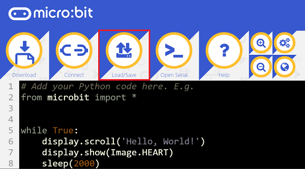

For programming, we need to add the file of AILens.py. Click Load/Save first and again with Show Files(1), choose "add file" to get to the download page to find the file folder of EF_Produce_MicroPython-master, then add AILens.py.


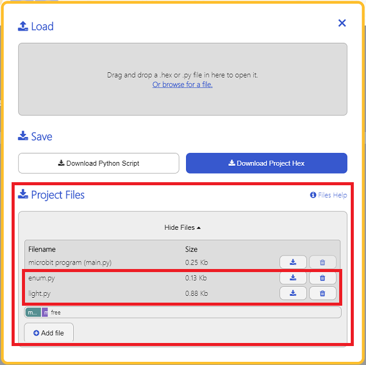

### API

| API | Description |
| :------------: | :-----------: |
|`AILENS()`|Init AI Lens|
|`switch_function(func)`|Choose AI Lens functions，`func`choose function：（`Learn`characteristics learn；`Card`card recognition；`Face`face recognition；`Tracking`tracking recognition；`Color`color recognition；`Ball`ball recognition）|
|`get_card_content()`|Recognize the contents on the card|
|`get_card_data()`|Get the info of the cards from the AI Lens to a list(X-axis; Y-axis; Width; Height; Confidence coefficient; Total numbers of cards; ID of current cards)|
|`get_face()`|Judge if there is a human face recognized in the AI Lens|
|`get_face_data()`|Get the info of the face(s) from the AI Lens to a list(X-axis; Y-axis; Width; Height; Confidence coefficient; Total numbers of face(s); ID of current face(s))|
|`get_ball_color()`|Recognize the color of the balls in the Ai Lens|
|`get_ball_data()`|Get the info of the ball(s) from the AI Lens to a list(X-axis; Y-axis; Width; Height; Confidence coefficient; Total numbers of ball(s); ID of current ball(s)).|
|`get_track_data()`|Get the info of the segment(s) from the AI Lens to a list（Deviation angel, deviation distance, segment length)|
|`get_color_type()`|Recognize the color of the cards in the AI Lens|
|`get_color_data()`|Get the info of the color(s) from the AI Lens to a list(X-axis; Y-axis; Width; Height; Confidence coefficient; Total numbers of color(s); ID of current color(s)).|
|`learn_object(learn_id)`|Name with an ID number for a learnt object, ID number: 1~5|
|`get_learn_data()`|Get the info of the learnt object(s) from the AI Lens to a list(ID of the object(s); Confidence coefficient).|


`class AILENS(object)`

Init AI Lens

`def switch_function(self, func)`

Choose AI Lens functions, `func`choose function, `Learn`characteristics learn, `Card`card recognition；`Face`face recognition；`Tracking`tracking recognition；`Color`color recognition；`Ball`ball recognition）

`def get_image(self)`

 Get an image

`def get_ball_color(self):`

Recognize the colors of the balls in the Ai Lens(If ball is blue,  the returned result is 'Blue'; if the ball is red, the result is 'Red'; or it returned with a ‘No Ball’ )

`def get_ball_data(self)`

Return the info of the balls in the AI Lens，BallData [x,y,w,h,confidence,total,order]。

x：X-axis

y：Y-axis

w：width

h：height

confidence：Confidence coefficient 

total：total numbers of the balls in the AI Lens 

order：ID of the current ball 

`def get_face(self)`

Judge if any face(s) in the Ai Lens 

`def get_face_data(self)`

Return the info of human face in the AI lens,  FaceData [x,y,w,h,confidence,total,order]。

x：X-axis

y：Y-axis

w：width

h：height

confidence：Confidence coefficient 

total：total numbers of the face(s) in the AI Lens

order：ID ID of the current face

`def get_card_content(self)`

Return the contents on the cards, the possible value are: 

numberCards = ["0", "1", "2", "3", "4", "5", "6", "7", "8", "9"]

letterCards = ["A", "B", "C", "D", "E"]

otherCards = ["Mouse", "micro:bit", "Ruler", "Cat", "Peer", "Ship", "Apple", "Car", "Pan", "Dog", "Umbrella", "Airplane", "Clock", "Grape", "Cup", "Turn left", "Turn right", "Forward", "Stop", "Back"]

If no cards get recognized, the returned value is ‘No Card’

`def get_color_type(self)`

Return the colors of the cards, the possible colors are: 

Green card："Green"

Blue card："Blue"

Yellow card："Yellow"

Black card： "Black"

Red card： "Red"

White card： "White"

If no colors get recognized, the returned value is ‘No Color’

`def get_color_data(self)`

 Return the info of the color(s), ColorData [x,y,w,h,confidence,total,order]

x：X-axis 

y：Y-axis

w：width 

h：height

confidence：Confidence coefficient 

total：total numbers of the color(s) in the AI Lens 

order： ID of the current color

`def get_track_data(self)`

Return the info of the segment(s) LineData [angel,width,len]

angel：return the deviation angel of the segment in the AI Lens 

width： return the deviation distance of the segment in the AI Lens 

len： return the length of the segment in the AI Lens 

`def learn_object(self, learn_id)`

Name with an ID number for a learnt object

ID of the learnt object(s): learn_id

`def get_learn_data(self)`

Return the info of the learnt object(s),  return info: LearnData [ID,confidence]

Object(s) ID：ID

Confidence coefficient of the learnt object：confidence


### Samples
### Sample 1: Characteristics learn
```
from microbit import *
from AILens import *
ai = AILENS()
ai.switch_function(Learn)
while True:
    ai.get_image()
    if button_a.is_pressed():
        ai.learn_object(1)
    buff = ai.get_learn_data()
    if buff[0] == 1:
        display.show(Image.HAPPY)
    else:
        display.show(Image.SAD)


```
### Result 
- Press button A to learn the object, a smile face displays  on the micro:bit while it recognizes the object or it displays a sad face. 


### Sample 2: Color recognition 
```
from microbit import *
from AILens import *
ai = AILENS()
ai.switch_function(Color)
while True:
    ai.get_image()
    if (ai.get_color_type() == "Green"):
        display.show(Image.HAPPY)
        sleep(2000)
    else:
        display.show(Image.SAD)
```
### Result 
- A smile face displays on the micro:bit for two seconds if the green card is recognized or it displays a sad face. 

### Sample 3: Balls recognition 
```
from microbit import *
from AILens import *
ai = AILENS()
ai.switch_function(Ball )
while True:
    ai.get_image()
    if (ai.get_ball_color() == "Red"):
        display.show(Image.HAPPY)
        sleep(2000)
    else:
        display.show(Image.SAD)
```
### Result
- A smile face displays on the micro:bit for two seconds if the red ball is recognized or it displays a sad face. 

### Sample 4: Recognize the black line
```
from microbit import *
from AILens import *
ai = AILENS()
ai.switch_function(Tracking)
while True:
    ai.get_image()
    buff = ai.get_track_data()
    
    if buff[1] > 100:
        display.show(Image.HAPPY)
    else:
        display.show(Image.SAD)
```
### Result
- The micro:bit displays a sad face if the black line was deteacted deviating to the left by the AI lens; It displays a smile face if the black line was deteacted deviating to the right by the AI lens

### Sample 5: Human face(s) recognition 
```
from microbit import *
from AILens import *
ai = AILENS()
ai.switch_function(Face )
while True:
    ai.get_image()
    
    if ai.get_face():
        display.show(Image.HAPPY)
    else:
        display.show(Image.SAD)
```
### Result
- A smile face displays on the micro:bit if the human face is detected or it displays a sad face. 

### Sample 6: Cards recognition 
```
from microbit import *
from AILens import *
ai = AILENS()
ai.switch_function(Card)
while True:
    ai.get_image()
    
    if (ai.get_card_content() == "Stop"):
        display.show(Image.HAPPY)
        sleep(2000)
    else:
        display.show(Image.SAD)
```
### Result 
- A smile face displays on the micro:bit if a "stop" card is detected or it displays a sad face. 

## AI Lens firmware update

For a better experience of the AI Lens, we are making an irregularly update for the new functions and optimization of the performance, a manually update of the firmware is required after the new version is released. 

### How to check the current version

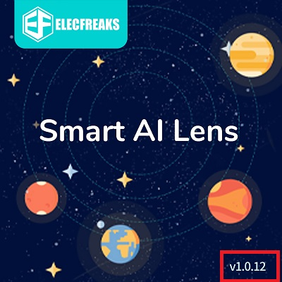
The current version number shall be displayed on the lower right corner of the boot screen(starting-on page), if there is no prompt, it should be the oldest version, please update asap. 


### The newest firmware version

Version V1.0.12[Click to download] (https://github.com/elecfreaks/learn-cn/raw/master/microbitplanetX/ai/v1.0.12.kfpkg)


### Steps of updating 

Firstly, install “kflash” for downloading the firmware, download via [kflash_gui_v1.6.5_2_windows.7z](https://github.com/elecfreaks/learn-cn/raw/master/microbitplanetX/ai/kflash_gui_v1.6.5_2_windows.7z) and unzip it. 

Open the file folder kflash_gui and find kflash_gui.exe.  

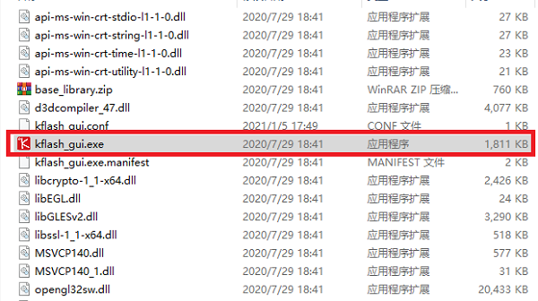

Double click it to open the file and choose to open the newest firmware. 

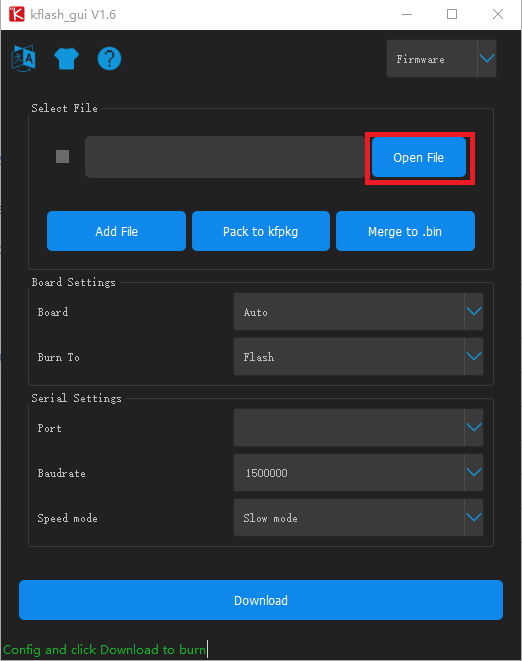

Connect the AI Lens with the USB wire. 

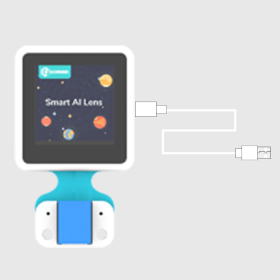

Choose the port to download it. 

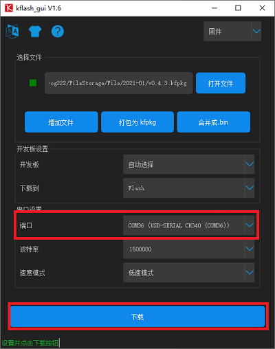


