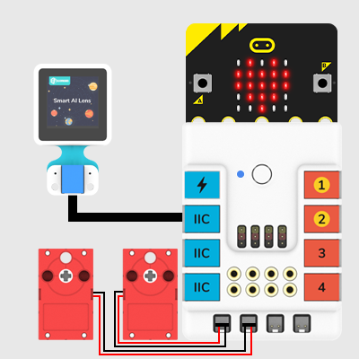
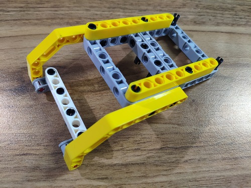
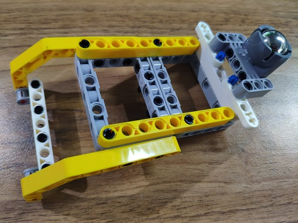
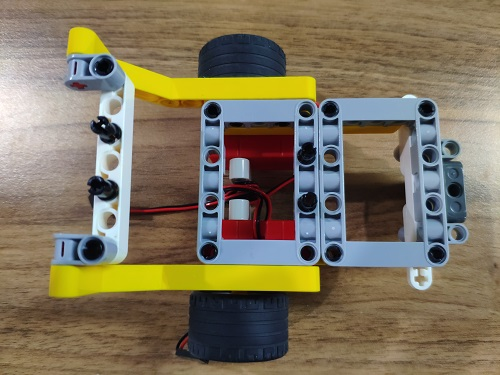
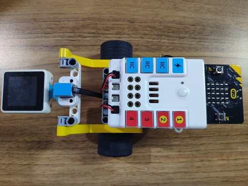
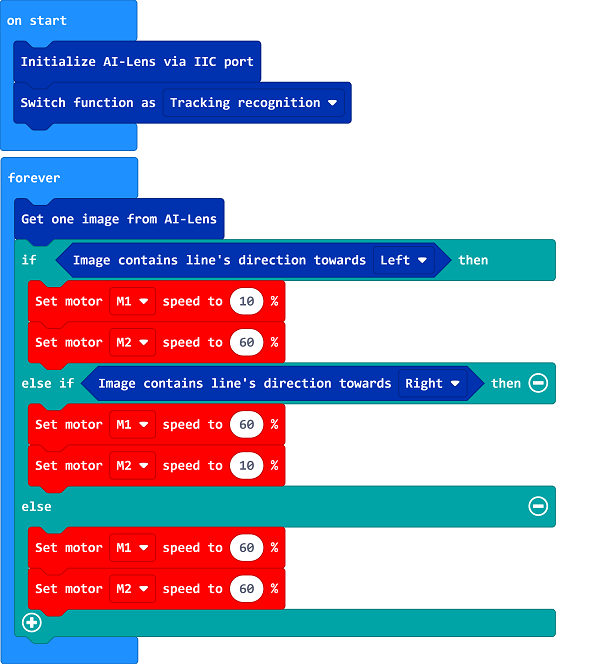

# Case 07: AI Lens Line Follower Car 

## Purpose

Build a line following car with the bricks and the AI lens. 

## Products Link

[ELECFREAKS Smart AI Lens Kit](https://shop.elecfreaks.com/products/elecfreaks-smart-ai-lens-kit?_pos=1&_sid=d572dc26c&_ss=r)

[ELECFREAKS Nezha Breakout Board](https://shop.elecfreaks.com/products/elecfreaks-nezha-breakout-board?_pos=1&_sid=327dd9f18&_ss=r)

[ELECFREAKS High-Speed Building Blocks Motor](https://shop.elecfreaks.com/products/elecfreaks-high-speed-building-blocks-motor?_pos=4&_sid=1012c2d84&_ss=r)

### Materials Required and Connection Diagram

 Connect the AI Lens to the IIC port and the two motors on M1,M2 ports on the Nezha expansion board as the picture shows. 

 Build a car with the bricks below. 

## MakeCode Programming 

### Step 1

Click "Advanced" in the MakeCode drawer to see more choices.

We need to add a package for programming. Click "Extensions" in the bottom of the drawer and search with "PlanetX" in the dialogue box to download it. 

***Note:*** If you met a tip indicating that the codebase will be deleted due to incompatibility, you may continue as the tips say or build a new project in the menu. 

### Step 2

### Code as below:

### Link
Link：[https://makecode.microbit.org/_D3objUWFo5YA](https://makecode.microbit.org/_D3objUWFo5YA)

You may also download it directly below:

<iframe style="position:absolute;top:0;left:0;width:100%;height:100%;" src="https://makecode.microbit.org/#pub:_D3objUWFo5YA" frameborder="0" sandbox="allow-popups allow-forms allow-scripts allow-same-origin"></iframe>
  

### Result
The car moves along with the line with the guidance of the AI lens. 

