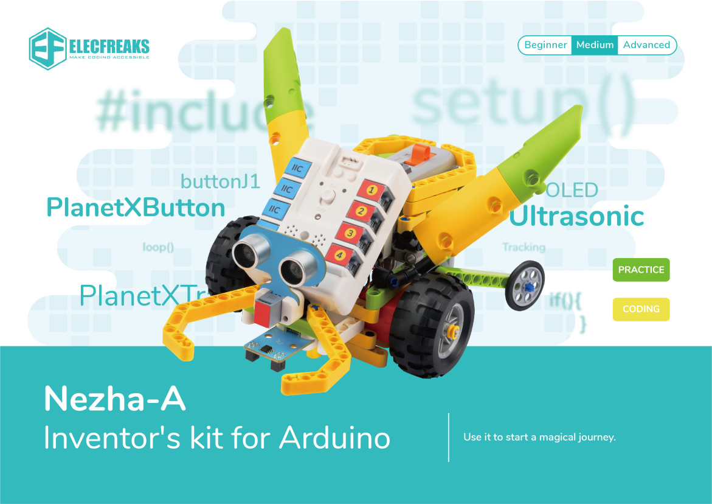
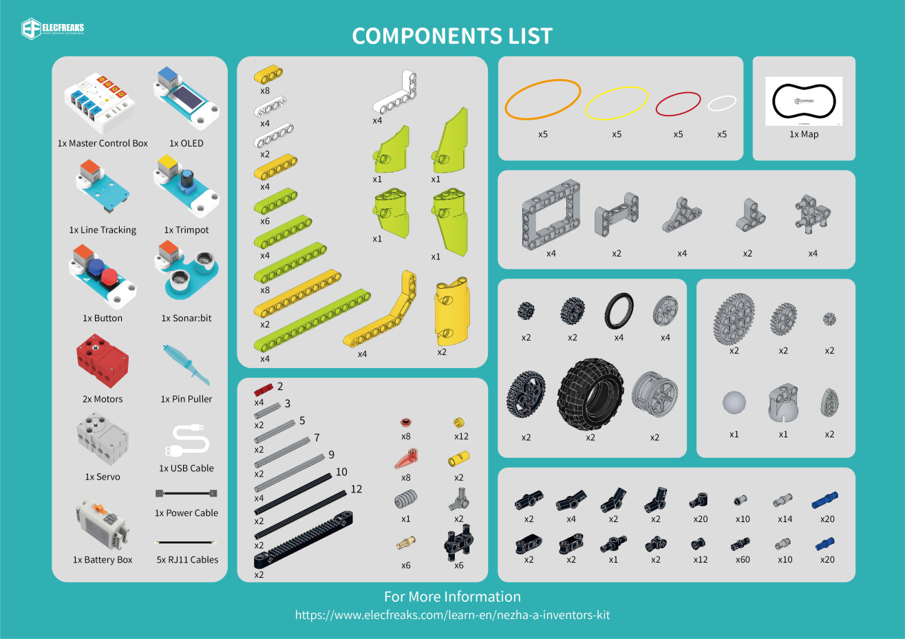

# 36 in 1 Nezha-A Inventor's kit for Arduino

## Introduction
[36 in 1 Nezha-A Inventor's kit](https://shop.elecfreaks.com/products/elecfreaks-arduino-36-in-1-nezha-a-inventors-kit?_pos=2&_sid=e1dfa3343&_ss=r) for Arduino is based on Nezha-A master box. It contains several sensors and modules, including an OLED display, potentiometer, ultrasonic sound sensor, two buttons, dual line-tracking sensor, and etc. It also contains more than 300 building blocks. We have paired this kit with 36 interesting cases and detailed block assembly diagrams. It allows children to experience the fun of exploring building structures while learning to program and fully stimulates their creativity and imagination.

Follow us and start with the 36 in 1 Nezha-A Inventor's kit for Arduino and let every child become an inventor!

## Pictures

## Packing List

