# Case 04: A Basic Car
## Purpose
Make a basic car with [NezhaA Inventor's Kit](https://www.elecfreaks.com/elecfreaks-nezha-a-inventor-s-kit-for-arduino.html).
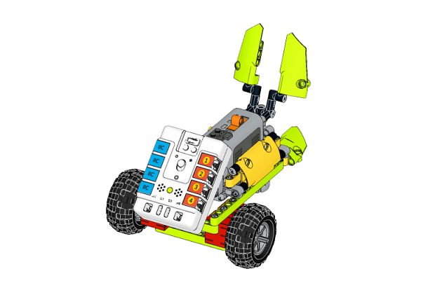

## Purchse

 [NezhaA Inventor's Kit](https://www.elecfreaks.com/elecfreaks-nezha-a-inventor-s-kit-for-arduino.html)

## Materials Required


## Assembly Steps
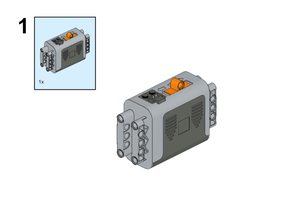


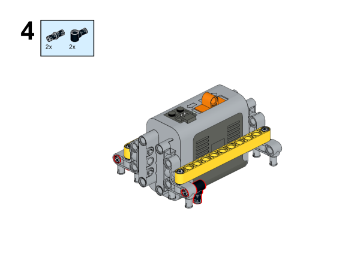
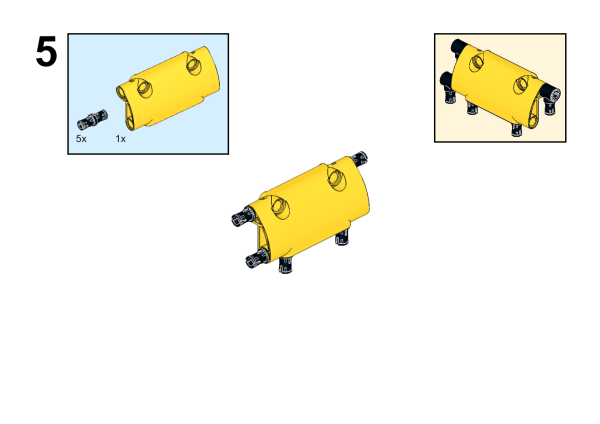


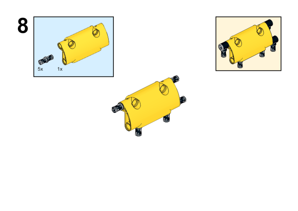
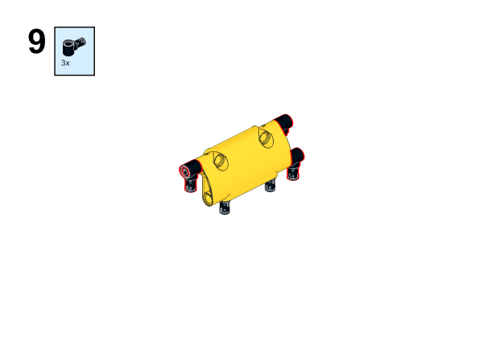

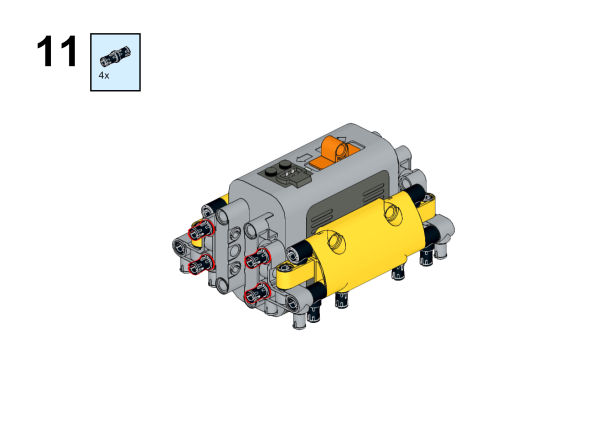
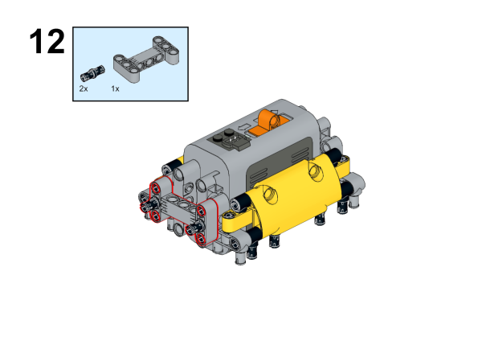
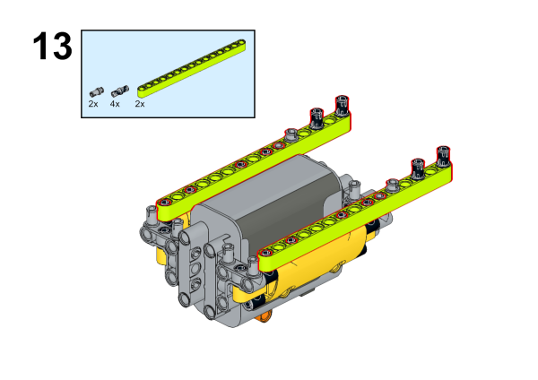
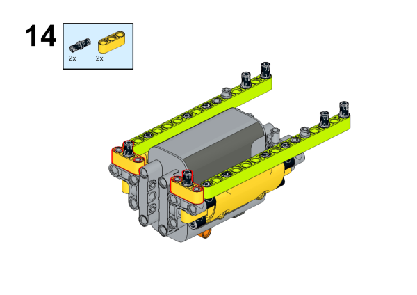
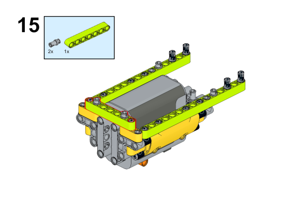
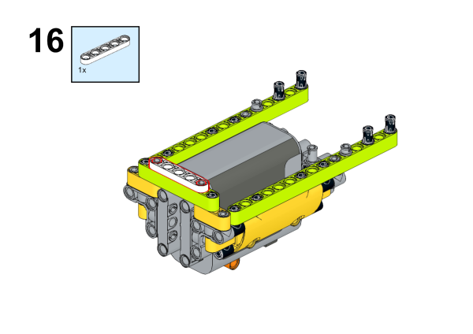


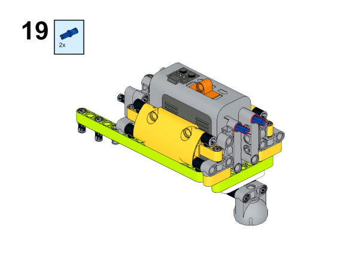
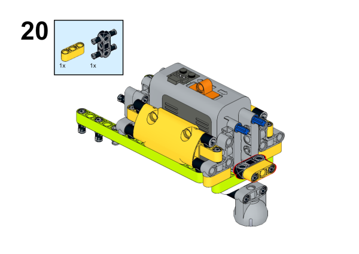

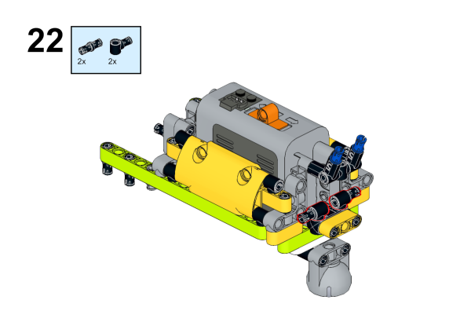
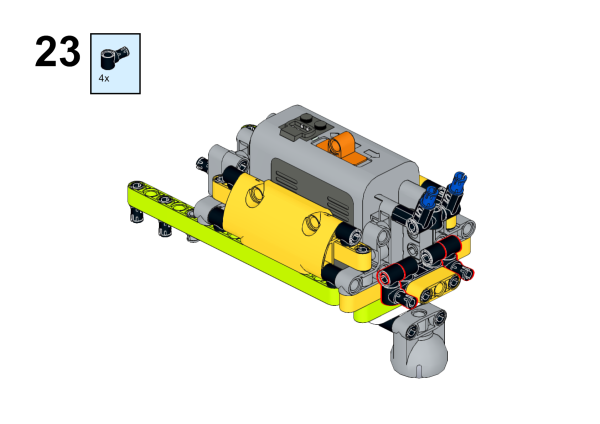

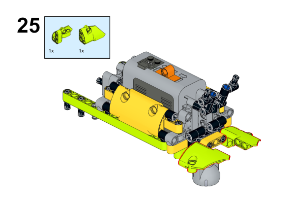
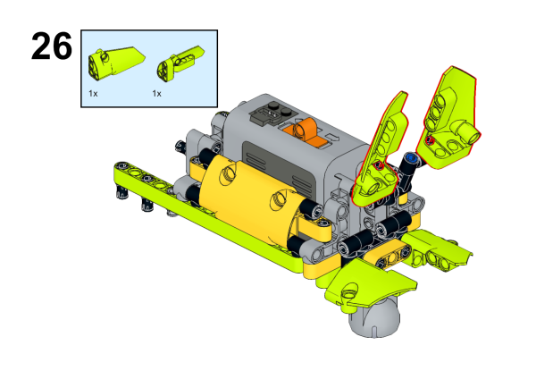
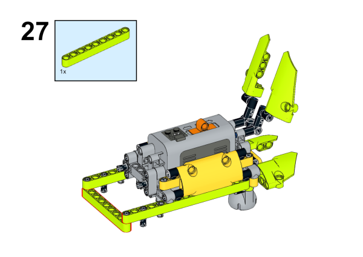
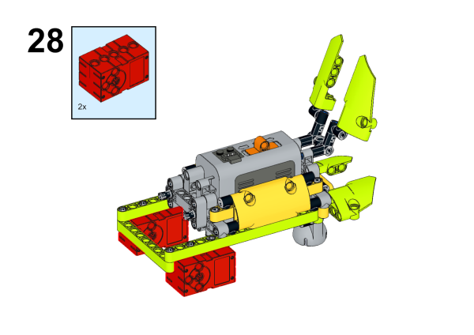
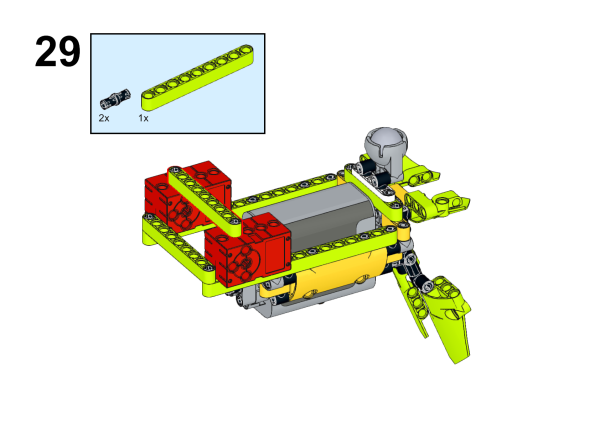
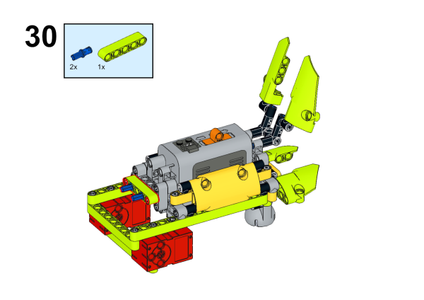
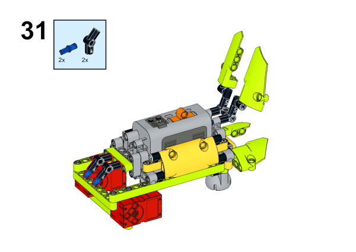
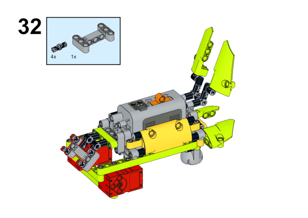
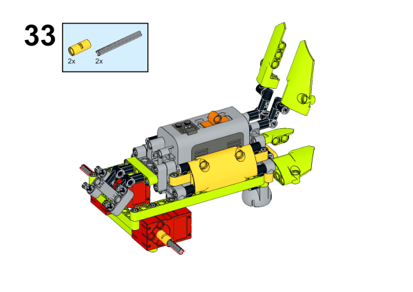

## Hardware Connections

Connect two [motors](https://www.elecfreaks.com/geekservo-motor-2kg-compatible-with-lego.html) to M1 and M2 port on [Nezha-A master box](https://www.elecfreaks.com/arduino-3-in-1-master-control-box.html). 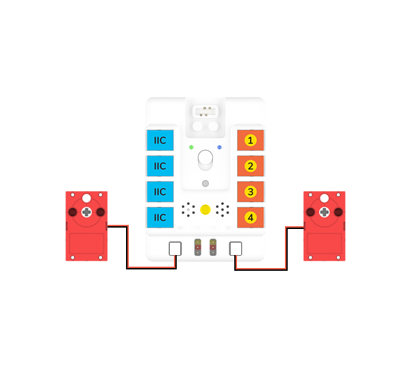

## Programming

### Prepare the programming

Steps for preparation please refer to: [Arduino 3 in 1 Breakout Board](https://www.elecfreaks.com/learn-en/Arduino-3-in-1-box/Arduino-3-in-1-box.html)

### Sample Projects:
```
// Language ArduinoC
#include <NezhaA.h>

NezhaA nezhaA;    //Create an instance of NezhaA category

void setup() {
  nezhaA.begin();    //Initiliaze the buzzer, motor, servo and light
  nezhaA.setMotorSpeed(M1, 100);   //Set the speed of the motor connecting to M1 at 100%
  nezhaA.setMotorSpeed(M2, 30);   //Set the speed of the motor connecting to M2 at 30%
}

void loop() {
}
```
### Result
After powering on, the basic car drives with a curve routine. 

