# Case 01: Rubber Bands Launcher
## Purpose
---
Make a rubber bands launcher through  [NezhaA Inventor's Kit](https://www.elecfreaks.com/elecfreaks-nezha-a-inventor-s-kit-for-arduino.html).
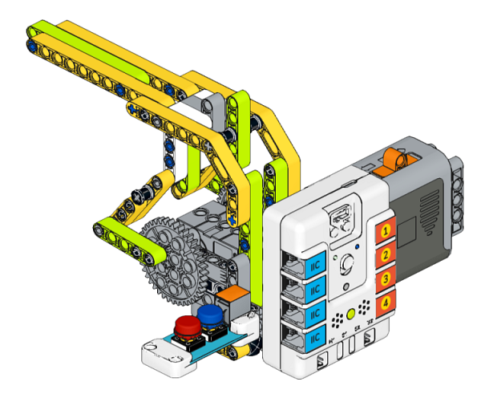

## Purchase Link
---
  [NezhaA Inventor's Kit](https://www.elecfreaks.com/elecfreaks-nezha-a-inventor-s-kit-for-arduino.html)

## Materials Required
---
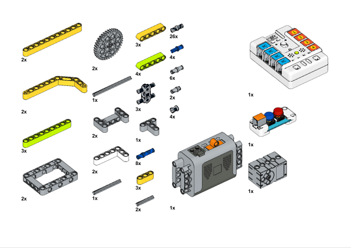
## Assembly steps 
---
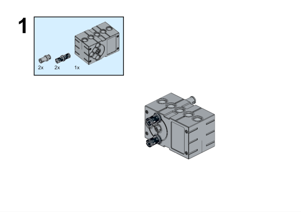
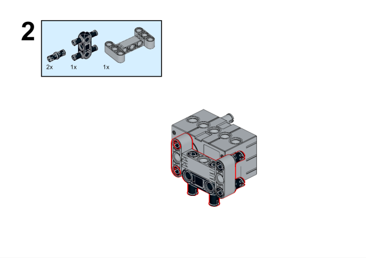
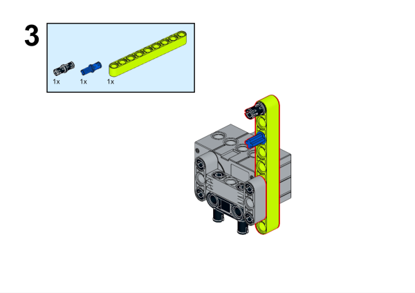
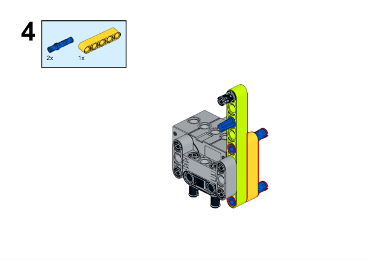
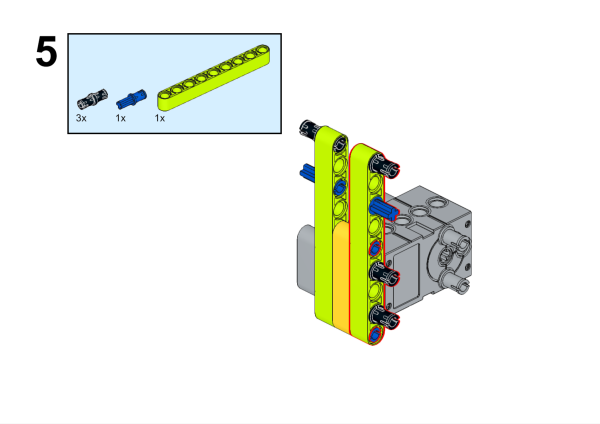
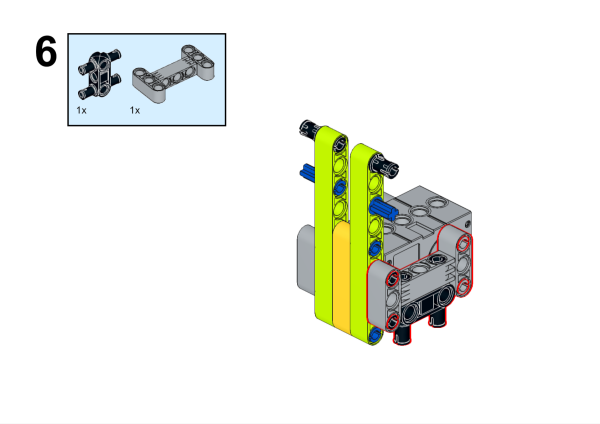
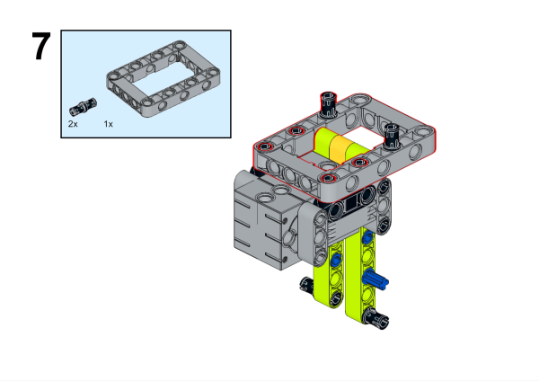
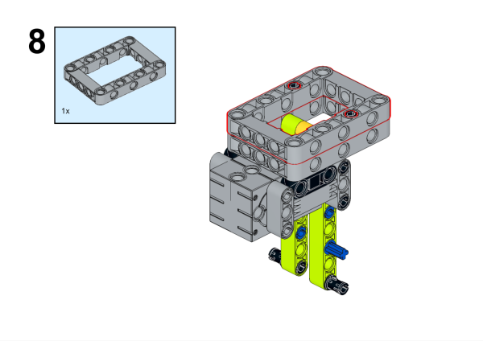
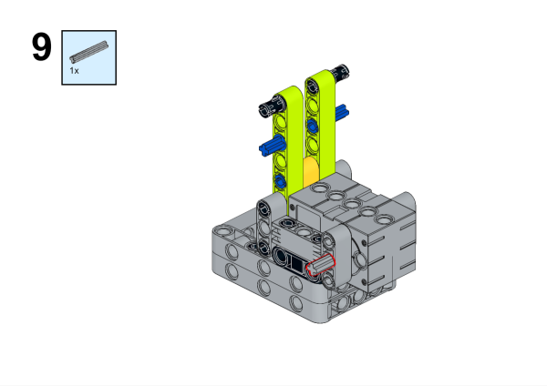
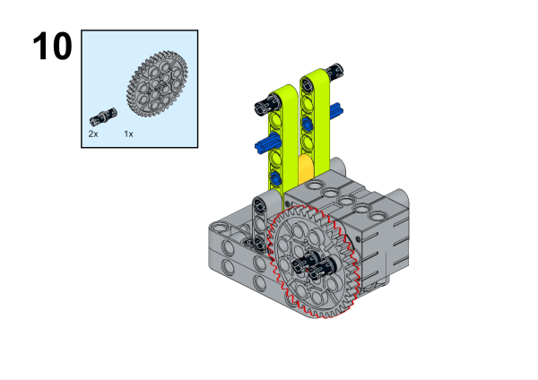

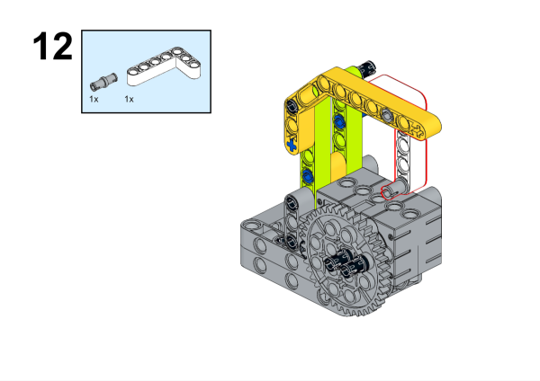
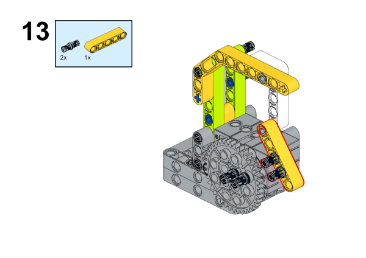
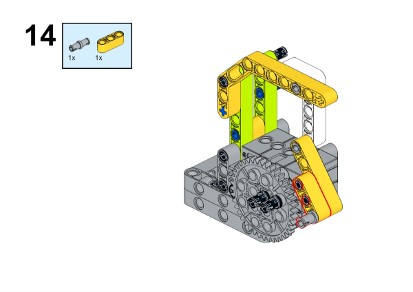
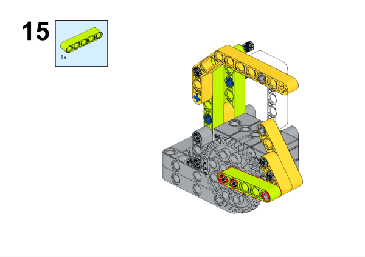
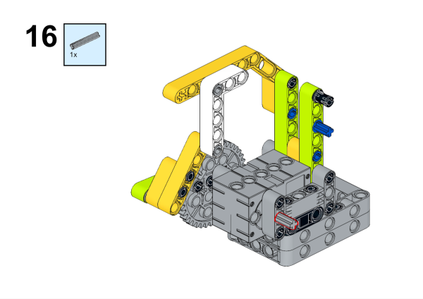
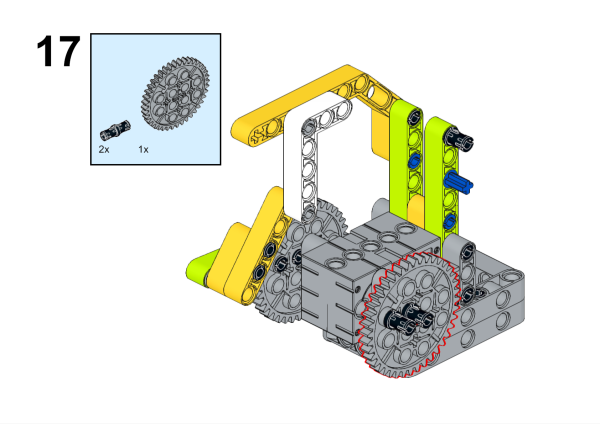
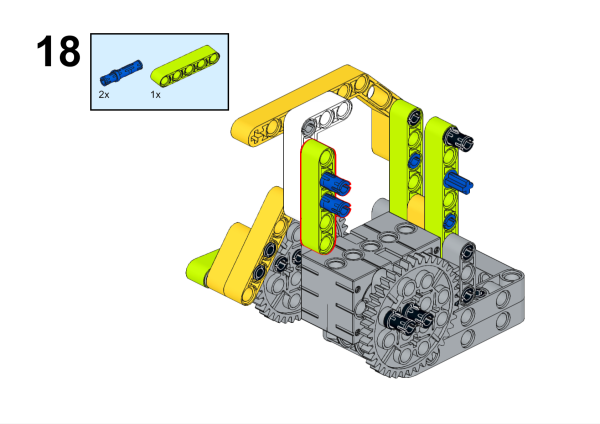
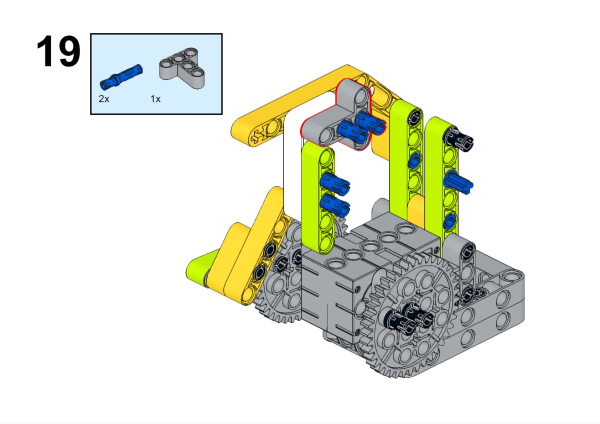
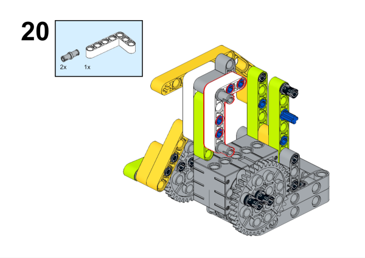
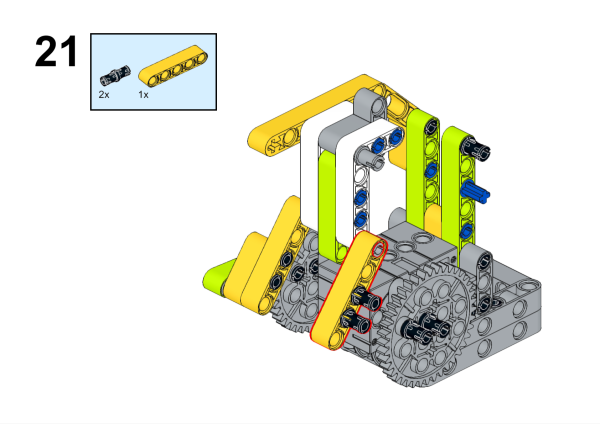
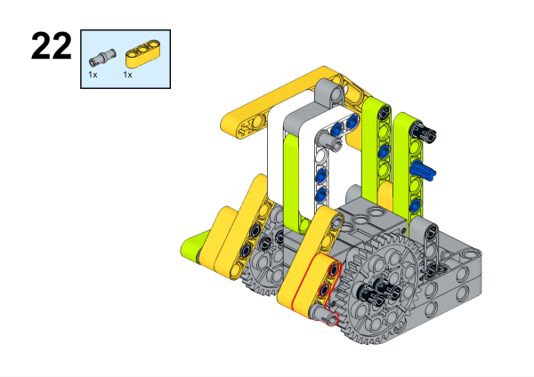
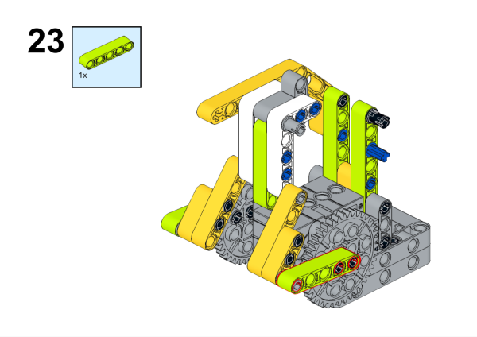
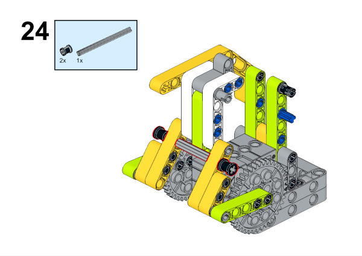
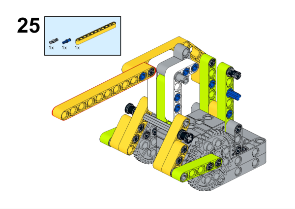

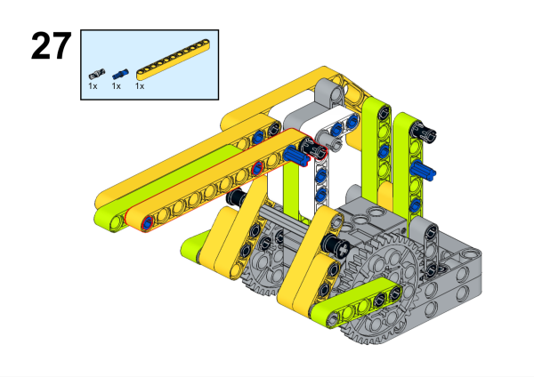
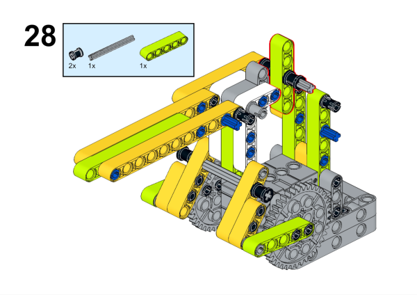
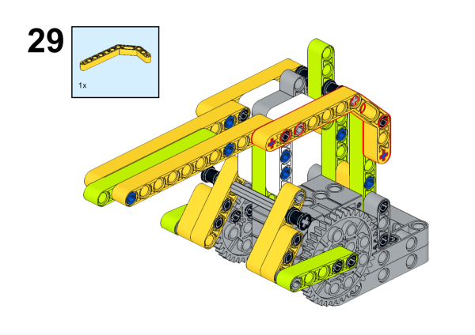
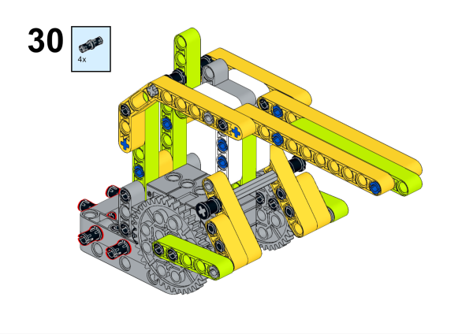
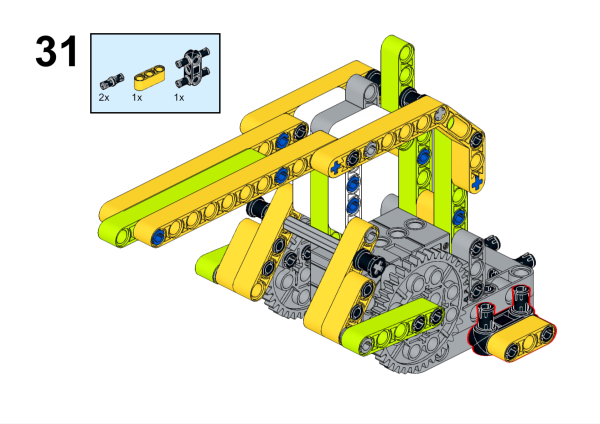
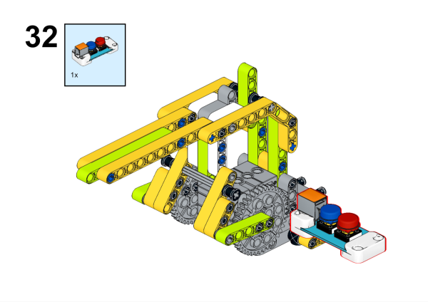
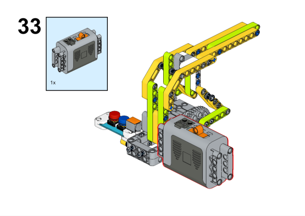
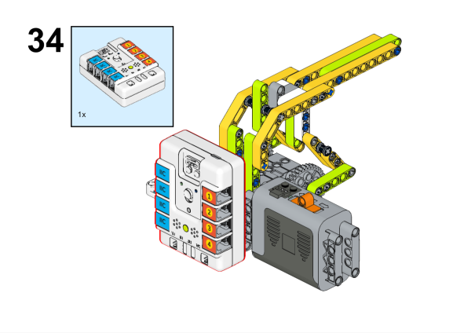

Wrap the rubber bands with the device:
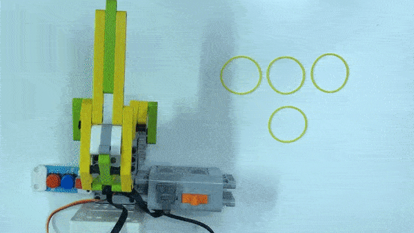

## Hardware Connection
---
Connect the [two buttons](https://www.elecfreaks.com/planetx-button.html) to J1 port and the [Servo](https://www.elecfreaks.com/geekservo-2kg-360-degrees-compatible-with-lego.html) to S1 port on [Nezha-A master box](https://www.elecfreaks.com/arduino-3-in-1-master-control-box.html). 
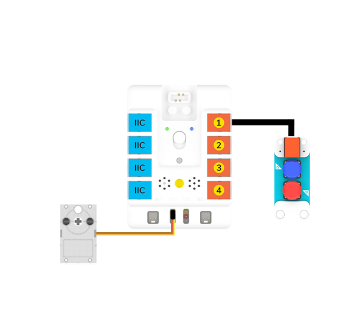

## Programming
---
### Prepare the programming
Steps for preparation please refer to: [Arduino 3 in 1 Breakout Board](https://www.elecfreaks.com/learn-en/Arduino-3-in-1-box/Arduino-3-in-1-box.html)
Import the libraries and the subsidiary libraries of [Nezha-A master box](https://www.elecfreaks.com/arduino-3-in-1-master-control-box.html) and then import the libraries of the [two buttons](https://www.elecfreaks.com/planetx-button.html):  [PlanetXButton-main.zip](https://github.com/elecfreaks/PlanetXButton/archive/refs/heads/main.zip)
Download and import the self-defined library connections for [Nezha-A master box](https://www.elecfreaks.com/arduino-3-in-1-master-control-box.html): [RJPins-main.zip](https://github.com/elecfreaks/RJPins/archive/refs/heads/main.zip)

### Sample Code: 
```python
#include <PlanetXButton.h>
#include <NezhaA.h>
#include <RJPins.h>

PlanetXButton buttonJ1(J1);    //Create an instance of PlanetXButton category
NezhaA nezhaA;    //Create an instance of NezhaA category

void setup() {
  nezhaA.begin();    //Initiliaze the buzzer, motor, servo and light
}

void loop() {
  if (buttonJ1.isPressed(C)) {    //While button C is pressed
    nezhaA.setServoAngle(S1, 190);    //Set the angle of the servo as 200 degrees at S1 port. 
  }
  if (buttonJ1.isPressed(D)) {
    nezhaA.setServoAngle(S1, 270);    
  }
}
```

### Result
Control the rubber band through this rubber band launcher. 
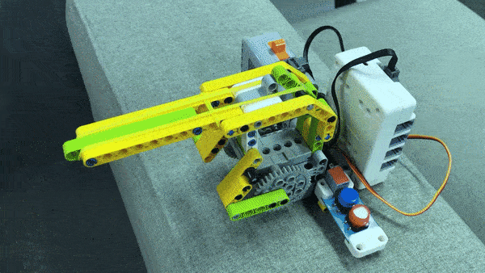

***Note*** The angle of the servo that controls the launch needs to be adjusted according to the number of rubber bands. Using too many rubber bands will cause excessive tension and damage the servos. It is recommended that no more than three rubber bands be used for launching.

