# Case 05:  A Line-follwing Car

## Purpose
---
Make a line-following car with [NezhaA Inventor's Kit](https://shop.elecfreaks.com/products/elecfreaks-arduino-36-in-1-nezha-a-inventors-kit?_pos=2&_sid=e1dfa3343&_ss=r).

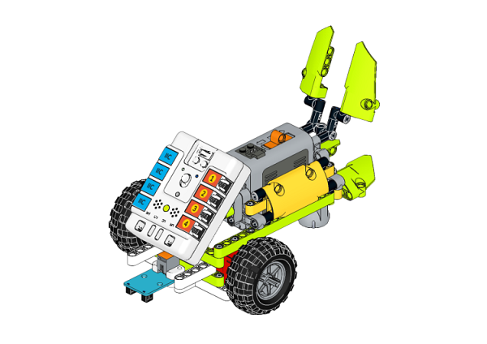

## Purchse
---
 [NezhaA Inventor's Kit](https://shop.elecfreaks.com/products/elecfreaks-arduino-36-in-1-nezha-a-inventors-kit?_pos=2&_sid=e1dfa3343&_ss=r)

## Materials Required
---
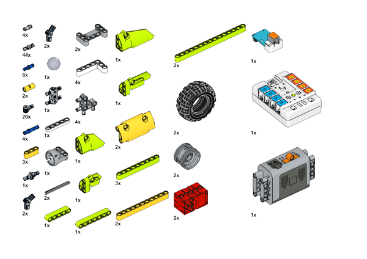

## Assembly Steps
---
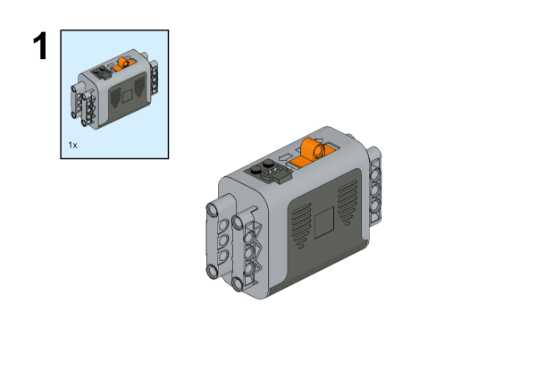
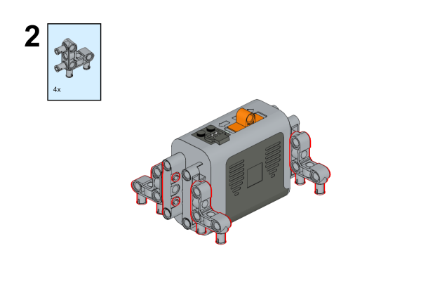
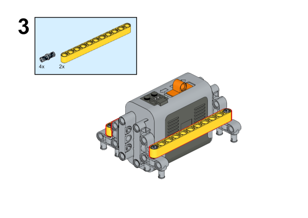
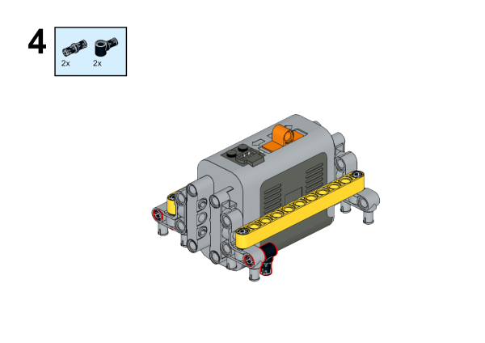
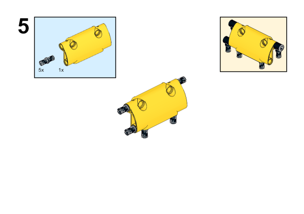
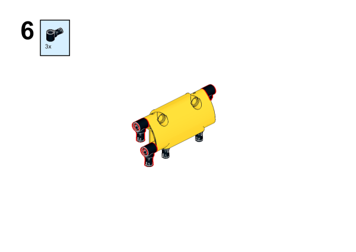
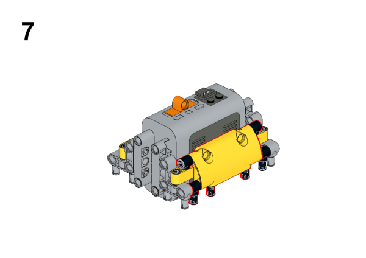
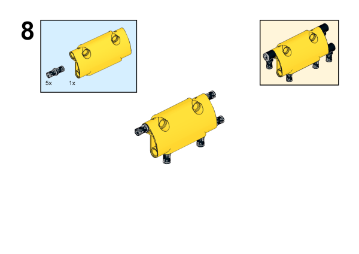
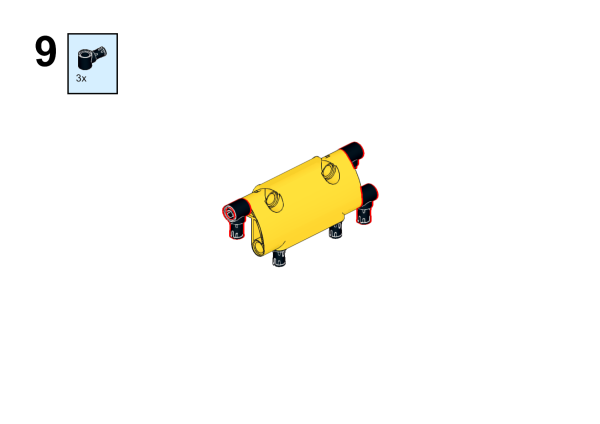

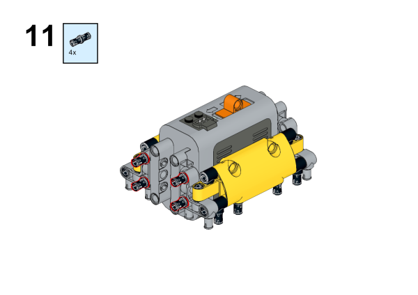
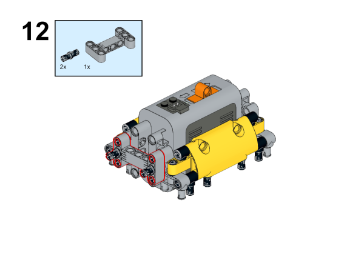
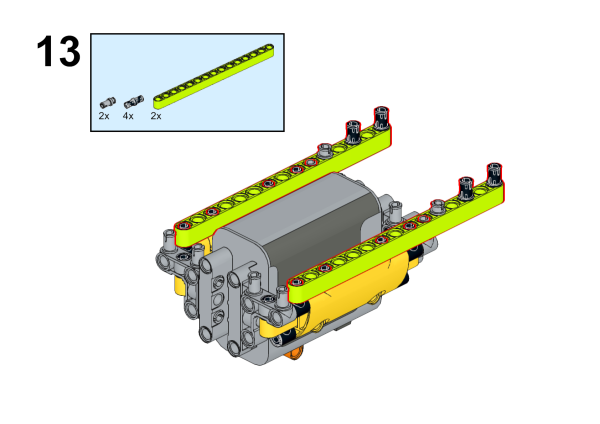
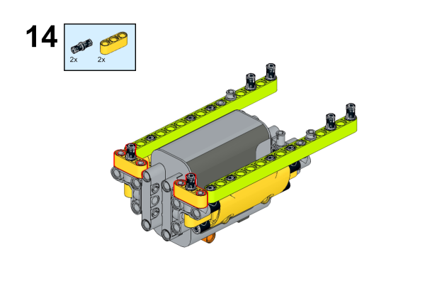
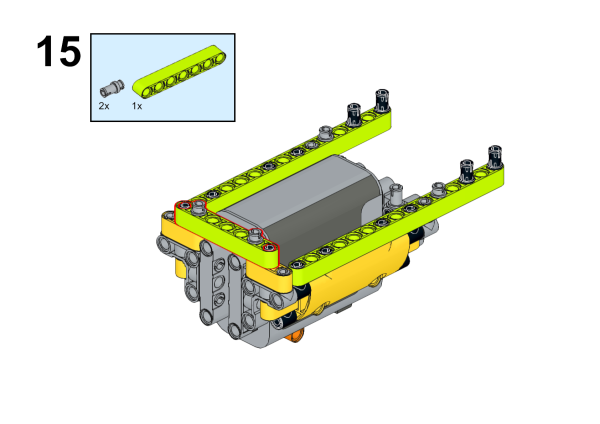
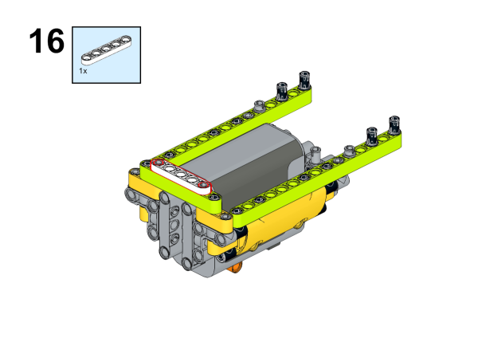
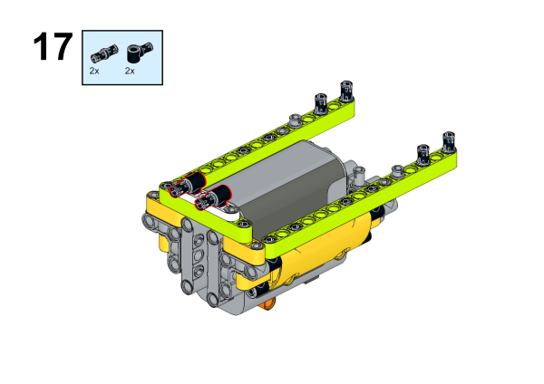
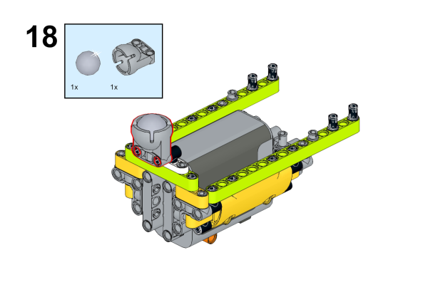
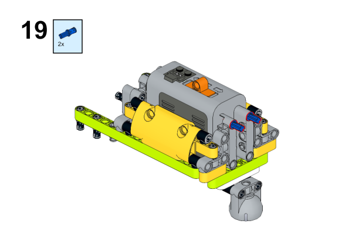
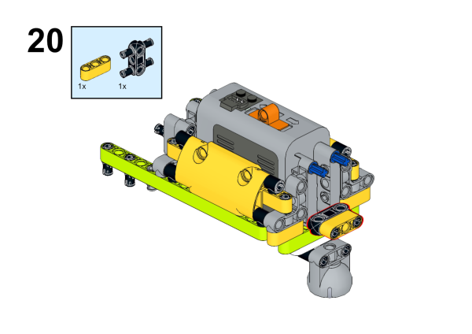
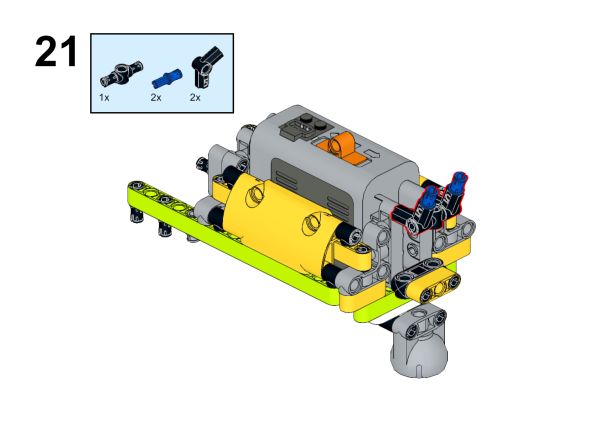
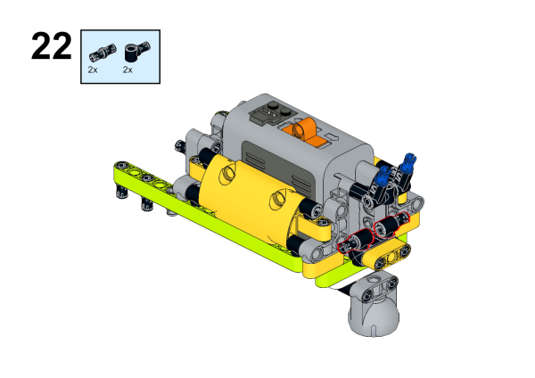
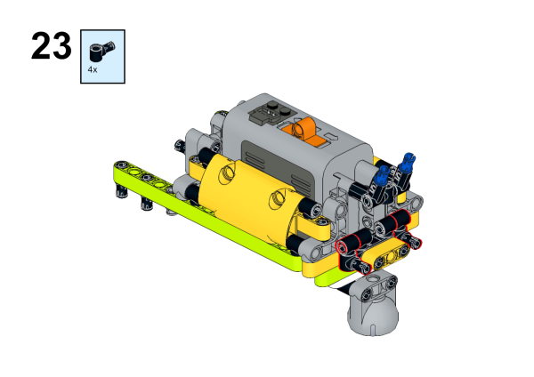
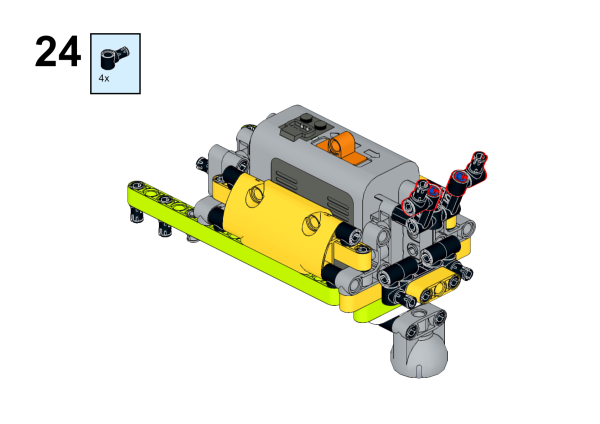
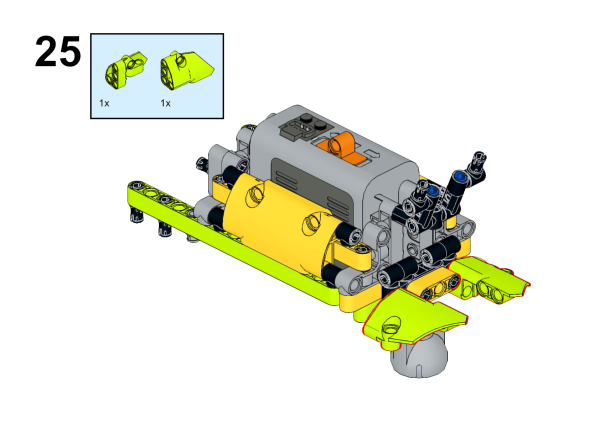
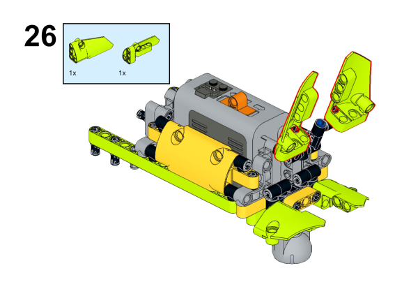
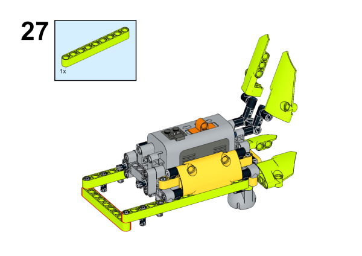
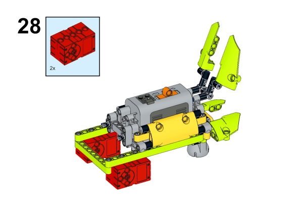
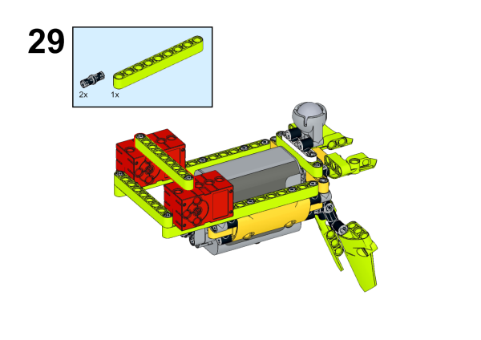
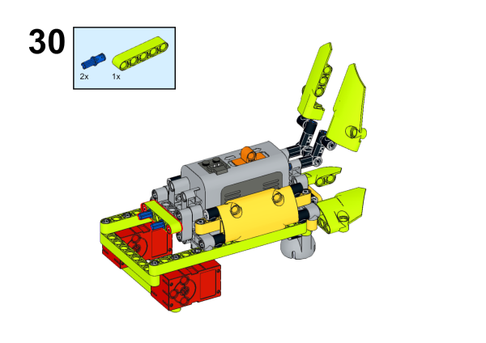
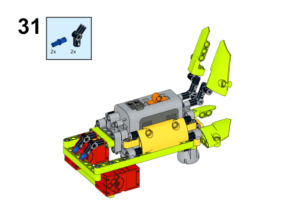
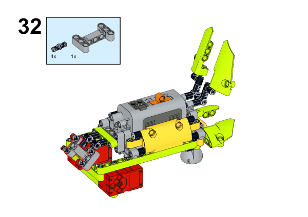
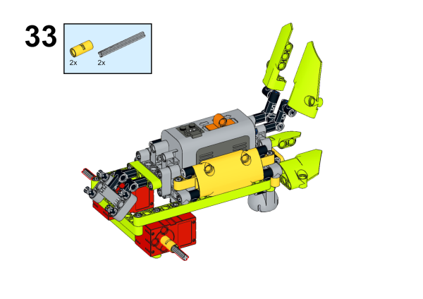

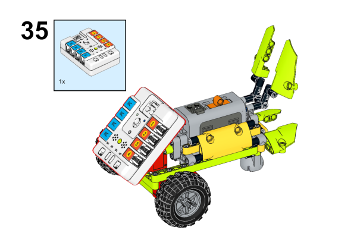
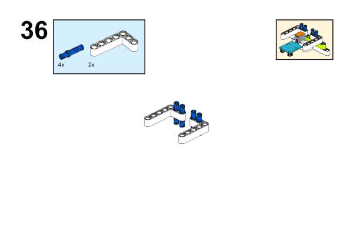

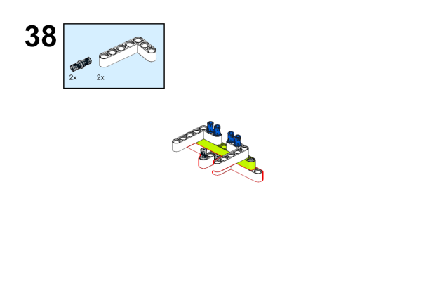
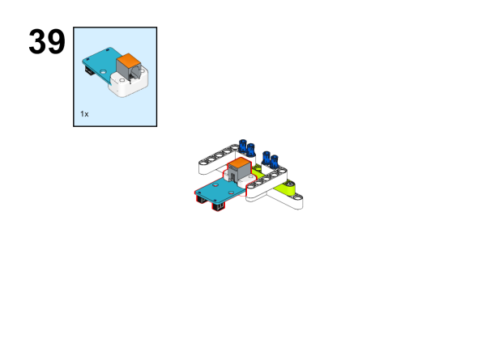

## Hardware Connections
---
Connect two [motors](https://www.elecfreaks.com/geekservo-motor-2kg-compatible-with-lego.html) to M1 and M2 port and the [line-tracking sensor](https://www.elecfreaks.com/planetx-tracking.html) on [Nezha-A master box](https://www.elecfreaks.com/arduino-3-in-1-master-control-box.html). 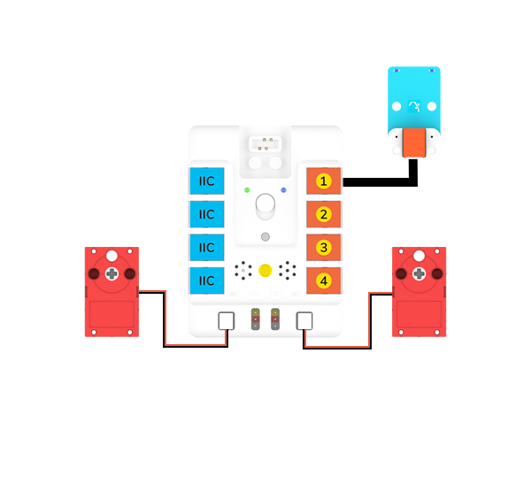

## Programming
---
### Prepare the programming

Steps for preparation please refer to: [Arduino 3 in 1 Breakout Board](https://www.elecfreaks.com/learn-en/Arduino-3-in-1-box/Arduino-3-in-1-box.html)

Import the libraries and the subsidiary libraries of [Nezha-A master box](https://www.elecfreaks.com/arduino-3-in-1-master-control-box.html) and then import the libraries of the [line-tracking sensor](https://www.elecfreaks.com/planetx-tracking.html):  [PlanetXTracking-main.zip](https://github.com/elecfreaks/PlanetXTracking/archive/refs/heads/main.zip)
Download and import the self-defined library connections for [Nezha-A master box](https://www.elecfreaks.com/arduino-3-in-1-master-control-box.html): [RJPins-main.zip](https://github.com/elecfreaks/RJPins/archive/refs/heads/main.zip)

### Sample Projects:

```
// Language ArduinoC
#include <NezhaA.h>
#include <RJPins.h>
#include <PlanetXTracking.h>

PlanetXTracking trackingJ1(J1);    //Create an instance of PlanetXTracking category
NezhaA nezha;    /Create an instance of NezhaA category

void setup() {
  nezha.begin();    //Initiliaze the buzzer, motor, servo and light
}

void loop() {
  if (trackingJ1.isTracked(Right)) {
    nezha.setMotorSpeed(M1, 0);    //Set the speed of the motor connecting to M1 at 0%
    nezha.setMotorSpeed(M2, 15);    //Set the speed of the motor connecting to M2 at 15%
  }
  if (trackingJ1.isTracked(Left)) {
    nezha.setMotorSpeed(M1, 15);    //Set the speed of the motor connecting to M1 at 15%
    nezha.setMotorSpeed(M2, 0);    //Set the speed of the motor connecting to M2 at 0%
  }  
}
```

### Result
After powering on, the car drives along with the map. 

