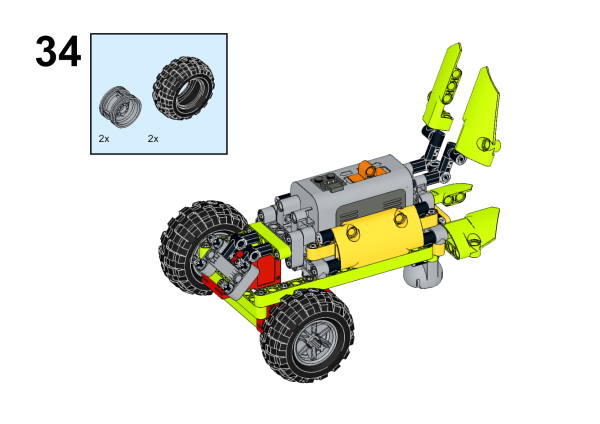

# Case 06: An Obstacle-avoidance Car

## Purpose
---
Make an obstacle-avoidance car with [NezhaA Inventor's Kit](https://shop.elecfreaks.com/products/elecfreaks-arduino-36-in-1-nezha-a-inventors-kit?_pos=2&_sid=e1dfa3343&_ss=r).

## Purchse
---
 [NezhaA Inventor's Kit](https://shop.elecfreaks.com/products/elecfreaks-arduino-36-in-1-nezha-a-inventors-kit?_pos=2&_sid=e1dfa3343&_ss=r)

## Materials Required
---


## Assembly Steps
---





## Hardware Connections
---
Connect two [motors](https://www.elecfreaks.com/geekservo-motor-2kg-compatible-with-lego.html) to M1, M2 port and the [ultrasonic sound sensor](https://www.elecfreaks.com/planetx-ultrasonic.html) to J1 port on [Nezha-A master box](https://www.elecfreaks.com/arduino-3-in-1-master-control-box.html). 


## Programming
---
### Prepare the programming

Steps for preparation please refer to: [Arduino 3 in 1 Breakout Board](https://www.elecfreaks.com/learn-en/Arduino-3-in-1-box/Arduino-3-in-1-box.html)

Import the libraries and the subsidiary libraries of [Nezha-A master box](https://www.elecfreaks.com/arduino-3-in-1-master-control-box.html) and then import the libraries of the [ultrasonic sound sensor](https://www.elecfreaks.com/planetx-ultrasonic.html): [PlanetXUltrasonic-main.zip](https://github.com/elecfreaks/PlanetXUltrasonic/archive/refs/heads/main.zip)
Download and import the self-defined library connections for [Nezha-A master box](https://www.elecfreaks.com/arduino-3-in-1-master-control-box.html): [RJPins-main.zip](https://github.com/elecfreaks/RJPins/archive/refs/heads/main.zip)

### Sample Projects:

```
// Language ArduinoC
#include <PlanetXUltrasonic.h>
#include <NezhaA.h>
#include <RJPins.h>

PlanetXUltrasonic ultrasonicJ1(J1);    //Create an instance of PlanetXUltrasonic category
NezhaA nezhaa;    //Create an instance of NezhaA category
int distance;    //Create a variable of int distance

void setup() {
  nezhaa.begin();    //Initiliaze the buzzer, motor, servo and light
}

void loop() {
  distance = (ultrasonicJ1.getDistance());    //Set the detected value from ultrasonic sound sensor as the variable distance 
  if (distance > 3 && distance < 20) {    //Judge if the variable is over 3 and below 20
    nezhaa.setMotorSpeed(M1, 15);    // Set the speed of the motor connecting to M1 at 15%
    nezhaa.setMotorSpeed(M2, -15);    //Set the speed of the motor connecting to M2 at -15%
    delay((1) * 1000);    //Pause 1000ms
  } else {
    nezhaa.setMotorSpeed(M1, 20);
    nezhaa.setMotorSpeed(M2, 20);
  }
}
```

### Result
After powering on, the car moves forward and it turns autamatically if it detects any obstacles. 

