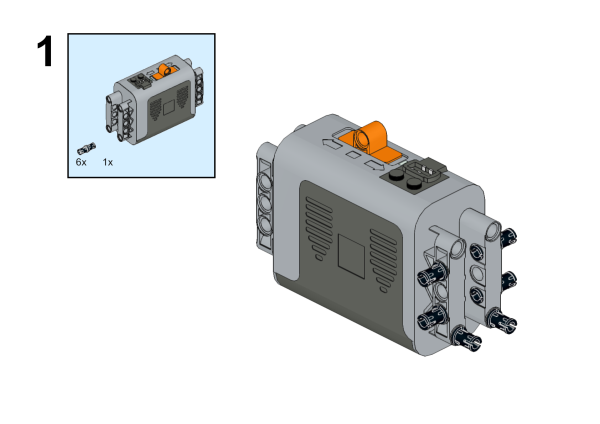
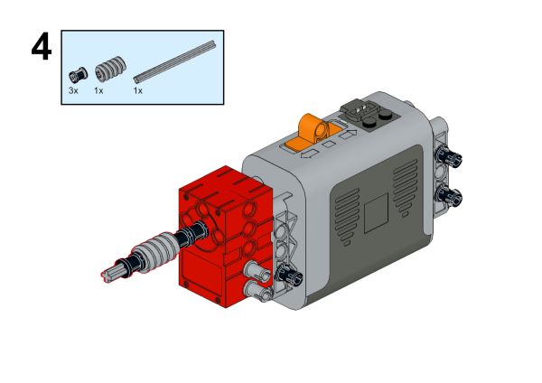

# Case 09: The Crawl Robot

## Purpose
---
Make a crawl robot with [NezhaA Inventor's Kit](https://shop.elecfreaks.com/products/elecfreaks-arduino-36-in-1-nezha-a-inventors-kit?_pos=2&_sid=e1dfa3343&_ss=r).


## Purchse
---
 [NezhaA Inventor's Kit](https://shop.elecfreaks.com/products/elecfreaks-arduino-36-in-1-nezha-a-inventors-kit?_pos=2&_sid=e1dfa3343&_ss=r)

## Materials Required
---


## Assembly Steps
---






## Hardware Connections
---
Connect the [motor](https://www.elecfreaks.com/geekservo-motor-2kg-compatible-with-lego.html) to M1 port on [Nezha-A master box](https://www.elecfreaks.com/arduino-3-in-1-master-control-box.html). 


## Programming
---
### Prepare the programming

Steps for preparation please refer to: [Arduino 3 in 1 Breakout Board](https://www.elecfreaks.com/learn-en/Arduino-3-in-1-box/Arduino-3-in-1-box.html).

### Sample Code: 

```
// Language ArduinoC
#include <NezhaA.h>

NezhaA nezhaA;    //Create an instance of Nezha category

void setup() {
  nezhaA.begin();    //Initiliaze the buzzer, motor, servo and light
  nezhaA.setMotorSpeed(M1, 100);    // Set the speed of the motor connecting to M1 at 100%
}

void loop() {

}

```
### Result
After powering on, the robot crawls forward. 
