# Case 11: A Simple Fan

## Purpose
---
Make a fan with [NezhaA Inventor's Kit](https://www.elecfreaks.com/elecfreaks-nezha-a-inventor-s-kit-for-arduino.html).

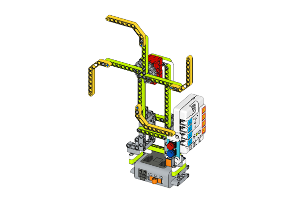

## Purchse
---
 [NezhaA Inventor's Kit](https://www.elecfreaks.com/elecfreaks-nezha-a-inventor-s-kit-for-arduino.html)

## Materials Required
---


## Assembly Steps
---
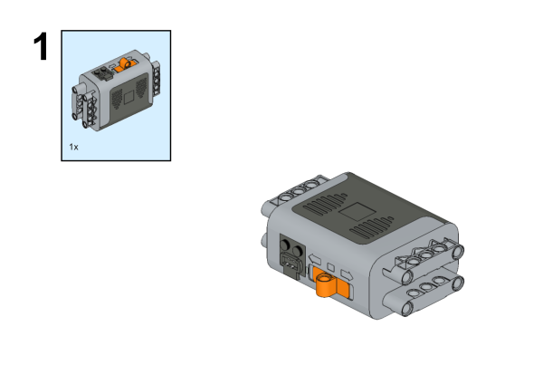
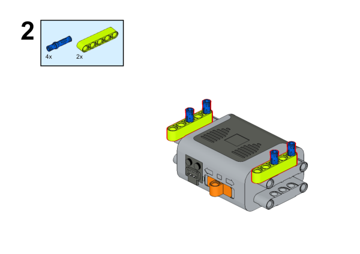
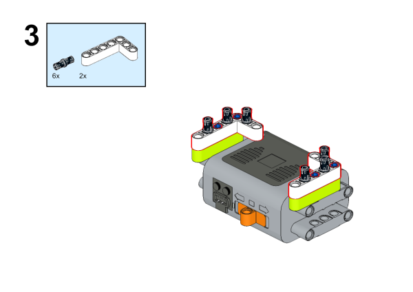
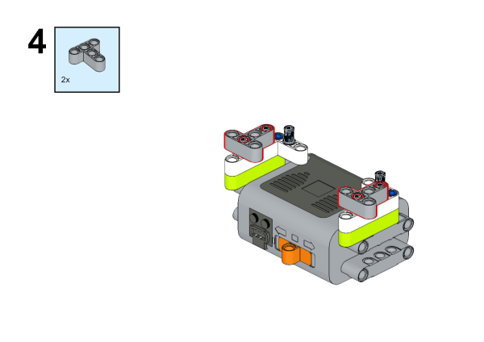
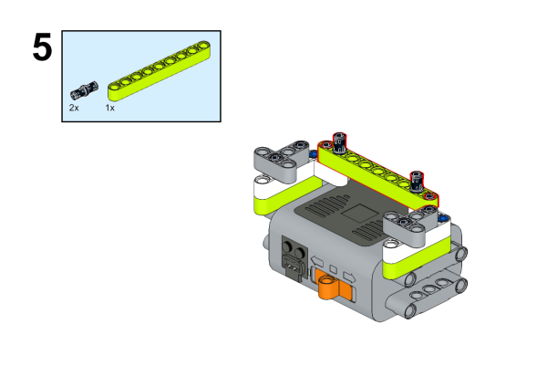
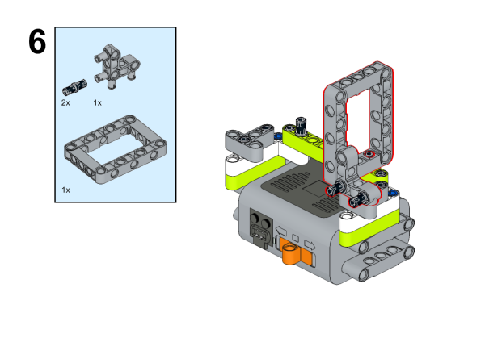
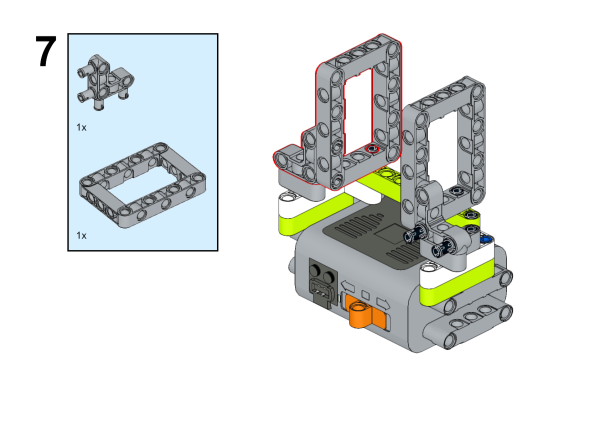
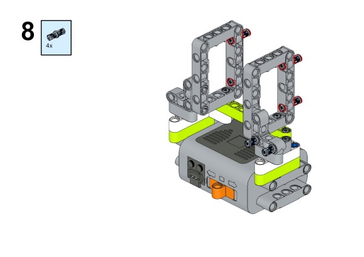
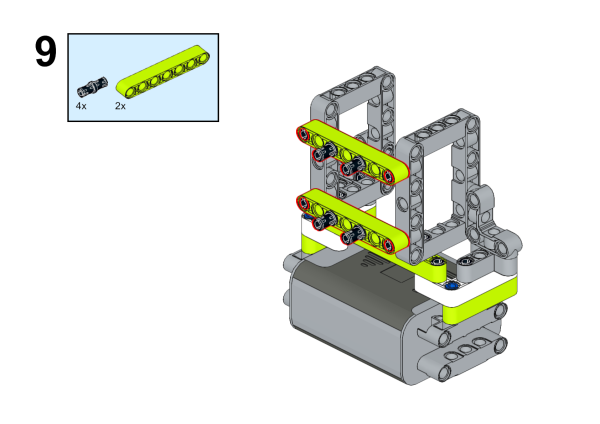
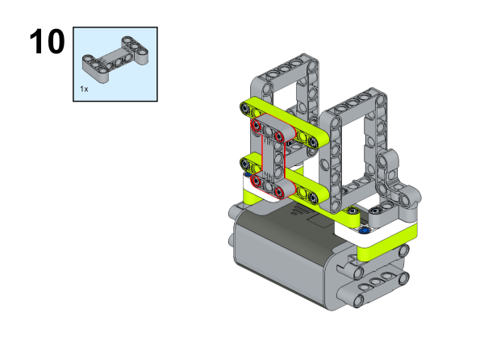
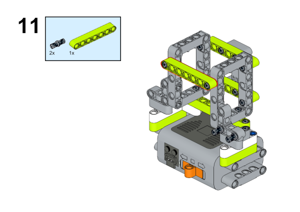
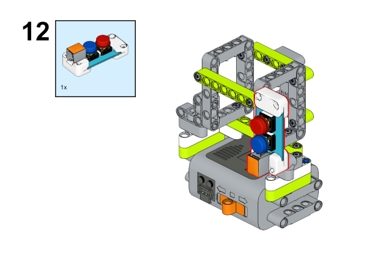

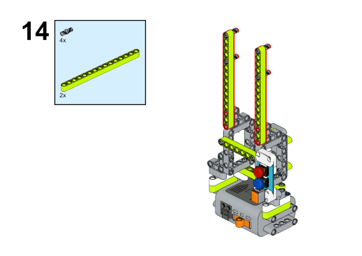
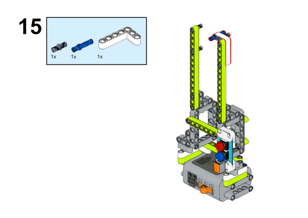
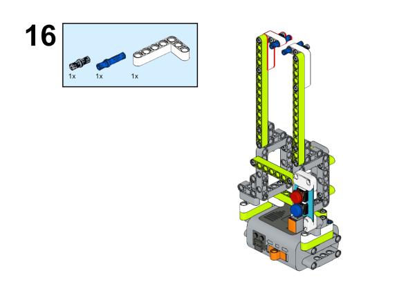
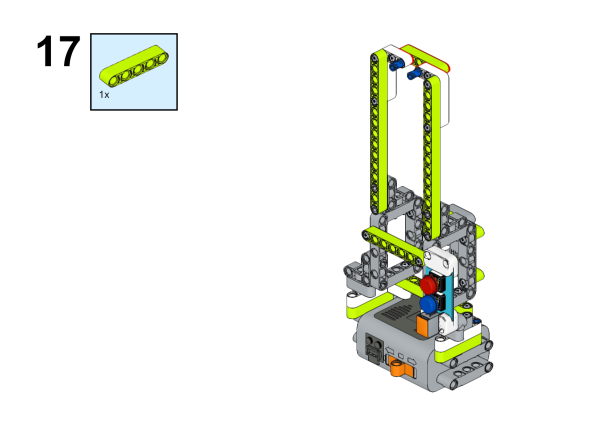
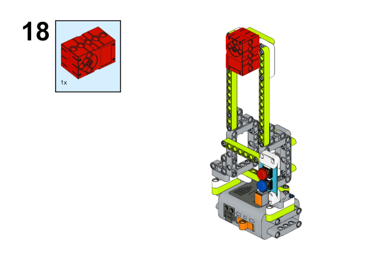
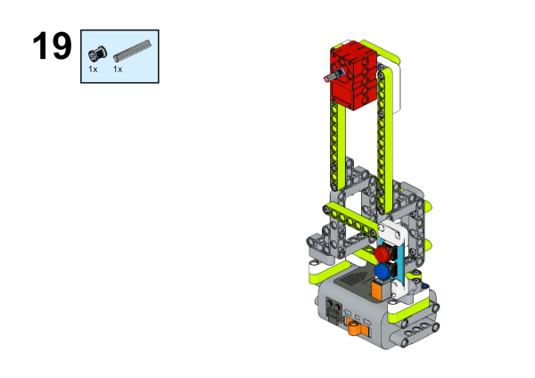
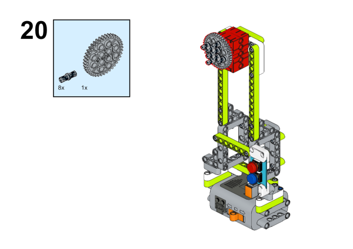
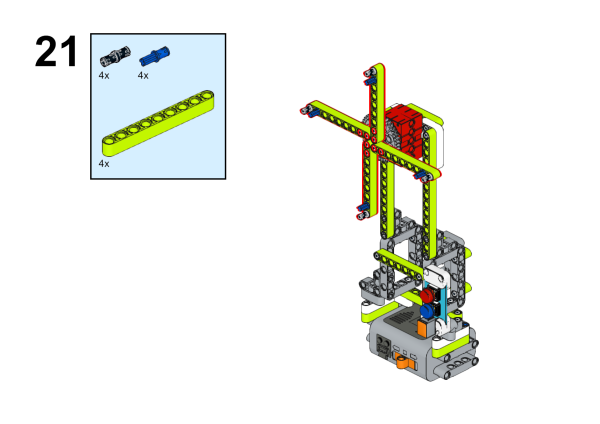
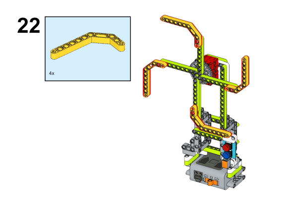
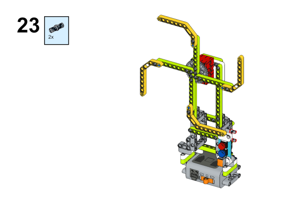
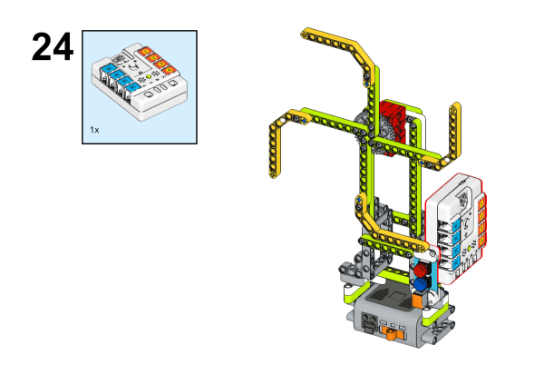

## Hardware Connection
---
Connect the [motor](https://www.elecfreaks.com/geekservo-motor-2kg-compatible-with-lego.html) to M1 and the [two buttons](https://www.elecfreaks.com/planetx-button.html) to J1 port on [Nezha-A master box](https://www.elecfreaks.com/arduino-3-in-1-master-control-box.html). 


## Programming
---
### Prepare the programming

Steps for preparation please refer to: [Arduino 3 in 1 Breakout Board](https://www.elecfreaks.com/learn-en/Arduino-3-in-1-box/Arduino-3-in-1-box.html)

Import the libraries and the subsidiary libraries of [Nezha-A master box](https://www.elecfreaks.com/arduino-3-in-1-master-control-box.html) and then import the libraries of the [two buttons](https://www.elecfreaks.com/planetx-button.html):[PlanetXButton-main.zip](https://github.com/elecfreaks/PlanetXButton/archive/refs/heads/main.zip)
Download and import the self-defined library connections for [Nezha-A master box](https://www.elecfreaks.com/arduino-3-in-1-master-control-box.html): [RJPins-main.zip](https://github.com/elecfreaks/RJPins/archive/refs/heads/main.zip) 

### Sample Code:
```
// Language ArduinoC
#include <RJPins.h>
#include <NezhaA.h>
#include <PlanetXButton.h>

PlanetXButton buttonJ1(J1);    //Create an instance of PlanetXButton category
NezhaA nezhaA;    //Create an instance of NezhaA category

void setup() {
  nezhaA.begin();    //Initiliaze the buzzer, motor, servo and light
}

void loop() {
  if (buttonJ1.isPressed(C)) {    //While button C is pressed
    nezhaA.setMotorSpeed(M1, 100);   //Set the speed of the motor connecting to M1 at 50%
  }
  if (buttonJ1.isPressed(D)) {    //While button D is pressed
    nezhaA.brakeMotor(M1);
  }
}
```

### Result
After powering on, press button C to drive the motor and press button D to stop driving. 
