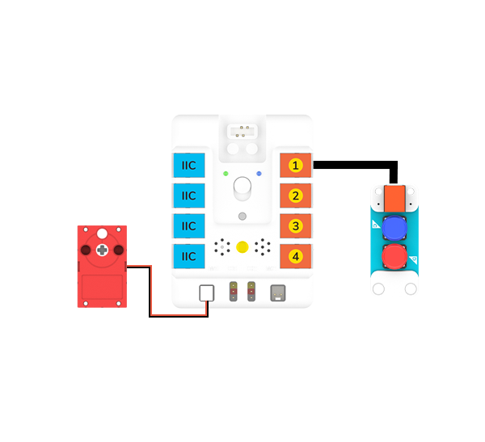

# Case 12: A Handheld Mechanical Claw
## Purpose

Make a handheld mechanical claw with [NezhaA Inventor's Kit](https://www.elecfreaks.com/elecfreaks-nezha-a-inventor-s-kit-for-arduino.html).


## Purchse

 [NezhaA Inventor's Kit](https://www.elecfreaks.com/elecfreaks-nezha-a-inventor-s-kit-for-arduino.html)

## Materials Required


## Assembly Steps


## Hardware Connections

Connect the [motor](https://www.elecfreaks.com/geekservo-motor-2kg-compatible-with-lego.html) to M1 port and the[two buttons](https://www.elecfreaks.com/planetx-button.html) to J1 port on [Nezha-A master box](https://www.elecfreaks.com/arduino-3-in-1-master-control-box.html). 


## Programming

### Prepare the programming

Steps for preparation please refer to: [Arduino 3 in 1 Breakout Board](https://www.elecfreaks.com/learn-en/Arduino-3-in-1-box/Arduino-3-in-1-box.html)

Import the libraries and the subsidiary libraries of [Nezha-A master box](https://www.elecfreaks.com/arduino-3-in-1-master-control-box.html) and then import the libraries of the [two buttons](https://www.elecfreaks.com/planetx-button.html): [PlanetXButton-main.zip](https://github.com/elecfreaks/PlanetXButton/archive/refs/heads/main.zip)

### Sample Code: 

```
// Language ArduinoC
#include <RJPins.h>
#include <NezhaA.h>
#include <PlanetXButton.h>

PlanetXButton buttonJ1(J1);    //Create an instance of PlanetXButton category
NezhaA nezhaA;    // Create an instance of NezhaA category
int flag;    //Create a variable flag to document the status of the claw

void setup() {
  nezhaA.begin();    //Initiliaze the buzzer, motor, servo and light
}

void loop() {
  if ((buttonJ1.isPressed(C)) && (flag == 0)) {    //While button C is pressed and the flag is 0,
    nezhaA.setMotorSpeed(M1, 100);   //Set the speed of the motor connecting to M1 at 100%
    delay((1) * 1000);    //Pause 2000ms
    nezhaA.brakeMotor(M1);    //Stop the motor connecting to M1
    flag = 1;    //Set flag=1, label it as the loose of the claw
  }
  if ((buttonJ1.isPressed(D)) && (flag == 1)) {    //While button D is pressed
    nezhaA.setMotorSpeed(M1, -100);   //Set the speed of the motor connecting to M1 at -100%
    delay((1) * 1000);    //Pause 2000ms
    nezhaA.brakeMotor(M1);    //Stop the motor connecting to M1
    flag = 0;    //Set flag=0, label it as the grasp of the claw
  }
}
```

### Result
Put the claw in a proper position that may grasp the goods, after powering on, press button C and the claw looses the goods; press button D and the claw grasps the goods. 
