# Quick Start

## Power supply method
*Note: The Arduino 3 in 1 breakout board requires a battery pack and cable.*

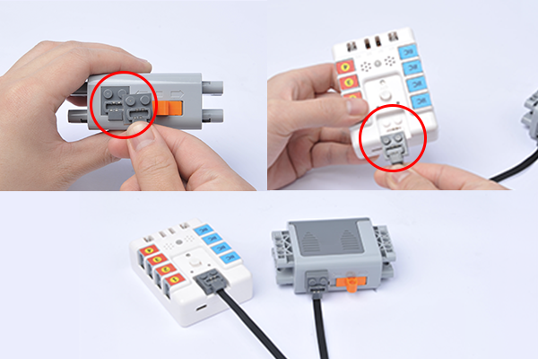

## Switching method
After connecting the power supply, push the switch to ON to turn on the power.

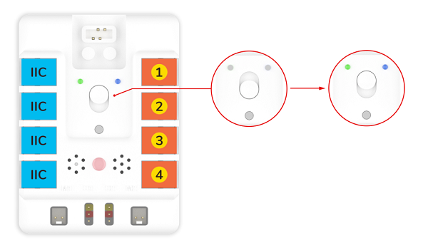

## Power indicator status
The power indicator lights green when there is sufficient power.

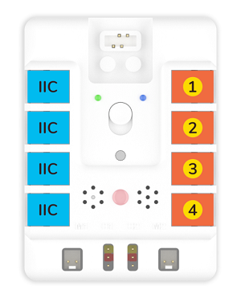

When the power is low, the power indicator lights up red.

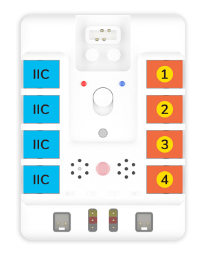

## Hardware connection method
All sensor connections are RJ11 type with error-proof and plug-proof design, simplifying hardware connections and making classroom teaching easier.

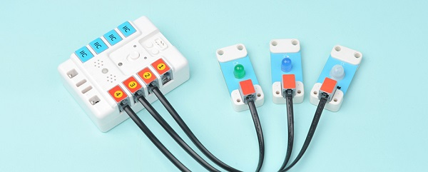

## Preparation for Programming and Sample Projects
### Download and Install Arduino IDE
The latest version of Arduino IDE is released from the official website:  [https://www.arduino.cc/en/Main/Software](https://www.arduino.cc/en/Main/Software), download by the system of your computer. 
<br />
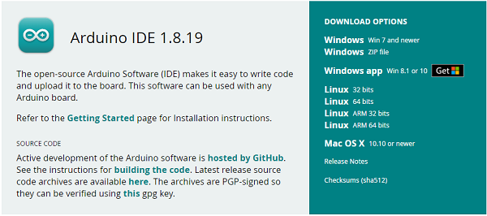

### Software Programming
Download the libraries for Nezha-A master board [NezhaA-main.zip](https://github.com/elecfreaks/NezhaA/archive/refs/heads/main.zip)<br />Download the subsidiary libraries for Nezha-A master board [Adafruit_NeoPixel-master.zip](https://github.com/elecfreaks/MuZa/archive/refs/heads/main.zip)<br />Open Arduino IDE, and choose tools- Board-Arduino Uno.
<br />
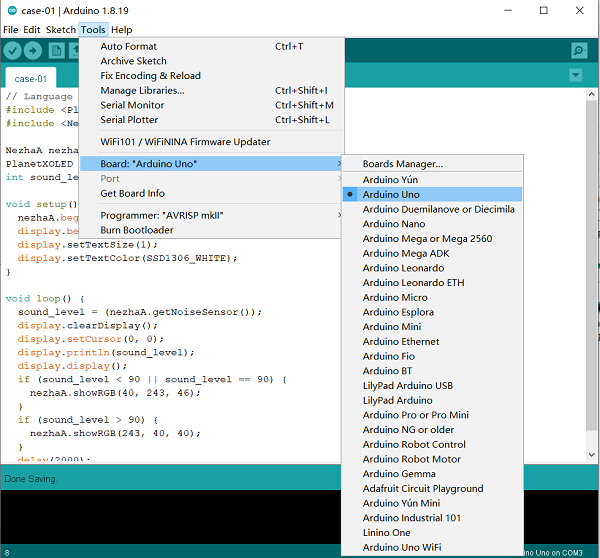
<br />
Connect Nezha-A master board with the computer via the type-c cable. 
<br />
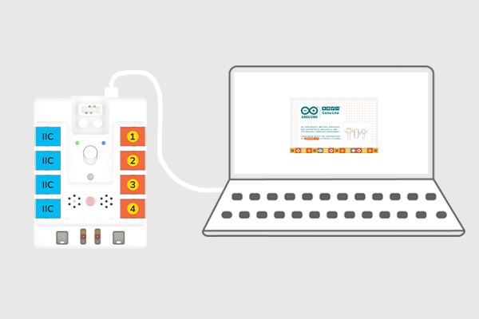
<br />
Click tools- port, and set the connections. 
<br />
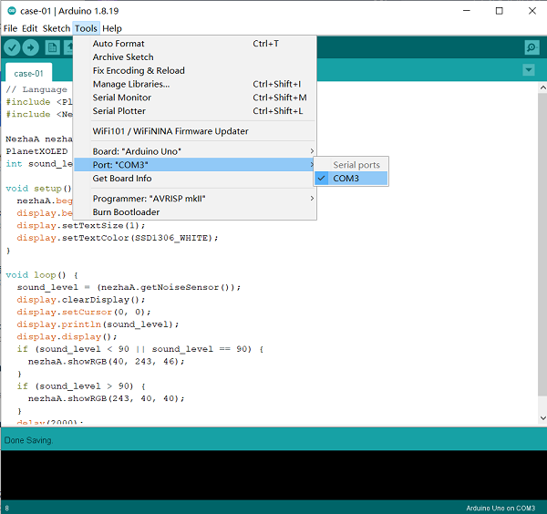
<br />
Click on Project - Load Library - Add .Click.
<br />
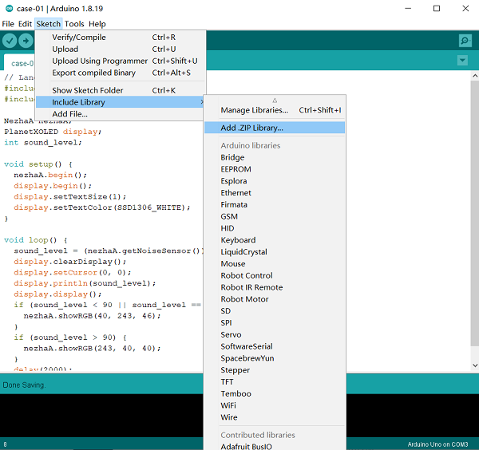
<br />
Select NezhaA-main.zip and add the libraries. 
<br />
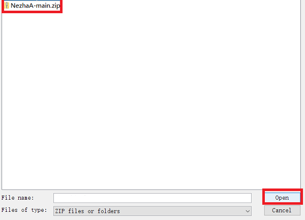
<br />
In the same way, import the subsidiary libraries of Adafruit_NeoPixel-master.zip. 

### Hardware Connections
Connect the motors and servos to M1, M2, S1, and S2 accordingly. 
<br />
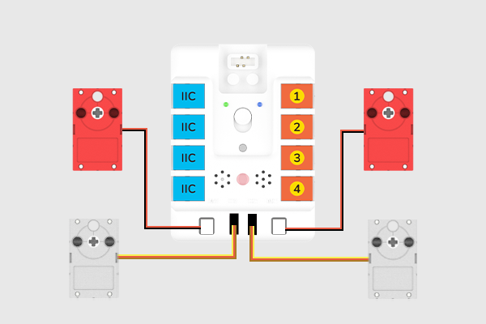

### Programming
### Sample 1: Control the servos and motors
```
#include <MuZa.h>

MuZa muZa;    //Create an instance of the MuZa class

void setup() {
  muZa.begin();    //Initiliaze the buzzer, motor and light
}

void loop() {
  muZa.setMotorSpeed(M1, 60);    //Set the speed of the motors as percentage in the scope of -100~+100
  muZa.setMotorSpeed(M2, 60);
  muZa.setServoAngle(S1, 180);    //Set the angles of the servo
  delay((2) * 1000);
  muZa.setServoAngle(S2, 180);
  delay((2) * 1000);
  muZa.setServoAngle(S1, 0);
  delay((2) * 1000);
  muZa.setServoAngle(S2, 0);
  delay((2) * 1000);
}
```
Click file-save to save the file. 
<br />
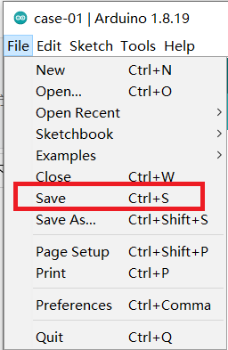
<br />
Set the save routine, give it a name and click save. 
<br />
Click the upload button to upload the program to the Nezha-A master box. 
<br />
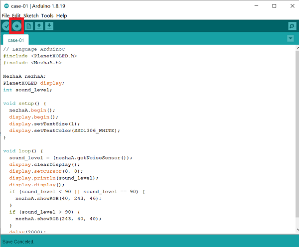

### Result
After powering on, the two motors start driving and the servos drive to the angle as we set in turn. 
### Sample 2: Play melody
```
#include <MuZa.h>

MuZa muZa;    //Create an instance of the MuZa class

void setup() {
  muZa.begin();    //Initiliaze the buzzer, motor, servo and light
  muZa.setTempo(60);    //Set the speed of playing melody via buzzer 
  muZa.tone(262, muZa.beatsToMS(0.25));    //Set notes and beats of melody
  muZa.tone(0, muZa.beatsToMS(0.25));    //Set to stop the buzzer
  muZa.tone(294, muZa.beatsToMS(0.25));
  muZa.tone(0, muZa.beatsToMS(0.25));
  muZa.tone(330, muZa.beatsToMS(0.25));
  muZa.tone(0, muZa.beatsToMS(0.25));
  muZa.tone(349, muZa.beatsToMS(0.25));
  muZa.tone(0, muZa.beatsToMS(0.25));
  muZa.tone(392, muZa.beatsToMS(0.25));
  muZa.tone(0, muZa.beatsToMS(0.25));
  muZa.tone(440, muZa.beatsToMS(0.25));
  muZa.tone(0, muZa.beatsToMS(0.25));
  muZa.tone(494, muZa.beatsToMS(0.25));
  muZa.tone(0, muZa.beatsToMS(0.25));
  muZa.tone(523, muZa.beatsToMS(0.25));
  muZa.tone(0, muZa.beatsToMS(0.25));
  muZa.tone(400, 2000);    //Set the frequency and time for playing buzzer
}

void loop() {
}
```
### Result
When the power is turned on, the buzzer plays a note.

### Sample 3: Light-controlled lamps
```
#include <MuZa.h>

MuZa muZa;    //Create an instance of the MuZa class

void setup() {
  muZa.begin();    //Initialize buzzer, motor, servo, light
}

void loop() {
  if ((muZa.getLightSensor()) < 50) {    //Determine if the return value of the photosensitive sensor is less than 50
    muZa.showRGB(108, 30, 187);    //Set the values of R, G and B of the LED
  } else {
    muZa.clearRGB();    //Clear lighting effects
  }
}
```
### Result
Automatically turns the lights on or off according to the ambient light intensity.

### Sample 4: Voice-controlled lamps
```
#include <MuZa.h>

MuZa muZa;    //Create an instance of the MuZa class

void setup() {
  muZa.begin();    //Initialize buzzer, motor, servo, light
}

void loop() {
  if ((muZa.getNoiseSensor()) > 100) {    //Determine if the return value of the noise sensor is over 100
    muZa.showRGB(108, 30, 187);    //Set the values of R, G and B of the LED
    delay((2) * 1000);    //Delay time 1000ms
  } else {
    muZa.clearRGB();    //Clear lighting effects
  }
}
```

### Result
Automatically turn on or off the lights according to the noise level of the surrounding environment.
