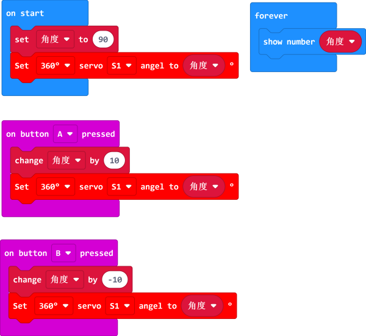

# Safety Instructions

##  Nezha-A  Precautions for Use
Nezha-A Master Control Box is an electronic product and we need to pay attention to the following issues in daily use, please read carefully and be aware of the relevant precautions.

1. Do not use the Nezha-A Control Box while it is being charged. Using the Nezha-A control box while charging will not only shorten the life, but may also cause damage to the product.
2. Do not use detergent or water to clean the Nezha-A main control box. We recommend that you use a cotton cloth moistened with alcohol to scrub it, or use a hair dryer if you still need to clean the interface.
3. Do not stuff paper, dust, chewing gum, etc. into the Nezha-A main control box connector. It is very difficult to clean foreign objects that are in the interface.
4. Do not disassemble or alter in any way the structure of the Nezha-A main control box by yourself.
5. Do not place the Nezha-A master control box near or in a fire as this may cause damage to the product or start a fire.
6. When the Nezha-A Master Control Box is not used for a long time, place it in a clean box and wrap it in a bag to prevent dust from falling into the interface and interfering with your operation. Store the wrapped Nezha-A main control box in a clean, dry environment.
## 360° Gray Block Servo Precautions for Use
For the first time to use the servo,please adjust the angles first before building in case of the possile stuck of the servo, please see the references debugging procedures are as follows:

## Notes on the use of PlanetX series sensors
The planetX series sensors are also electronic components, and the precautions for use are the same as those for items 2, 3, 4, 5, and 6 of the Nezha-A main control box.

