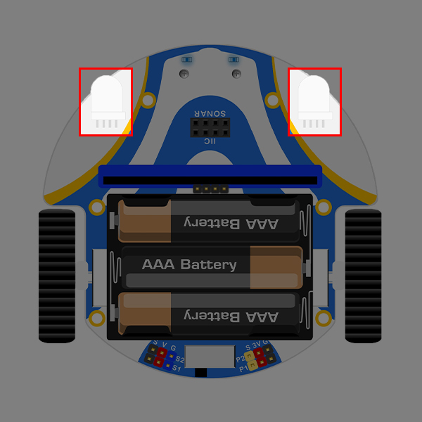

# Introduction to Pico:ed Smart Cutebot kit
## Introduction
ELECFREAKS [Pico:ed Smart Cutebot](https://www.elecfreaks.com/elecfreaks-pico-ed-smart-cutebot-kit-without-pico-ed-board.html)  is a rear-drive smart car driven by dual high speed motors.
There are many on-board equipments on the Pico:ed Smart Cutebot including ultrasonic sensor, two RGB LED headlights, clearance lamps on thebo ttom, two line-tracking probes, an active buzzer as the horn and so on! Let's drive your first smart carELECFREAKS Pico:ed Smart Cutebot is a rear-drive smart car driven by dual high speed motors.

-  High-speed motors, the dual high-speed motors rear drive give powerful power.
-  Compact structure, the rounded shape and anti-collision edges give a comfortable feel.
- Easy to assemble, only need to install battery pack and ultrasonic sound sensor which are convenient and quick to operate.

## Technical parameters

| **Technical category** | **Parameters** |
| --- | --- |
| Support Voltage | 3.5V — 5V |
| Dimensions | 85.68mm X 85.34mm X 38.10mm |
| IR Remote Control | To receive the signals of IR, it connects to P16 |
| RGB Headlight | 2 x RGB lights |
| Rainbow LED | Connect to P15 |
| Interfaces | Servo interface(S1,S2), IIC interface(P19,P20), ultrasonic interface, P1 and P2 (lead out by GVS terminal) |
| Motor type | GA12-N20 miniature DC geared motor |
| Ultrasonic Sound Sensor | HC-SR04(2-400cm non-contact distance sensing, accuracy 3mm) |

## Functional Modules Description
The front of the car is equipped with ultrasonic interface and IIC interface

The front left and right sides are equipped with two RGB full color LED lights, they are controlled by the expansion board.

Three AAA batteries holders are installed right above to drive the whole cart.

The battery pack expansion board is extended with both S1 and S2 servo interfaces and P1 and P2 IO interfaces.

The cart has an infrared receiver at the end (under the battery box) which is connected to the P16 interface.

The cart is equipped with an IIC interface for AI Lens connection.

Next to the infrared receiver at the rear is the car's main power switch, with an LED to indicate the switch status.

The left and right sides are two miniature high-speed DC gear motor-driven wheels, you enjoy the speed of flying!

There are two line trscking probes on the bottom of the cart for detecting black lines and edges, which are connected to P13 and P14 interfaces.

A metal universal wheel is assembled in front of the bottom of the cart, and the cart completes 360 degree omnidirectional driving with the speed difference between the left and right wheels.

Two Rainbow LED full-color light beads are installed on both sides on the bottom board, they are connected to the P15 port and can be used as the car's clearance lamps or other functions.

## 1.6. Parts list

- 1 x Cutebot car
- 1 x Battery box
- 1 x HC-SR04 ultrasonic sound sensor 
- 1 x Line-following map
- 1 x Manual book
