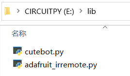

# Preparation for the Programming

## Programming Environment 
In order to program pico:ed, we need to download and install the programming software thonny, and add the library files of pico:ed, please refer to the following steps: [Programming Environment Preparation for Pico:ed V2](https://www.elecfreaks.com/learn-en/pico-ed/pico_ed_v2_python.html)。
## Download the circuitpython_cutebot library
After preparing the Pico:ed library, you also need to prepare the circuitpython_cutebot and CircuitPython_IRRemote library files.
Download from [circuitpython_cutebot-main.zip](https://github.com/elecfreaks/circuitpython_cutebot/archive/refs/heads/main.zip) and unzip them, copy cutebot.py file in the lib folder under the CIRCUITPY folder.
Download from [Adafruit_CircuitPython_IRRemote-main.zip](https://github.com/adafruit/Adafruit_CircuitPython_IRRemote/archive/refs/heads/main.zip) and unzip them, and copy the adafruit_irremote.py file in the lib folder under the CIRCUITPY folder.

## Usage for circuitpython_cutebot library
For specific usage of the related operation classes and functions about circuitpython, please refer to: 
