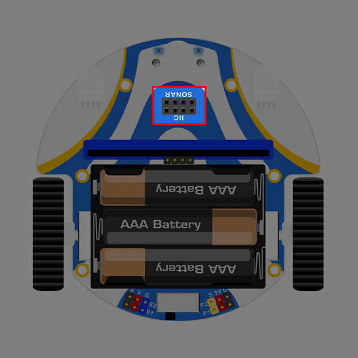

# Case 07: The Obstacle Avoidance Car

## Introduction
Make [Cutebot](https://www.elecfreaks.com/elecfreaks-pico-ed-smart-cutebot-kit-with-pico-ed-board.html) drive forward and turn automatically when it meets an obstacle.
## Hardware Installation
Insert the ultrasonic sensor into the connector of **Sonar**.
**Note: When you install the ultrasonic sensor, you cannot plug it into the IIC interface. If you plug it into the IIC interface, the Cutebot won't work and the ultrasonic sensor heats up. **


## Programming Preparation
Please refer to: [Preparing Programming Environment](https://www.yuque.com/elecfreaks-learn/picoed/gccnpl)
## Sample code
```python
from cutebot import *
import time

# Create a sample for Cutebot category
cutebot = Cutebot()    

# While true, keep reading the returned value detected from the ultrasonic sound sensor. 
# When there is no obstacle in front of the Cutebot, the Cutebot smart car moves forward at 50% speed
# When there is an obstacle in front of the Cutebot smart car, set the left wheel speed to 50% and the right wheel speed to -50%
while True:
    distance = cutebot.get_distance(Unit.cm)
    if distance > 3 and distance < 20:
        cutebot.set_speed(50,-50)
        time.sleep(0.5)
    else:
        cutebot.set_speed(50,50)
```
### Code details

1. Import the modules that we need for the program: `cutebot` module contains classes and functions that operate on the Cutebot smart car, and `time` module contains classes and functions that operate on time.
```python
from cutebot import *
import time
```

2. Create a sample for Cutebot category.
```python
cutebot = Cutebot()
```

3. While true, keep reading the returned value detected from the ultrasonic sound sensor. 
   When there is no obstacle in front of the Cutebot, the Cutebot smart car moves forward at 50% speed.

   When there is an obstacle in front of the Cutebot smart car, set the left wheel speed to 50% and the right wheel speed to -50%.
```python
while True:
    distance = cutebot.get_distance(Unit.cm)
    if distance > 3 and distance < 20:
        cutebot.set_speed(50,-50)
        time.sleep(0.5)
    else:
        cutebot.set_speed(50,50)
```
## Results
After turning on the power, the Cutebot travels on a random trajectory and automatically lights up the turn signal according to the direction the smart car is traveling.

## Exploration
When the speed of the left and right wheels is the same, how can we program the two headlights of the Cutebot smart car to light up at the same time?
