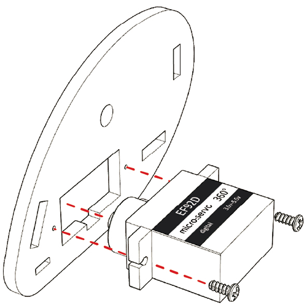

# Assembly 
## Introduction
---
Hello, now it's time for us to do the assembly. We're going to assemble the [Ring:bit](https://www.elecfreaks.com/elecfreaks-micro-bit-ring-bit-v2-car-kit-without-micro-bit-board.html) smart car step by step in this wiki. Let's get started with your nimple hands!

## [Ring:bit](https://www.elecfreaks.com/elecfreaks-micro-bit-ring-bit-v2-car-kit-without-micro-bit-board.html) Car V2 Components List
---
First of all, these two pictures below are the parts diagram of [Ring:bit](https://www.elecfreaks.com/elecfreaks-micro-bit-ring-bit-v2-car-kit-without-micro-bit-board.html) smart car, you can first familiarize yourself with the parts style and name, and then check if your kit has all the parts inside.

## Assembly Step

---
### Step-1

Fisrt, use the tapping screw to fix the servo to the side board.(as below pictures)

Then, use the screw to fix the wheel to the servo.(as below pictures)

### Step-2

Use the rivet to install the castor wheel on the chassis.

### Step-3

Assemble the front board, the back board and the base board to the side board as below picture.

### Step-4

Use the binding post to fix all installed components.

### Step-5

Use the screw to fix the [Ring:bit](https://www.elecfreaks.com/elecfreaks-micro-bit-ring-bit-v2-car-kit-without-micro-bit-board.html) to the micro:bit board.

### Step-6

Connecting wire as below pictures, you can connect the pins as you wish but make sure the programming be consistent with the connectons. 

Note: No matter which connection you use, make sure the yellow line connects with the number pins(0/1/2).

### Completed

Fix the assembled [Ring:bit](https://www.elecfreaks.com/elecfreaks-micro-bit-ring-bit-v2-car-kit-without-micro-bit-board.html) to the front board.

Congratulations, with your great assembly skills and continued hard work, you have finally assembled the [Ring:bit](https://www.elecfreaks.com/elecfreaks-micro-bit-ring-bit-v2-car-kit-without-micro-bit-board.html) car. In the next lesson, let's experience a new journey together by writing code to drive the [Ring:bit](https://www.elecfreaks.com/elecfreaks-micro-bit-ring-bit-v2-car-kit-without-micro-bit-board.html) smart car.
