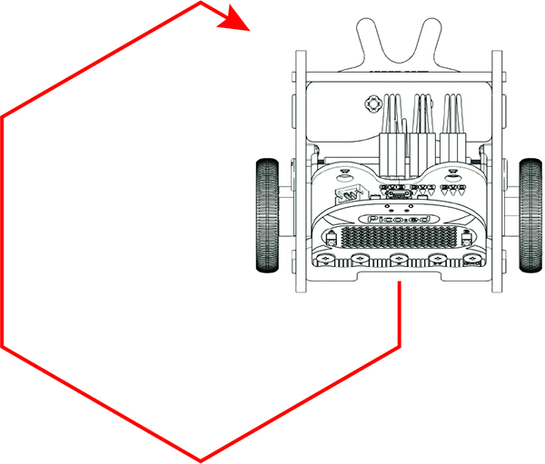
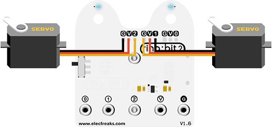

# Case 02: Make A Shape



## Introduction
---

Hi, after the learn of the first lesson, I am sure you understand the programming for [Ring:bit](https://www.elecfreaks.com/elecfreaks-micro-bit-ring-bit-v2-car-kit-without-micro-bit-board.html) car in a quite simple way, let's move on by making the car run along with a shape. 

## Hardware Connection

Just as what we do in the first lesson, connect the left wheel servo to P1 of the [Ring:bit](https://www.elecfreaks.com/elecfreaks-micro-bit-ring-bit-v2-car-kit-without-micro-bit-board.html) expansion board and the right wheel servo to P2.



## Software Programming
---

You should prepare the programming platform ready, if not, please can refer to this essay: [Preparation for programming](https://www.elecfreaks.com/learn-en/pico-ed/index.html)

### Sample Projects

```python
# Import the modules that we need
import board
from ringbit import *
from picoed import *
from time import *

# Set the pins of the servos
ringbit = Ringbit(board.P2, board.P1)

# While true, set the [Ring:bit](https://www.elecfreaks.com/elecfreaks-micro-bit-ring-bit-v2-car-kit-without-micro-bit-board.html) car run along with a square-like routine
while True:
    ringbit.set_speed(-100, -100)
    sleep(1.5)
    ringbit.set_speed(-50, 0)
    sleep(1.2)
```
### Details of program:

1. Import the modules that we need. `board` is the common container, and you can connect the pins you'd like to use through it; `ringbit` module contains classes and functions for [Ring:bit](https://www.elecfreaks.com/elecfreaks-micro-bit-ring-bit-v2-car-kit-without-micro-bit-board.html) smart car operation;  `picoed` module contains the operation functions to button A/B and `time` module contains the operation functions to time. 

   ```python
   import board
   from ringbit import *
   from picoed import *
   from time import *
   ```

2. Set the pins of the servos.

   ```python
   ringbit = Ringbit(board.P2, board.P1)
   ```

3. Set the [Ring:bit](https://www.elecfreaks.com/elecfreaks-micro-bit-ring-bit-v2-car-kit-without-micro-bit-board.html) car run along with a square-like routine.

   ```python
   while True:
       ringbit.set_speed(-100, -100)
       sleep(1.5)
       ringbit.set_speed(-50, 0)
       sleep(1.2)
   ```

   
## Result

The car runs along with a square-like routine. 

<iframe width="560" height="315" src="https://www.youtube.com/embed/htsOxCZe_Nw" title="YouTube video player" frameborder="0" allow="accelerometer; autoplay; clipboard-write; encrypted-media; gyroscope; picture-in-picture" allowfullscreen></iframe>

## Exploration

If we want the [Ring:bit](https://www.elecfreaks.com/elecfreaks-micro-bit-ring-bit-v2-car-kit-without-micro-bit-board.html) car to travel with a square pentagon routine, how can we program it?

## FAQ

## Relevant Files
