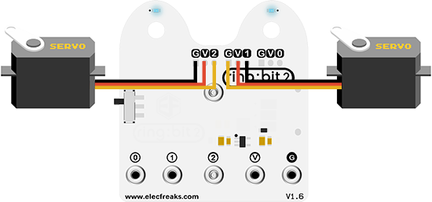

# Case 03: Turn at An Angle


## Introduction
---

Hello, we've learnt how to run a shape in case 02, but how can we draw a circle with the [Ring:bit](https://www.elecfreaks.com/elecfreaks-micro-bit-ring-bit-v2-car-kit-without-micro-bit-board.html) car? Let's start this case with the question. 

## Hardware Connection

Also with the same assembly steps with former practices, connect the left wheel servo to P1 of the [Ring:bit](https://www.elecfreaks.com/elecfreaks-micro-bit-ring-bit-v2-car-kit-without-micro-bit-board.html) board and the right wheel servo to P2.



Use a rubber band to fix a pencil on the base board of the [Ring:bit](https://www.elecfreaks.com/elecfreaks-micro-bit-ring-bit-v2-car-kit-without-micro-bit-board.html) car.


## Software Programming

---

You should prepare the programming platform ready, if not, please can refer to this essay: [Preparation for programming](https://www.elecfreaks.com/learn-en/pico-ed/index.html)

### Sample Projects

```python
# Import the modules that we need
import board
from ringbit import *
from picoed import *

# Set the pins of the servos
ringbit = Ringbit(board.P2, board.P1)

# While true, detect if button A/B is pressed to make the [Ring:bit](https://www.elecfreaks.com/elecfreaks-micro-bit-ring-bit-v2-car-kit-without-micro-bit-board.html) car drive the circle or stop. 
while True:
    if button_a.is_pressed():
        ringbit.set_speed(-100, -50)
    elif button_b.is_pressed():
        ringbit.set_speed(0, 0)

```

### Details of program:

1. Import the modules that we need. `board` is the common container, and you can connect the pins you'd like to use through it; `ringbit` module contains classes and functions for [Ring:bit](https://www.elecfreaks.com/elecfreaks-micro-bit-ring-bit-v2-car-kit-without-micro-bit-board.html) smart car operation;  `picoed` module contains the operation functions to button A/B. 

   ```python
   import board
   from ringbit import *
   from picoed import *
   ```

2. Set the pins of the servos.

   ```python
   ringbit = Ringbit(board.P2, board.P1)
   ```

3. While true, detect if button A/B is pressed to make the [Ring:bit](https://www.elecfreaks.com/elecfreaks-micro-bit-ring-bit-v2-car-kit-without-micro-bit-board.html) car drive the circle or stop. 

   ```python
   while True:
       if button_a.is_pressed():
           ringbit.set_speed(-100, -50)
       elif button_b.is_pressed():
           ringbit.set_speed(0, 0)
   ```

   

## Result

On button A pressed, the car draws a circle.

On button B pressed, stop the car.

<iframe width="560" height="315" src="https://www.youtube.com/embed/fEO9EPXERHM" title="YouTube video player" frameborder="0" allow="accelerometer; autoplay; clipboard-write; encrypted-media; gyroscope; picture-in-picture" allowfullscreen></iframe>

## Exploration

How can you make your car draw a figure of eight?

## FAQ

## Relevant Files
