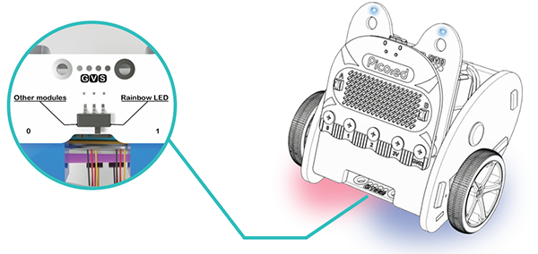
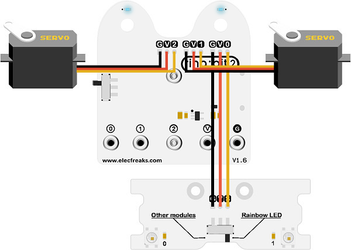
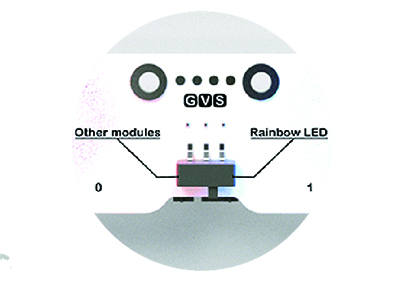

# Case 04: Here Comes the Police



## Introduction
---

Hello, the police cars are quite cool with the dazzling light colors, sometimes we might even want to drive it, from this lesson it helps to give us an experience of driving "police car". 

## Hardware Connection

Connect the left wheel servo to P1 of the [Ring:bit](https://www.elecfreaks.com/elecfreaks-micro-bit-ring-bit-v2-car-kit-without-micro-bit-board.html) expansion board and the right wheel servo to P2.

Connect the [Ring:bit](https://www.elecfreaks.com/elecfreaks-micro-bit-ring-bit-v2-car-kit-without-micro-bit-board.html) car special expansion board to the P0.



Slide the clip switch of the special expansion board to the Rainbow LED.



## Software Programming

---

You should prepare the programming platform ready, if not, please can refer to this essay: [Preparation for programming](https://www.yuque.com/elecfreaks-learn/picoed/gxro38)

### Sample Projects

```python
# Import the modules that we need
import board
from ringbit import *
from time import *
from picoed import *

# Set the pins of the servos and the pins and directions of the expansion board
ringbit = Ringbit(board.P1, board.P2)
ringbit.init_rainbow_leds(board.P0, 2)

for x in range(display.width):
    display.pixel(x, 0, 50)
    display.pixel(x, display.height - 1, 50)
    
for y in range(display.height):
    display.pixel(0, y, 50)
    display.pixel(display.width - 1, y, 50)

# While true, change the value of the two LEDs at random, detect if button A/B is pressed to control the speed of the car
while True:
    ringbit.rainbow_leds[0] = (0, 255, 0)
    ringbit.rainbow_leds[1] = (0, 0, 255)
    sleep(0.5)
    ringbit.rainbow_leds[0] = (0, 0, 255)
    ringbit.rainbow_leds[1] = (0, 255, 0)
    sleep(0.5)
    if button_a.is_pressed():
        ringbit.set_speed(0, 0)
    elif button_b.is_pressed():
        ringbit.set_speed(100, 100)

```
### Details of program:

1. Import the modules that we need. `board` is the common container, and you can connect the pins you'd like to use through it; `ringbit` module contains classes and functions for [Ring:bit](https://www.elecfreaks.com/elecfreaks-micro-bit-ring-bit-v2-car-kit-without-micro-bit-board.html) smart car operation;  `picoed` module contains the operation functions to button A/B; the `time` module contains functions for operating on time, the `digitalio` module contains classes for basic digital IO access, and `neopixel_write` contains functions for operating on light strips.

   ```python
   import board
   from ringbit import *
   from time import *
   from picoed import *
   ```

   

2. Set the pins of the servos and the pins and directions of the expansion board.

   ```python
   ringbit = Ringbit(board.P1, board.P2)
   ringbit.init_rainbow_leds(board.P0, 2)
   ```

   

3. draw a box on the screen.

   ```python
   for x in range(display.width):
       display.pixel(x, 0, 50)
       display.pixel(x, display.height - 1, 50)
   for y in range(display.height):
       display.pixel(0, y, 50)
       display.pixel(display.width - 1, y, 50)
   ```

4. While true, change the value of the two LEDs at random.

   ```python
   while True:
       ringbit.rainbow_leds[0] = (0, 255, 0)
       ringbit.rainbow_leds[1] = (0, 0, 255)
       sleep(0.5)
       ringbit.rainbow_leds[0] = (0, 0, 255)
       ringbit.rainbow_leds[1] = (0, 255, 0)
       sleep(0.5)
   ```

   

5. Detect if button A/B is pressed to control the speed of the car.

   ```python
       if button_a.is_pressed():
           ringbit.set_speed(0, 0)
       elif button_b.is_pressed():
           ringbit.set_speed(100, 100)
   ```

   

## Result

Press button A, the car stops moving and the light keeps changing;

Press button B, the car moves forward at the full speed with the LEDs on the bottom board keeps flashing in different colors. 

<iframe width="560" height="315" src="https://www.youtube.com/embed/fEO9EPXERHM" title="YouTube video player" frameborder="0" allow="accelerometer; autoplay; clipboard-write; encrypted-media; gyroscope; picture-in-picture" allowfullscreen></iframe>

## Exploration

How do you code to make your car flash the yellow and white emergency warning lights?

## FAQ

## Relevant Files
