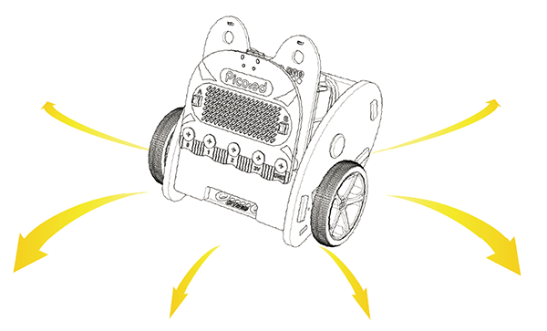

# Case 05: Crazy Dance



## Introduction

Hello, the [Ring:bit](https://www.elecfreaks.com/elecfreaks-micro-bit-ring-bit-v2-car-kit-without-micro-bit-board.html) car is a powerful kit that can do a lot of things after the 4 former cases, here we will do a relatively simple thing, which is to make a dance car. 

## Hardware Connection

Connect the left wheel servo to P1 of the [Ring:bit](https://www.elecfreaks.com/elecfreaks-micro-bit-ring-bit-v2-car-kit-without-micro-bit-board.html) expansion board and the right wheel servo to P2.

## Software Programming

---

You should prepare the programming platform ready, if not, please can refer to this essay: [Preparation for programming](https://www.elecfreaks.com/learn-en/pico-ed/index.html)

### Sample Projects

```python
# Import the modules that we need
import board
from random import *
from ringbit import *

# Set the pins of the servos
ringbit = Ringbit(board.P2, board.P1)

# Set the speed value of the both wheels as the random value among (-100， 100)
while True:
    left_wheel = randint(-100, 100)
    right_wheel = randint(-100, 100)
    ringbit.set_speed(left_wheel, right_wheel)
```

### Details of program:

1.Import the modules that we need. `board` is the common container, and you can connect the pins you'd like to use through it; `ringbit` module contains classes and functions for [Ring:bit](https://www.elecfreaks.com/elecfreaks-micro-bit-ring-bit-v2-car-kit-without-micro-bit-board.html) smart car operation and the `random` module contains functions to generate random numbers.

```python
import board
from random import *
from ringbit import *
```

2.Set the pins of the servos
```python
ringbit = Ringbit(board.P2, board.P1)
```

3.Set the speed value of the both wheels as the random value among (-100， 100)
```python
while True:
    left_wheel = randint(-100, 100)
    right_wheel = randint(-100, 100)
    ringbit.set_speed(left_wheel, right_wheel)
```
## Result

The car runs at different speed.

<iframe width="560" height="315" src="https://www.youtube.com/embed/-gWBk3IHrqg" title="YouTube video player" frameborder="0" allow="accelerometer; autoplay; clipboard-write; encrypted-media; gyroscope; picture-in-picture" allowfullscreen></iframe>

## Exploration

Design a set of the actions for [Ring:bit](https://www.elecfreaks.com/elecfreaks-micro-bit-ring-bit-v2-car-kit-without-micro-bit-board.html) car with your ideas. 

## FAQ

## Relevant Files
