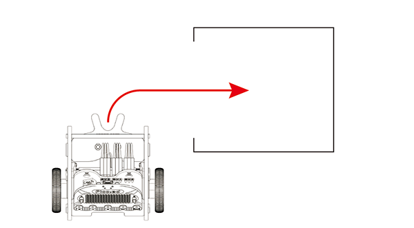

# Case06 Reverse Stall Parking



## Introduction

 Hello, we have programmed the [Ring:bit](https://www.elecfreaks.com/elecfreaks-micro-bit-ring-bit-v2-car-kit-without-micro-bit-board.html) car to do a lot of things, we can also make it automatically drive to the parking lot. In this lesson, we will program to reverse the [Ring:bit](https://www.elecfreaks.com/elecfreaks-micro-bit-ring-bit-v2-car-kit-without-micro-bit-board.html) car into the garage, let's start.

## Hardware Connection
Connect the left wheel servo to P1 of the [Ring:bit](https://www.elecfreaks.com/elecfreaks-micro-bit-ring-bit-v2-car-kit-without-micro-bit-board.html) expansion board and the right wheel servo to P2.


## Software Programming

You should prepare the programming platform ready, if not, please can refer to this essay:[Preparation for programming](https://www.yuque.com/elecfreaks-learn/picoed/gxro38)

### Sample Projects

```python
# Import the modules that we need
import board
from ringbit import *
from picoed import *
from time import *

# Set the pins of the servos
ringbit = Ringbit(board.P2, board.P1)

# While true, set to change the speed of both wheels by pressing button A/B on pico:ed
while True:
    if button_a.is_pressed():
        ringbit.set_speed(-100, -60)
        sleep(3)
        ringbit.set_speed(0, 0)
    elif button_b.is_pressed():
        ringbit.set_speed(100, 60)
        sleep(3)
        ringbit.set_speed(0, 0)
```
### Details of program:

1. Import the modules that we need. `board` is the common container, and you can connect the pins you'd like to use through it; `ringbit` module contains classes and functions for [Ring:bit](https://www.elecfreaks.com/elecfreaks-micro-bit-ring-bit-v2-car-kit-without-micro-bit-board.html) smart car operation and the `random` module contains functions to generate random numbers.

   ```python
   import board
   from ringbit import *
   from picoed import *
   from time import *
   ```

2. Set the pins of the servos.

   ```python
   ringbit = Ringbit(board.P2, board.P1)
   ```

3. Set to change the speed of both wheels by pressing button A/B on pico:ed.

   ```python
   while True:
       if button_a.is_pressed():
           ringbit.set_speed(-100, -60)
           sleep(3)
           ringbit.set_speed(0, 0)
       elif button_b.is_pressed():
           ringbit.set_speed(100, 60)
           sleep(3)
           ringbit.set_speed(0, 0)while True:
   ```

   

## Result

Achieve the functions of reversing stall parking and driving away by pressing buttons A/B on Pico:ed. 

 <iframe width="560" height="315" src="https://www.youtube.com/embed/47CdNDNtrmw" title="YouTube video player" frameborder="0" allow="accelerometer; autoplay; clipboard-write; encrypted-media; gyroscope; picture-in-picture" allowfullscreen></iframe>

## Exploration
How can make the [Ring:bit](https://www.elecfreaks.com/elecfreaks-micro-bit-ring-bit-v2-car-kit-without-micro-bit-board.html) car move forward and then reverse stall parking?

## FAQ

## Relevant Files
