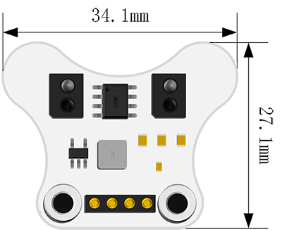

# Expansion：Line-following Module

## Introduction
---

[Ring:bit](https://shop.elecfreaks.com/products/elecfreaks-pico-ed-ring-bit-v2-car-kit-with-pico-ed-board?_pos=2&_sid=18032a345&_ss=r) car V2 line following module is a dedicated module designed for the [Ring:bit](https://shop.elecfreaks.com/products/elecfreaks-pico-ed-ring-bit-v2-car-kit-with-pico-ed-board?_pos=2&_sid=18032a345&_ss=r) car V2, it is easy to be installed to achieve the line following function for the [Ring:bit](https://shop.elecfreaks.com/products/elecfreaks-pico-ed-ring-bit-v2-car-kit-with-pico-ed-board?_pos=2&_sid=18032a345&_ss=r) car V2.

Equipped with double infrared probes, it can detect the distance between 2~12mm accurately and it can achieve the function of line following around the circles, the detection of the black lines and the detection of the edge.

## Features

The micro:bit can drive it directly with the input voltage of this module in 3V~5V.

It only needs one IO port it with standard 3-pin GVS ports.

It uses the infrared light to detect with a strong anti-interference capability.

## Parameter
| Items                  | Parameter                             | Notes           |
| --- | --- | --- |
| Name                   | [Ring:bit](https://shop.elecfreaks.com/products/elecfreaks-pico-ed-ring-bit-v2-car-kit-with-pico-ed-board?_pos=2&_sid=18032a345&_ss=r) car V2 line following module | -               |
| SKU                    | **EF03424**                           | -               |
| Working Voltage        | DC 3-5V                               | -               |
| Port                   | [Ring:bit](https://shop.elecfreaks.com/products/elecfreaks-pico-ed-ring-bit-v2-car-kit-with-pico-ed-board?_pos=2&_sid=18032a345&_ss=r) car dedicated pin ports | Fixed by screws |
| Types of Output Signal | Simulation                            | -               |
| Effective Distance     | 2~12mm                                | -               |
| Dimension              | 34.15 x 27.20mm                       | -               |
| Net Weight             | 4.7g                                  | - |

## Outlook and Dimensions




---

## Quick to Start

### Hardware Connections

The first step is to insert this module to the baseboard of the [Ring:bit](https://shop.elecfreaks.com/products/elecfreaks-pico-ed-ring-bit-v2-car-kit-with-pico-ed-board?_pos=2&_sid=18032a345&_ss=r) car V2,The next step is to fix the module with the two screws,Completed.

<iframe width="560" height="315" src="https://www.youtube.com/embed/TvnA8Abie5E" title="YouTube video player" frameborder="0" allow="accelerometer; autoplay; clipboard-write; encrypted-media; gyroscope; picture-in-picture" allowfullscreen></iframe>

## Programming
---
Preparation for Programming: [Info](https://www.elecfreaks.com/learn-en/pico-ed/index.html)

### Sample Code

```python
# Import modules that we need
import board
from ringbit import *
from time import *

# Set the pins of both wheels
ringbit = Ringbit(board.P1, board.P2)

# Set the speed of the cars
ringbit.set_speed(100, 100)

# Read the value from the line-following module and set the speed to be controlled with the values. 
while True:
    value = ringbit.get_tracking(board.P0)
    if value == 10:
        ringbit.set_speed(0, 100)
        sleep(0.1)
    elif value == 01:
        ringbit.set_speed(100, 0)
        sleep(0.1)
    elif value == 11:
        ringbit.set_speed(100, 100)
        sleep(0.1)
```

### Details of the Code

1.Import the modules that we need. `board` is the common container, and you can connect the pins you'd like to use through it; `ringbit` module contains classes and functions for [Ring:bit](https://shop.elecfreaks.com/products/elecfreaks-pico-ed-ring-bit-v2-car-kit-with-pico-ed-board?_pos=2&_sid=18032a345&_ss=r) smart car operations, the `time` module contains functions for time operations.

```python
import board
from ringbit import *
from time import *
```

2.Set the pins of both wheels
```python
ringbit = Ringbit(board.P1, board.P2)
```

3.Set the speed of the car
```python
ringbit.set_speed(100, 100)
```

4.Read the value from the line-following sensor and set the value of speed according to the value. 
```python
while True:
    value = ringbit.get_tracking(board.P0)
    if value == 10:
        ringbit.set_speed(0, 100)
        sleep(0.1)
    elif value == 01:
        ringbit.set_speed(100, 0)
        sleep(0.1)
    elif value == 11:
        ringbit.set_speed(100, 100)
        sleep(0.1)
```
### Result

The car could run along with the map through this sensor, does your [Ring:bit](https://shop.elecfreaks.com/products/elecfreaks-pico-ed-ring-bit-v2-car-kit-with-pico-ed-board?_pos=2&_sid=18032a345&_ss=r) car look the same as the following picture suggests? 

<iframe width="560" height="315" src="https://www.youtube.com/embed/cbKEO6snbjM" title="YouTube video player" frameborder="0" allow="accelerometer; autoplay; clipboard-write; encrypted-media; gyroscope; picture-in-picture" allowfullscreen></iframe>

## Exploration 

## FAQ

## For more details, please visit:

[ELECFREAKS WIKI](https://www.elecfreaks.com/learn-en/)
