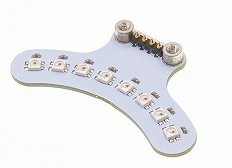
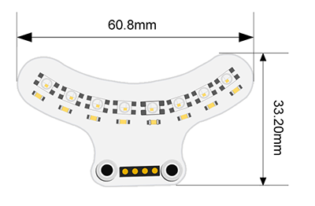

# Expansion：Rainbow LED Ligth Bar Module

## Introduction
[Ring:bit](https://www.elecfreaks.com/elecfreaks-micro-bit-ring-bit-v2-car-kit-without-micro-bit-board.html) car V2 light-bar module is the dedicated module designed for [Ring:bit](https://www.elecfreaks.com/elecfreaks-micro-bit-ring-bit-v2-car-kit-without-micro-bit-board.html) Car V2. It brings you mutiple color with simple assemblling methods.

It comes with 8 Rainbow full color LEDs. You can update it to a car with auto-headlights and rainbow lights.



## Features

Input voltage 3V~5V，driving directly by micro:bit.

Standard 3 line GVS port, occupying only one I/O port.

8 small LEDs, power saving and energy saving.

Each led can be programmed seperately with RGB color.

## Parameter

| Items | Parameter | Note |
| --- | --- | --- |
| Name | [Ring:bit](https://www.elecfreaks.com/elecfreaks-micro-bit-ring-bit-v2-car-kit-without-micro-bit-board.html) Car v2 ligth bar |  |
| SKU | EF03425 |  |
| Working Voltage | DC 3-5V |  |
| Connections | [Ring:bit](https://www.elecfreaks.com/elecfreaks-micro-bit-ring-bit-v2-car-kit-without-micro-bit-board.html) Car dedicated pin ports | Fixed with scews |
| Output Signal   | Simulation                       |                  |
| LEDs            | 8 units                          |                  |
| Size            | 60.8×33.20mm                     |                  |
| NW              | 5.7g                             |  |

## Outlook and Dimensions



---

## Quick to Start

### Hardware Connections

First, insert this module to the baseboard of the [Ring:bit](https://www.elecfreaks.com/elecfreaks-micro-bit-ring-bit-v2-car-kit-without-micro-bit-board.html) car V2,Fix with the screws,Completed.

<iframe width="560" height="315" src="https://www.youtube.com/embed/h08lXLCV2nQ" title="YouTube video player" frameborder="0" allow="accelerometer; autoplay; clipboard-write; encrypted-media; gyroscope; picture-in-picture" allowfullscreen></iframe>

## Programming

Preparation for programming: [Introduction](https://www.yuque.com/elecfreaks-learn/picoed/er7nuh)

### Sample Code

```python
# Import the modules we need: 
import board
from ringbit import *
from digitalio import *
from neopixel_write import *
from time import *
from random import *

# Set the pins and directions of the wheels and the light bar
ringbit = Ringbit(board.P1, board.P2)
pin = DigitalInOut(board.P0)
pin.direction = Direction.OUTPUT

# Set the speed of the car
ringbit.set_speed(100, 100)

# While true, change the color of the light bar
while True:
    rings = []
    for i in range(30):
        rings.append(randint(0, 255))
    neopixel_write(pin, bytearray(rings))
    sleep(0.1)
```

### Details of the Program: 

1. Import the modules that we need. `board` is the common container, and you can connect the pins you'd like to use through it; `ringbit` module contains classes and functions for [Ring:bit](https://www.elecfreaks.com/elecfreaks-micro-bit-ring-bit-v2-car-kit-without-micro-bit-board.html) smart car operations, the `time` module contains functions for time operations, the `digitalio` module contains classes for basic digital IO access, the `neopixel_write` module contains functions for strip operations, and the `random` module contains functions that can return random numbers
```python
import board
from ringbit import *
from digitalio import *
from neopixel_write import *
from time import *
from random import *
```

2. Set the pins of the servos and the pins and directions of the breakout board. 
```python
ringbit = Ringbit(board.P1, board.P2)
pin = DigitalInOut(board.P0)
pin.direction = Direction.OUTPUT
```

3. Set the speed of the car
```python
ringbit.set_speed(100, 100)
```

4. While true, change the RGB value of each LED in the light bar to detect if the A\B button is pressed to set the speed of the left and right wheels of the [Ring:bit](https://www.elecfreaks.com/elecfreaks-micro-bit-ring-bit-v2-car-kit-without-micro-bit-board.html) smart car
```python
while True:
    rings = []
    for i in range(30):
        rings.append(randint(0, 255))
    neopixel_write(pin, bytearray(rings))
    sleep(0.1)
```

## Result
The two lights on the bottom of the [Ring:bit](https://www.elecfreaks.com/elecfreaks-micro-bit-ring-bit-v2-car-kit-without-micro-bit-board.html) car as well as the light bar change colour randomly to give a colourful effect; press A to move the car forward at full speed, press B to stop the car.

<iframe width="560" height="315" src="https://www.youtube.com/embed/MzSyhNCl7n4" title="YouTube video player" frameborder="0" allow="accelerometer; autoplay; clipboard-write; encrypted-media; gyroscope; picture-in-picture" allowfullscreen></iframe>

## FAQ
## Relevant File
