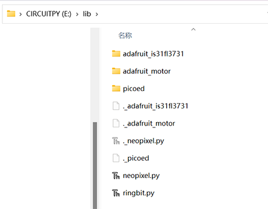

# Preparation for Programming

## Introduction
---
1. Hello, it's great that you can see here, that means you have assembled the Ring:bit smart car, next we need to write the program in the programming software, just like we need to write in the homework book, we should first download and install the programming software, we recommend the programming software: [Thonny](https://thonny.org/).

   If you have already installed Thonny and selected the correct interpreter, please ignore this step, if not, you can refer to the specific installation steps: [Download and install programming software](https://www.elecfreaks.com/learn-en/pico-ed/pico-ed-python.html). 

2. Next, we need to prepare the firmware for picoed and burn the firmware inside [pico:ed](https://www.elecfreaks.com/elecfreaks-pico-ed-v2.html). Firmware is the device "driver" that is stored inside the device, through which the code we write can follow the standard device driver to achieve the running action of a particular machine. Firmware is the software that does the most basic and lowest-level work of a system. 

   In a hardware device, the firmware is the soul of the hardware device. If you are not familiar with how to burn picoed firmware into [pico:ed](https://www.elecfreaks.com/elecfreaks-pico-ed-v2.html), you can refer to this article: [Firmware Installation Steps](https://www.elecfreaks.com/learn-en/pico-ed/pico-ed-python.html). 

3. For the function of [pico:ed](https://www.elecfreaks.com/elecfreaks-pico-ed-v2.html), such as A/B button, we need to add the picoed library file, if you are not clear about the way to add the picoed library file, you can refer to this article: [Add picoed library](https://github.com/elecfreaks/learn-en/tree/master/pico-regular-libraries).

## Preparation for Libraries
---
In the following cases, other related libraries are needed to ensure that you can complete all tasks.

1. [CircuitPython_Motor](https://github.com/adafruit/Adafruit_CircuitPython_Motor/archive/refs/heads/main.zip). The `CircuitPython_Motor` library file contains control methods for motors and servos.
2. [CircuitPython_NeoPixel](https://github.com/adafruit/Adafruit_CircuitPython_NeoPixel). The `CircuitPython_NeoPixel` library file contains control methods for light rings.
3. [CircuitPython_Ringbit](https://github.com/elecfreaks/circuitpython_ringbit). The `CircuitPython_Ringbit` library file contains control methods for the ring:bit expansion board. 
4. Next, just follow the steps for adding the picoed library files and place `adafruit_motor`, `adafruit_is31fl3731` `neopixel.py` `ringbit.py` in the lib folder of the CIRCUITPY disk, see the reference picture below.

## Ringbit Libraries
For more operation and functions of ringbit, please refer to: [Usage for Ring:bit library](https://github.com/elecfreaks/learn-en/blob/master/pico-regular-libraries/pico-ringbit-libraries.md)

