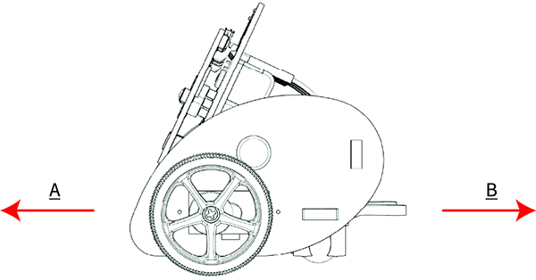
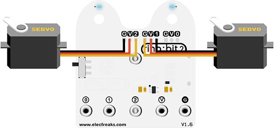

# Case 01: Full Speed Ahead



## Introduction

Hello, we are going to code to drive the [Ring:bit](https://www.elecfreaks.com/elecfreaks-micro-bit-ring-bit-v2-car-kit-without-micro-bit-board.html) car to do some interesting projects in this lesson, of course we will explain the knowledge from easy to deep, this lesson will implement the [Ring:bit](https://www.elecfreaks.com/elecfreaks-micro-bit-ring-bit-v2-car-kit-without-micro-bit-board.html) car to complete the basic forward and backward actions, let's start. 

## Hardware Connect

Connect the left wheel servo to P1 of the [Ring:bit](https://www.elecfreaks.com/elecfreaks-micro-bit-ring-bit-v2-car-kit-without-micro-bit-board.html) expansion board and the right wheel servo to P2. You can also exchange the connections as long as you program with the equivlent connections in MakeCode, let's move on! 



## Software Programming

You should prepare the programming platform ready, if not, please can refer to this essay: [Preparation for programming](https://www.yuque.com/elecfreaks-learn/picoed/gxro38)

### Sample Projects

```python
# Import the modules that we need
import board
from ringbit import *
from picoed import *

# Set the pins of the servos
ringbit = Ringbit(board.P1, board.P2)

# While ture, detect if button A/B is pressed to control the movement of the car
while True:
    if button_a.is_pressed():
        ringbit.set_speed(100, 100)
    elif button_b.is_pressed():
        ringbit.set_speed(-100, -100)
        
```

### Details of program:

1. Import the modules that we need. `board` is the common container, and you can connect the pins you'd like to use through it; `ringbit` module contains classes and functions for [Ring:bit](https://www.elecfreaks.com/elecfreaks-micro-bit-ring-bit-v2-car-kit-without-micro-bit-board.html) smart car operation and `picoed` module contains the operation functions to button A/B. 

   ```python
   import board
   from ringbit import *
   from picoed import *
   ```

2. Set the pins of the servos.

   ```python
   ringbit = Ringbit(board.P1, board.P2)
   ```

3. While ture, detect if button A/B is pressed to control the movement of the car.

   ```python
   while True:
       if button_a.is_pressed():
           ringbit.set_speed(100, 100)
       elif button_b.is_pressed():
           ringbit.set_speed(-100, -100)
   ```

   
## Result

Press button A to drive the car at its full speed;

Press button B to reverse the car. 

<iframe width="560" height="315" src="https://www.youtube.com/embed/47CdNDNtrmw" title="YouTube video player" frameborder="0" allow="accelerometer; autoplay; clipboard-write; encrypted-media; gyroscope; picture-in-picture" allowfullscreen></iframe>

## Exploration

How to program to stop the car by pressing both A/B at the same time?

## FAQ

## Relevant Files
