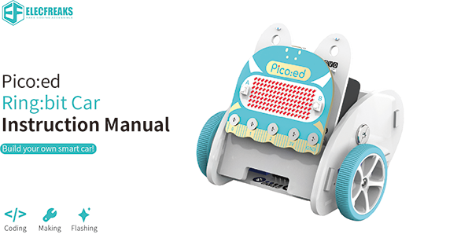

# Kits Information

## Introduction
---

[Ring:bit](https://www.elecfreaks.com/elecfreaks-micro-bit-ring-bit-v2-car-kit-without-micro-bit-board.html) car is a DIY smart car which is based on Pico:ed board and ELECFREAKS [Ring:bit](https://www.elecfreaks.com/elecfreaks-micro-bit-ring-bit-v2-car-kit-without-micro-bit-board.html). It adopts modular assembly and programming-driven method, which is easy to learn. It will bring a rich experience to your creation. Next, let's take a look at the details of the [Ring:bit](https://www.elecfreaks.com/elecfreaks-micro-bit-ring-bit-v2-car-kit-without-micro-bit-board.html) car kit.

[Ring:bit](https://www.elecfreaks.com/elecfreaks-micro-bit-ring-bit-v2-car-kit-without-micro-bit-board.html) has extended 3 channels of GPIO, among which 2 channels are used for driving servos and one channel of GPIO is undefined. Just add one of the many extensions available and your [Ring:bit](https://www.elecfreaks.com/elecfreaks-micro-bit-ring-bit-v2-car-kit-without-micro-bit-board.html) Car can do even more things like line and light following, obstacle avoiding, drawing and more!

*Please note that the [Ring:bit](https://www.elecfreaks.com/elecfreaks-micro-bit-ring-bit-v2-car-kit-without-micro-bit-board.html) car version 2 has been upgraded. It is diffrent from the [Ring:bit](https://www.elecfreaks.com/elecfreaks-micro-bit-ring-bit-v2-car-kit-without-micro-bit-board.html) car version 1, all the files mentioned here are in [Ring:bit](https://www.elecfreaks.com/elecfreaks-micro-bit-ring-bit-v2-car-kit-without-micro-bit-board.html) V2.*

## Parameter
---

| Parameter | Details |
| --- | --- |
| Working Voltage | 3.5V~5V(3×AAA batteries） |
| Bottom Light | 2 × RGB |
| Mode Switch | RAINBOW LED）and OTHERMODULES |
| Connection | P0、P1、P2(GVS） |
| Servo | 360 degrees digital servo |
| Size | 86 x 80 x 82mm |

## Components list

---

|                              |          |
| --- | --- |
| Components                   | Numbers  |
| micro:bit                    | Optional |
| [Ring:bit](https://www.elecfreaks.com/elecfreaks-micro-bit-ring-bit-v2-car-kit-without-micro-bit-board.html) Expansion Board | 1        |
| [Ring:bit](https://www.elecfreaks.com/elecfreaks-micro-bit-ring-bit-v2-car-kit-without-micro-bit-board.html) Car Expansion Board | 1        |
| [Ring:bit](https://www.elecfreaks.com/elecfreaks-micro-bit-ring-bit-v2-car-kit-without-micro-bit-board.html) Car Front Board | 1        |
| [Ring:bit](https://www.elecfreaks.com/elecfreaks-micro-bit-ring-bit-v2-car-kit-without-micro-bit-board.html) Car Back Board | 1        |
| [Ring:bit](https://www.elecfreaks.com/elecfreaks-micro-bit-ring-bit-v2-car-kit-without-micro-bit-board.html) Car Base Board | 1        |
| [Ring:bit](https://www.elecfreaks.com/elecfreaks-micro-bit-ring-bit-v2-car-kit-without-micro-bit-board.html) Car Side Board | 2        |
| [Ring:bit](https://www.elecfreaks.com/elecfreaks-micro-bit-ring-bit-v2-car-kit-without-micro-bit-board.html) Car Wheel | 2        |
| Binding Post                 | 1        |
| 360° Servo                   | 2        |
| Castor Wheel                 | 1        |
| Screw                        | 5        |
| Tapping Screw                | 5        |
| Rivet                        | 2        |
| Screwdriver                  | 1        |

