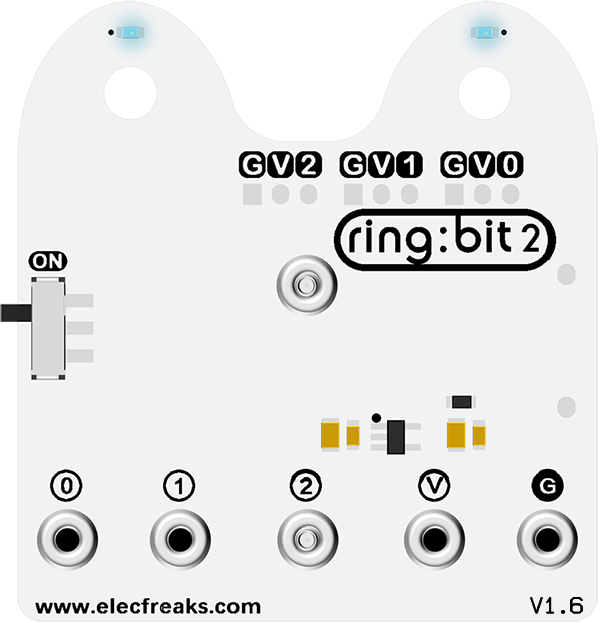
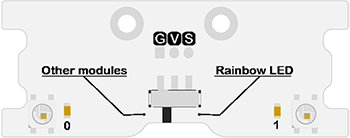
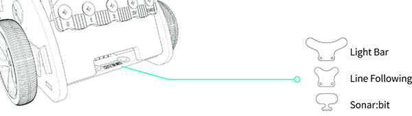

# [Ring:bit](https://www.elecfreaks.com/elecfreaks-micro-bit-ring-bit-v2-car-kit-without-micro-bit-board.html) Breakout Board with Battery Holder in 3 IO Ports

## [Ring:bit](https://www.elecfreaks.com/elecfreaks-micro-bit-ring-bit-v2-car-kit-without-micro-bit-board.html) V2  
---

Hello, in order to use [Ring:bit](https://www.elecfreaks.com/elecfreaks-micro-bit-ring-bit-v2-car-kit-without-micro-bit-board.html) car better, we need to know about [Ring:bit](https://www.elecfreaks.com/elecfreaks-micro-bit-ring-bit-v2-car-kit-without-micro-bit-board.html) expansion board, [Ring:bit](https://www.elecfreaks.com/elecfreaks-micro-bit-ring-bit-v2-car-kit-without-micro-bit-board.html) V2 is a simple expansion board based on Pico:ed. From the Pico:ed main board, it leads to 3 IO ports, 3 power ports and 3 ground ports. We will use this module to convert the P0/P1/P2 interface to a universal GVS interface. The back battery compartment is for 3 AAA batteries to drive the car and other accessories.

## Introduction
---

The [Ring:bit](https://www.elecfreaks.com/elecfreaks-micro-bit-ring-bit-v2-car-kit-without-micro-bit-board.html) V2 breakout board is a dedicated expansion board designed to increase the expandability of the [Ring:bit](https://www.elecfreaks.com/elecfreaks-micro-bit-ring-bit-v2-car-kit-without-micro-bit-board.html) car. The board contains two Rainbow LEDs and a dedicated expansion port for connecting dedicated expansion modules.
There is a sliding switch on the board, toggle the switch to "Rainbow LED" to use the two on-board Rainbow LEDs and toggle the switch to "Other modules" and you can connect other dedicated modules, but you cannot do both at the same time.

