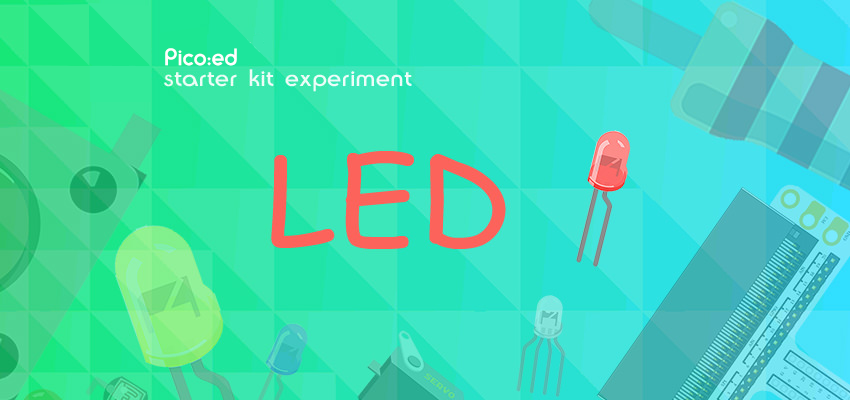
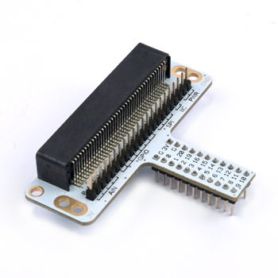
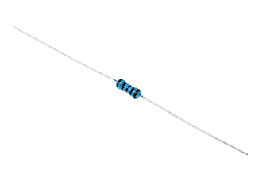
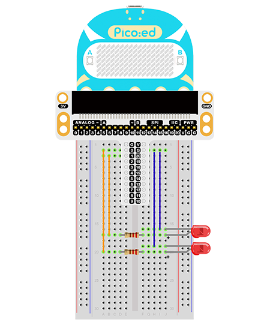

# Case 01: LED



## Introduction 

LED lights are used widely in urban construction with a wide range of applications such as traffic lights at intersections, shop billboards, park signage lighting, shopping mall lighting and more. In this lesson, we will control the 2 LEDs to make an alternative flashing with the Pico:ed. 

## Components List

### Hardware: 

1 × Pico:ed

1 × USB Cable

1 × Breadboard Adapter 

1 × 83×55mm Breadboard

2 × LEDs

2 × 100Ω Resistors

N* Dupont Cables


## Main Components

### Breadboard Adapter

The breadboard adapter allows all the pins of the Pico:ed to be led out on the breadboard, making it easy to create simple circuits there.



This below picture shows how to connect the breadboard adapter with a breadboard. And the adapter suits for breadboards in all sizes. 


### LED
LED is the abbreviation of Light Emitting Diode. This is a semiconductor diode. It converts electrical energy into light energy. When an electric current passes through it, it glows.


If you look closely at an LED, you will find two characteristics. One is that the pins are not the same length and the other is that one side of the LED is flat, rather than cylindrical. These features tell you which pin is the anode (positive) and which pin is the cathode (negative). The longer pins are connected to the positive supply (3.3v) and the pins with the flat side are connected to ground.

### Resistor
A resistor is a component used to control current. It limits the current in the circuit to which it is connected. In our experiments, we used a 100ohm resistor. If the current is not restricted, it will damage the LEDs.



Would you like to identify the resistance value by its colour ring? You can read this article: How to Identify Color Circle Resistance Value

### Hardware Connection

Connect all your components as the pictures describe: 

1. Connect the shorter pins of the LED with the GND. 
2. Connect the longer pin of one LED with the P0 and another with P1 through the resistors. 



See the picture after connection: 

Program Preparation: [Prpgramming environment](https://www.yuque.com/elecfreaks-learn/picoed/er7nuh)

### Sample Code:

```

# Import the modules that we need: 
import board
import digitalio
import time

# Set the connencted pins and their directions of the LEDs
led_0 = digitalio.DigitalInOut(board.P0_A0)
led_1 = digitalio.DigitalInOut(board.P1_A1)
led_0.direction = digitalio.Direction.OUTPUT
led_1.direction = digitalio.Direction.OUTPUT

# Set the 2 LEDs turn on and off. 
while True:
    led_0.value = True
    led_1.value = False
    time.sleep(1)
    led_0.value = False
    led_1.value = True
    time.sleep(1)

```

### Details of the Code: 

1. Import the modules that we need. `board` is the common container, and you can connect the pins you'd like to use through it. The `digitalio`module contains classes to provide access to basic digital IO. `time` is the module contains the fuction of time setting. 
```python
import board
import digitalio
import time
```

2. Set the connected pins and the directions of the 2 LEDs. 
```python
led_0 = digitalio.DigitalInOut(board.P0_A0)
led_1 = digitalio.DigitalInOut(board.P1_A1)
led_0.direction = digitalio.Direction.OUTPUT
led_1.direction = digitalio.Direction.OUTPUT
```
If the pins you are using are not P0_A0 and P1_A1, the other pin numbers can be viewed by entering the following code in the shell window below the Thonny editor. 
```python
>>> import board
>>> help(board)
object <module 'board'> is of type module
  __name__ -- board
  board_id -- elecfreaks_picoed
  BUZZER_GP0 -- board.BUZZER_GP0
  I2C0_SDA -- board.BUZZER_GP0
  I2C0_SCL -- board.I2C0_SCL
  BUZZER -- board.BUZZER
  BUZZER_GP3 -- board.BUZZER
  P4 -- board.P4
  P5 -- board.P5
  P6 -- board.P6
  P7 -- board.P7
  P8 -- board.P8
  P9 -- board.P9
  P10 -- board.P10
  P11 -- board.P11
  P12 -- board.P12
  P13 -- board.P13
  P14 -- board.P14
  P15 -- board.P15
  P16 -- board.P16
  SDA -- board.SDA
  P20 -- board.SDA
  SCL -- board.SCL
  P19 -- board.SCL
  BUTTON_A -- board.BUTTON_A
  BUTTON_B -- board.BUTTON_B
  SMPS_MODE -- board.SMPS_MODE
  VBUS_SENSE -- board.VBUS_SENSE
  LED -- board.LED
  P0_A0 -- board.P0_A0
  P0 -- board.P0_A0
  A0 -- board.P0_A0
  P1_A1 -- board.P1_A1
  P1 -- board.P1_A1
  A1 -- board.P1_A1
  P2_A2 -- board.P2_A2
  P2 -- board.P2_A2
  A2 -- board.P2_A2
  P3_A3 -- board.P3_A3
  P3 -- board.P3_A3
  A3 -- board.P3_A3
```

3. While true, set the status of the 2 LEDs as turning on and off. And you can use `1` and `0`  to replace `True` and `False` as the on and off switches of the LEDs.
```python
while True:
    led_0.value = True  # 1
    led_1.value = False  # 0
    time.sleep(1)
    led_0.value = False  # 0
    led_1.value = True  # 1
    time.sleep(1)
```
## Results
The 2 LEDs light on alternately and if this is not the case, please check your applications. 

## Exploration

How to simulate the traffic lights with 3 LEDs? 

## FAQ

## For more information, please visit: 

[ELECFREAKS WIKI](https://www.elecfreaks.com/learn-en/)
