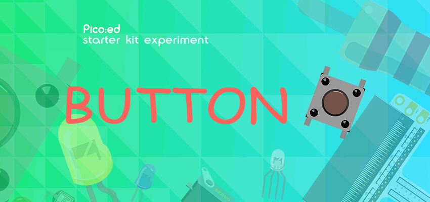
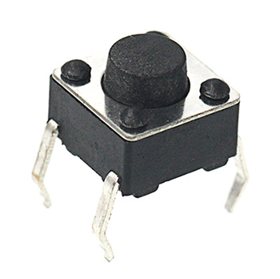
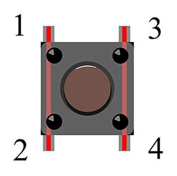
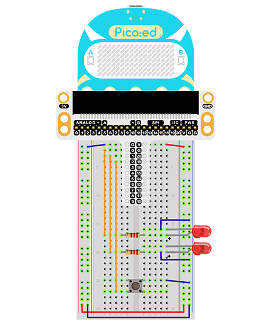

# Case 02: Button



## Introduction 
---
The Momentary push-button switches are electronic components that are used in daily life mainly to connect and disconnect circuits. In the previous lesson we have learnt how to use Pico:ed to control 2 LEDs flashing alternately. Here we will use a momentary push button switch to control the flashing of the 2 LEDs. When we press the button, the 2 LEDs will blink alternately; release the button, the LEDs will stop blinking.

## Components List
---
### Hardware

1 × Pico:ed

1 × USB Cable

1 × Breadboard Adapter 

1 ×  83×55mm Breadboard

2 × LEDs

2 × 100Ω Resistors

1 × Momentary Push Button

N* Dupont Cables


## Main Components
---
### Momentary Push Button

This is a common component used to control electronic devices. It is mostly used to connect or disconnect control circuits to enable the control of motors or other electronic devices. The momentary push-button switch is usually kept open. When it is pressed, the circuit is switched on; when it is popped up, it jumps back to the unconnected state.



The momentary push button switch has 4 pins which can be divided into 2 groups, pin 1 shorted to pin 2 and pin 3 shorted to pin 4 . 



## Steps
---
### Hardware Connection

Connect your components according to the following pictures: 
1. Connect the shorter pin of the led light to GND

2. Connect the longer pin of the led to the P0 port and the P1 port through the resistors.

3. Connect the momentary push button switch to port P2


The picture shows the project after getting the compoents connected: 



## Programming
---
Program Preparation: [Prpgramming environment](https://www.yuque.com/elecfreaks-learn/picoed/er7nuh)

### Sample Code:

```python
Import the modules that we need: 
import board
import digitalio
import time

Set the connencted pins and their directions of the LEDs
led_0 = digitalio.DigitalInOut(board.P0_A0)
led_1 = digitalio.DigitalInOut(board.P1_A1)
led_0.direction = digitalio.Direction.OUTPUT
led_1.direction = digitalio.Direction.OUTPUT

Set the connected pins of the button and pull it up. 
button = digitalio.DigitalInOut(board.P2_A2)
button.direction = digitalio.Direction.INPUT
button.pull = digitalio.Pull.UP

Set to change the status of the LEDs with the status of the button. 
while True:
    if button.value == False:
        led_0.value = True
        led_1.value = False
        time.sleep(1)
        led_0.value = False
        led_1.value = True
        time.sleep(1)
```
### Details of the Code: 

1. Import the modules that we need. `board` is the common container, and you can connect the pins you'd like to use through it. The `digitalio`module contains classes to provide access to basic digital IO. `time` is the module contains the fuction of time setting. 
```python
import board
import digitalio
import time
```

2. Set the connected pins and the directions of the LED. 
```python
led_0 = digitalio.DigitalInOut(board.P0_A0)
led_1 = digitalio.DigitalInOut(board.P1_A1)
led_0.direction = digitalio.Direction.OUTPUT
led_1.direction = digitalio.Direction.OUTPUT
```

3. Set the connected pins of the button and pull it up. 
```python
button = digitalio.DigitalInOut(board.P2_A2)
button.direction = digitalio.Direction.INPUT
button.pull = digitalio.Pull.UP
```
If the pins you are using are not P0_A0, P1_A1 and P2_A2, the other pin numbers can be viewed by entering the following code in the shell window below the Thonny editor. 
```python
>>> import board
>>> help(board)
object <module 'board'> is of type module
  __name__ -- board
  board_id -- elecfreaks_picoed
  BUZZER_GP0 -- board.BUZZER_GP0
  I2C0_SDA -- board.BUZZER_GP0
  I2C0_SCL -- board.I2C0_SCL
  BUZZER -- board.BUZZER
  BUZZER_GP3 -- board.BUZZER
  P4 -- board.P4
  P5 -- board.P5
  P6 -- board.P6
  P7 -- board.P7
  P8 -- board.P8
  P9 -- board.P9
  P10 -- board.P10
  P11 -- board.P11
  P12 -- board.P12
  P13 -- board.P13
  P14 -- board.P14
  P15 -- board.P15
  P16 -- board.P16
  SDA -- board.SDA
  P20 -- board.SDA
  SCL -- board.SCL
  P19 -- board.SCL
  BUTTON_A -- board.BUTTON_A
  BUTTON_B -- board.BUTTON_B
  SMPS_MODE -- board.SMPS_MODE
  VBUS_SENSE -- board.VBUS_SENSE
  LED -- board.LED
  P0_A0 -- board.P0_A0
  P0 -- board.P0_A0
  A0 -- board.P0_A0
  P1_A1 -- board.P1_A1
  P1 -- board.P1_A1
  A1 -- board.P1_A1
  P2_A2 -- board.P2_A2
  P2 -- board.P2_A2
  A2 -- board.P2_A2
  P3_A3 -- board.P3_A3
  P3 -- board.P3_A3
  A3 -- board.P3_A3
```

4. Set to control the LED with the button. 
```python
while True:
    if button.value == False:
        led_0.value = True
        led_1.value = False
        time.sleep(1)
        led_0.value = False
        led_1.value = True
        time.sleep(1)
```
## Result
---
Press the button and the two LEDs flash alternately; release the button and they will trun off, if this is not the case, please check your applications. 


## Exploration
---
How to program to light on in red while pressing the button and light on in green after releasing it? 

## FAQ
---
## For more information, please visit: 
---
[ELECFREAKS WIKI](https://www.elecfreaks.com/learn-en/)
