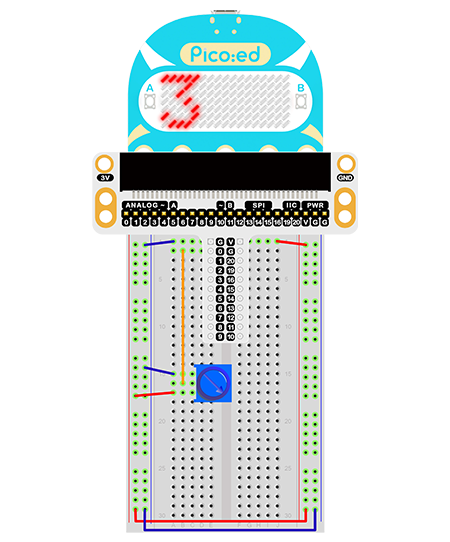

# Case 03: Trimpot 


## Introduction
A trimpot is an adjustable electronic component. It consists of a resistor body and a rotating or sliding system. When a voltage is applied between the two fixed contacts of the resistor body, the position of the contacts on the resistor body is changed by the turning or sliding system, and a voltage is obtained between the moving contacts and the fixed contacts in relation to the position of the moving contacts. It is mostly used as a voltage divider, in which case the potentiometer is a four-terminal element. In the following lesson we will read the output voltage of the trimpot and display it as a wavy line on the Pico:ed 7 * 17 screen.

## Components List

### Hardware

1 × Pico:ed

1 × USB Cable

1 × Breadboard Adapter 

1 ×  83×55mm Breadboard

1 × 10kΩ Resistors

N* Dupont Cables

## Main Components

### Trimpot

A trimpot is an adjustable electronic component. It consists of a resistor body and a rotating or sliding system. When a voltage is applied between the two fixed contacts of the resistor body, the position of the contacts on the resistor body is changed by the turning or sliding system, and a voltage is obtained between the moving contacts and the fixed contacts in relation to the position of the moving contacts. It is mostly used as a voltage divider.


## Hardware Connection
Connect the components as the pictures suggest: 



This is the picture after finishing the connection: 

Rotate the trimpot and the output voltage will vary among 0V and 3V as the button is rotated.

## Programming

Program Preparation: [Prpgramming environment](https://www.yuque.com/elecfreaks-learn/picoed/er7nuh)

### Sample Code:

```python
# Import the modules that we need: 
import board
import picoed
import analogio
import time

# Set the connected pins to trimpot
poten = analogio.AnalogIn(board.P0_A0)

# Initialize the data list and save the value of the trimpot, thus we can set the light level of the LEDs screen with them.
data = [0, 0, 0, 0, 0, 0, 0, 0, 0, 0, 0, 0, 0, 0, 0, 0, 0]
for i in range(picoed.display.width):
    data[i] = int(poten.value / 9363)
    

# Then loop converts the value of the trimpot to the Y coordinate of the LED in the 17th column of the LED screen on the Pico:ed, and scrolls to the left in turn.
while True:
    
    # Analog value of the pin（0-65535）map to the height of the matrix（0-7）
    data[16] = int(poten.value / 9363)
    for i in range(len(data)):
        picoed.display.pixel(i, data[i] - 1, 0)
        if i != 16:
            data[i] = data[i+1]
        picoed.display.pixel(i, data[i] - 1, 30)
        picoed.display.pixel(16, data[16] - 1, 0)
        time.sleep(0.01)
```
### Details of the Code: 

1. Import the modules that we need. `board` is the common container, and you can connect the pins you'd like to use through it. `picoed` module is able to set the LED effect on Pico:ed. The `digitalio`module contains classes to provide access to basic digital IO. `time` is the module contains the fuction of time setting. 
```python
import board
import picoed
import analogio
import time
```

2. Set the connected pins of the trimpot, here we use P0_A0. 
```python
poten = analogio.AnalogIn(board.P0_A0)
```
If the pins you are using are not P0_A0 and P1_A1, the other pin numbers can be viewed by entering the following code in the shell window below the Thonny editor. 
```python
>>> import board
>>> help(board)
object <module 'board'> is of type module
  __name__ -- board
  board_id -- elecfreaks_picoed
  BUZZER_GP0 -- board.BUZZER_GP0
  I2C0_SDA -- board.BUZZER_GP0
  I2C0_SCL -- board.I2C0_SCL
  BUZZER -- board.BUZZER
  BUZZER_GP3 -- board.BUZZER
  P4 -- board.P4
  P5 -- board.P5
  P6 -- board.P6
  P7 -- board.P7
  P8 -- board.P8
  P9 -- board.P9
  P10 -- board.P10
  P11 -- board.P11
  P12 -- board.P12
  P13 -- board.P13
  P14 -- board.P14
  P15 -- board.P15
  P16 -- board.P16
  SDA -- board.SDA
  P20 -- board.SDA
  SCL -- board.SCL
  P19 -- board.SCL
  BUTTON_A -- board.BUTTON_A
  BUTTON_B -- board.BUTTON_B
  SMPS_MODE -- board.SMPS_MODE
  VBUS_SENSE -- board.VBUS_SENSE
  LED -- board.LED
  P0_A0 -- board.P0_A0
  P0 -- board.P0_A0
  A0 -- board.P0_A0
  P1_A1 -- board.P1_A1
  P1 -- board.P1_A1
  A1 -- board.P1_A1
  P2_A2 -- board.P2_A2
  P2 -- board.P2_A2
  A2 -- board.P2_A2
  P3_A3 -- board.P3_A3
  P3 -- board.P3_A3
  A3 -- board.P3_A3
```

3. Initialize the data list and save the value of the trimpot, thus we can set the light level of the LEDs screen with them.
```python
data = [0, 0, 0, 0, 0, 0, 0, 0, 0, 0, 0, 0, 0, 0, 0, 0, 0]
for i in range(picoed.display.width):
    data[i] = int(poten.value / 7000)
    
```

4. Then loop converts the value of the trimpot to the Y coordinate of the LED in the 17th column of the LED screen on the Pico:ed, and scrolls to the left in turn.
```python
while True:
    data[16] = int(poten.value / 7000)
    for i in range(len(data)):
        picoed.display.pixel(i, data[i] - 1, 0)
        if i != 16:
            data[i] = data[i+1]
        picoed.display.pixel(i, data[i] - 1, 30)
        picoed.display.pixel(16, data[16] - 1, 0)
        time.sleep(0.01)
```
## Result
Rotate the trimpot and the output voltage of the trimpot displays as a wavy line on the Pico:ed 7 * 17 screen.

## Exploration
If we want to change the light level of the LEDs with the trimpot, how can we design the circuit and program? 

## FAQ
## For more information, please visit: 

[ELECFREAKS WIKI](https://www.elecfreaks.com/learn-en/)
