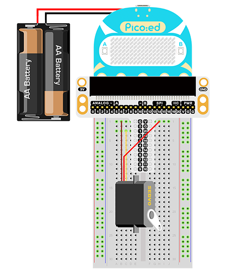

# Case 08: Servo


## Introduction

A servo is an actuator for position (angle) servoing and is suitable for control systems where the angle needs to be constantly changing and can be maintained. In this lesson we will use Pico:ed to control the servo to rotate through the range of travel.

## Components List

### Hardware

1 × Pico:ed

1 × USB Cable

1 × Breadboard Adapter 

1 × 83×55mm Breadboard

1× Mini Servo

N* Dupont Cables

## Main Components

### Servo

The servo consists of an automatic control system consisting of a DC motor, a reduction gear set, a potentiometer and a control circuit. The angle of rotation of the output shaft is specified by sending a signal. Servos generally have a maximum rotation angle (e.g. 180 degrees). The main difference with a normal DC motor is that a DC motor turns in a circle, a servo can only turn within a certain angle and not in a circle (a digital servo can be switched between servo and motor mode without this problem). A normal DC motor cannot give back information about the angle of rotation, whereas a servo can. The use of a servo is also different, as a DC motor is generally used to turn a whole circle for power, while a servo is used to control the rotation of an object by a certain angle, such as a robot joint. The servo system of a servo is controlled by variable width pulses and the control line is used to transmit the pulses. The parameters of the pulses are minimum, maximum and frequency. In general, the reference signal of the servo is 20 ms in period and 1.5 ms in width, and the position defined by this reference signal is the intermediate position. The servo has a maximum rotation angle and the middle position is defined as the exact same amount from this position to the maximum angle as the minimum angle. The most important point is that the maximum rotation angle may be different for different servos, but the pulse width at its mid position is a certain amount, that is 1.5ms.


There are many sizes of servos, but all have three external wires, distinguished by brown, red and orange (colours may vary slightly depending on the brand), brown for the earth wire, red for the positive power wire and orange for the signal wire.


## Steps

### Hardware Connection

Connect the components as the pictures suggest: 

1.Connect the servo to P1 of the breakout board



This is the picture after finishing the connections: 

## Programming

Program Preparation: [Prpgramming environment](https://www.yuque.com/elecfreaks-learn/picoed/er7nuh)

### Sample Code:

```python
# Import the modules that we need: 
import time
import board
import pwmio
from adafruit_motor import servo

# Set the pins connecting to servo and create the object for servo
pwm = pwmio.PWMOut(board.P1_A1, duty_cycle=2 ** 15, frequency=50)
my_servo = servo.Servo(pwm)

# While true, set the servo keep rotate
while True:
    for angle in range(0, 180, 5): 
        my_servo.angle = angle
        time.sleep(0.05)
    for angle in range(180, 0, -5):
        my_servo.angle = angle
        time.sleep(0.05)
```
### Details of the Code:

1. Import the modules that we need. `board` is the common container, and you can connect the pins you'd like to use through it.  The `time` module contains functions for setting the time. The `pwmio` module contains classes that provide access to the basic pulse IO and the `adafruit_motor` module contains classes that operate on the servo.
```python
import time
import board
import pwmio
from adafruit_motor import servo
```

2. et the pins connecting to servo and create the object for servo
```python
pwm = pwmio.PWMOut(board.P1_A1, duty_cycle=2 ** 15, frequency=50)
my_servo = servo.Servo(pwm)
```
If the pins you are using are not P0_A0 and P1_A1, the other pin numbers can be viewed by entering the following code in the shell window below the Thonny editor.
```python
>>> import board
>>> help(board)
object <module 'board'> is of type module
  __name__ -- board
  board_id -- elecfreaks_picoed
  BUZZER_GP0 -- board.BUZZER_GP0
  I2C0_SDA -- board.BUZZER_GP0
  I2C0_SCL -- board.I2C0_SCL
  BUZZER -- board.BUZZER
  BUZZER_GP3 -- board.BUZZER
  P4 -- board.P4
  P5 -- board.P5
  P6 -- board.P6
  P7 -- board.P7
  P8 -- board.P8
  P9 -- board.P9
  P10 -- board.P10
  P11 -- board.P11
  P12 -- board.P12
  P13 -- board.P13
  P14 -- board.P14
  P15 -- board.P15
  P16 -- board.P16
  SDA -- board.SDA
  P20 -- board.SDA
  SCL -- board.SCL
  P19 -- board.SCL
  BUTTON_A -- board.BUTTON_A
  BUTTON_B -- board.BUTTON_B
  SMPS_MODE -- board.SMPS_MODE
  VBUS_SENSE -- board.VBUS_SENSE
  LED -- board.LED
  P0_A0 -- board.P0_A0
  P0 -- board.P0_A0
  A0 -- board.P0_A0
  P1_A1 -- board.P1_A1
  P1 -- board.P1_A1
  A1 -- board.P1_A1
  P2_A2 -- board.P2_A2
  P2 -- board.P2_A2
  A2 -- board.P2_A2
  P3_A3 -- board.P3_A3
  P3 -- board.P3_A3
  A3 -- board.P3_A3
```

3. While true, set the servo rotate among (0,180)degrees back and forth
```python
while True:
    for angle in range(0, 180, 5): 
        my_servo.angle = angle
        time.sleep(0.05)
    for angle in range(180, 0, -5):
        my_servo.angle = angle
        time.sleep(0.05)
```
## Result

The servo rotates among (0,180) degrees back and forth. 

## Exploration

How to program to make a pointer thermometer with a TMP36 sensor and a servo?

## FAQ

## For more information, please visit: 

[ELECFREAKS WIKI](https://www.elecfreaks.com/learn-en/)
