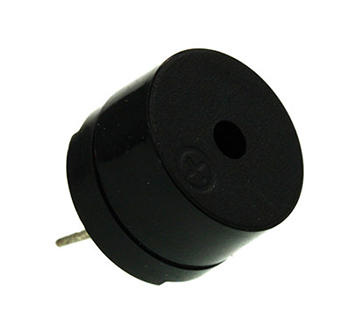
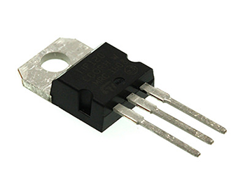
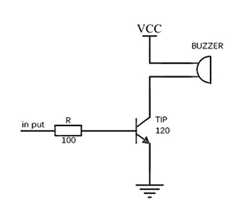
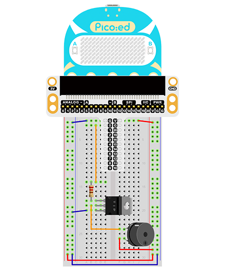

# Case 09: Buzzer


## Introduction

The buzzer is an integrated structure of electronic sounders, widely used as sounding devices in computers, printers, photocopiers, alarms, electronic toys, automotive electronics, telephones, timers and other electronic products. In this lesson, we use Pico:ed to drive the buzzer and make it sound different syllables as an alarm.

## Components List

### Hardware

1 × Pico:ed

1 × USB Cable

1 × Breadboard Adapter 

1 × 83×55mm Breadboard

1× Buzzer

1X NPN Transistor

1× 100Ω Resistors

N* Dupont Cables

## Main Components

### Buzzer

The buzzer is a sound producing device, which consists of a vibrating and resonating device. The buzzer can be subdivided into active and passive types according to the type of control.



The active type buzzer works on the principle of sound generation: the buzzer has an integrated internal oscillation system and an amplification sampling circuit, which causes the resonant device to generate a sound signal when a DC power supply passes through the buzzer.


A passive type buzzer works on the principle of sound generation: a square wave signal is input to the resonant device and converted into an acoustic signal output, the working sound generation principle of a passive type buzzer is as follows.


Note: For this project, we are using a passive buzzer.

## Transistor

A transistor is a semiconductor device that controls current and serves to amplify weak signals into electrical signals with a large amplitude value.



If the PWM signal generated by the Pico:ed is fed directly into the buzzer, the buzzer will only emit a weak sound because the drive current of the IO port is usually too weak to drive a device like the buzzer.  This is where we need to use a transistor to amplify the current from the PWM signal so that the buzzer can make a normal sound. A typical application circuit for driving a buzzer with a transistor is as follows.



## Steps

### Hardware Connection

Connect the components as the pictures suggest: 

1.Connect the buzzer in series with the 100Ω resistor and the transistor to the P0 port



This is the picture after finishing the connections: 

## Programming

Program Preparation: [Prpgramming environment](https://www.yuque.com/elecfreaks-learn/picoed/er7nuh)

### Sample Code:

```python
# Import the modules that we need: 
import board
import pwmio
import time

# Set the pins used for buzzer and the play tones of the buzzer
piezo = pwmio.PWMOut(board.P0_A0, duty_cycle=0,frequency=440, variable_frequency=True)
def play_note(note):
    piezo.frequency = note
    piezo.duty_cycle = 65535 // 2
    time.sleep(0.25)
    piezo.duty_cycle = 0
    time.sleep(0.05)
    
# While true, play the tones
while True:
    play_note(494)
    time.sleep(0.2)
    play_note(262)
    time.sleep(0.2)
    play_note(294)
    time.sleep(0.2)
```
### Details of the Code:

1. Import the modules that we need. `board` is the common container, and you can connect the pins you'd like to use through it. The `pwmio` module contains classes that provide access to the basic pulse IO and the `pwmio` module contains classes that provide access to the basic pulse IO. 
```python
import board
import pwmio
import time
```

2. Set the pins used for buzzer and the play tones of the buzzer
```python
piezo = pwmio.PWMOut(board.P0_A0, duty_cycle=0,frequency=440, variable_frequency=True)
def play_note(note):
    piezo.frequency = note
    piezo.duty_cycle = 65535 // 2
    time.sleep(0.25)
    piezo.duty_cycle = 0
    time.sleep(0.05)
```
If the pins you are using are not P0_A0, the other pin numbers can be viewed by entering the following code in the shell window below the Thonny editor.
```python
>>> import board
>>> help(board)
object <module 'board'> is of type module
  __name__ -- board
  board_id -- elecfreaks_picoed
  BUZZER_GP0 -- board.BUZZER_GP0
  I2C0_SDA -- board.BUZZER_GP0
  I2C0_SCL -- board.I2C0_SCL
  BUZZER -- board.BUZZER
  BUZZER_GP3 -- board.BUZZER
  P4 -- board.P4
  P5 -- board.P5
  P6 -- board.P6
  P7 -- board.P7
  P8 -- board.P8
  P9 -- board.P9
  P10 -- board.P10
  P11 -- board.P11
  P12 -- board.P12
  P13 -- board.P13
  P14 -- board.P14
  P15 -- board.P15
  P16 -- board.P16
  SDA -- board.SDA
  P20 -- board.SDA
  SCL -- board.SCL
  P19 -- board.SCL
  BUTTON_A -- board.BUTTON_A
  BUTTON_B -- board.BUTTON_B
  SMPS_MODE -- board.SMPS_MODE
  VBUS_SENSE -- board.VBUS_SENSE
  LED -- board.LED
  P0_A0 -- board.P0_A0
  P0 -- board.P0_A0
  A0 -- board.P0_A0
  P1_A1 -- board.P1_A1
  P1 -- board.P1_A1
  A1 -- board.P1_A1
  P2_A2 -- board.P2_A2
  P2 -- board.P2_A2
  A2 -- board.P2_A2
  P3_A3 -- board.P3_A3
  P3 -- board.P3_A3
  A3 -- board.P3_A3
```

3. While true, play the tones
```python
while True:
    play_note(494)
    time.sleep(0.2)
    play_note(262)
    time.sleep(0.2)
    play_note(294)
    time.sleep(0.2)
```
## Result

The buzzer alarms and repeats in the specific tones. 

## Exploration

How to program if we want to alarm for high temperature with the TMP36 sensor and the buzzer? 

## FAQ

## For more information, please visit: 

[ELECFREAKS WIKI](https://www.elecfreaks.com/learn-en/)
