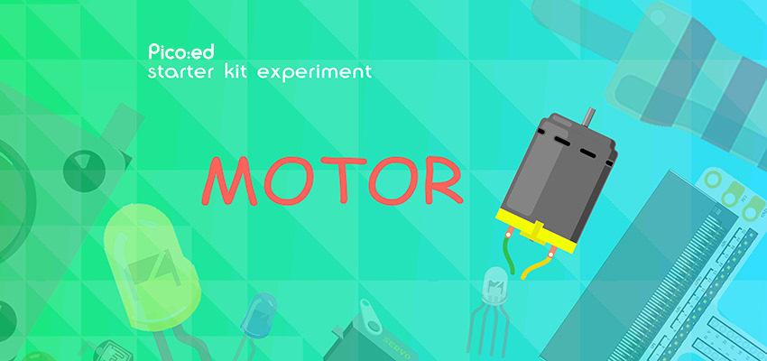
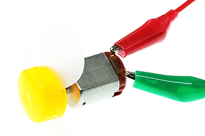
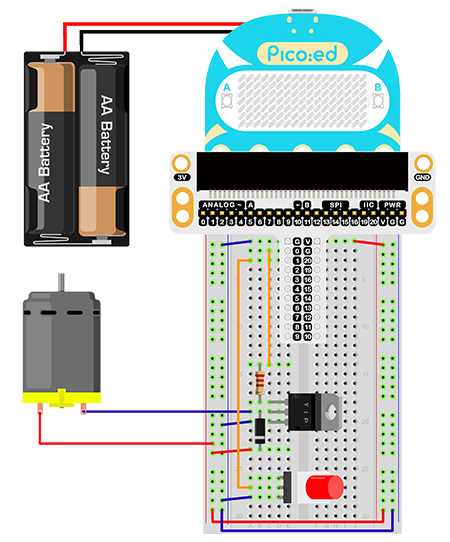

# Case 10: Motor



## Introduction

A motor is a device that converts electrical energy into kinetic energy according to the laws of electromagnetic induction. In this lesson we will use a switch to control the start and stop of a motor.

## Components List

### Hardware

1 × Pico:ed

1 × USB Cable

1 × Breadboard Adapter 

1 × 83×55mm Breadboard

1× Mini Motor

1x NPN Transistor

1x Diode

1× 100Ω Resistor

2x Alligator Cables

1x Self lock switch

N* Dupont Cables

## Main Components

### Motor

A motor is a device that converts electrical energy into kinetic energy according to the laws of electromagnetic induction. There are many different types of motors, in this case we are using a DC motor. When a DC voltage is applied to both ends of the motor, the motor rotates, and the higher the voltage is, the faster it rotates.


### Diode

A diode is an element with two electrodes, an anode at one end and a cathode at the other, which only allows current to move from the anode to the cathode, think of it as an electronic version of a non-return valve. For a normal diode, the positive and negative electrodes can be distinguished by the colour of the surface of the tube, the end with the white line being the negative electrode.


### Alligator Cable

Alligator clip cables serve the same purpose as jump wires. Some devices are not easy to connect with jump wires, thus we consider using alligator clips to connect.


For this project, we are using alligator clips to connect our motors.



## Steps

### Hardware Connection

Connect the components as the pictures suggest: 



The driving current of the IO port of the Pico:ed is very weak and not enough to drive the motor directly. The circuit diagram for amplifying the IO signal current with a transistor is very similar to the circuit diagram for driving the buzzer in the previous lesson, the only difference is the addition of a diode at both ends of the motor. This diode is called a continuity diode in this circuit.
The motor has coils inside it, and as the coils pass through the current, they generate an induced electromotive force at both ends.  When the current disappears, the induced electromotive force generates a reverse voltage to the components in the circuit, which may damage the device. The continuity diode is connected in reverse parallel to both ends of the coil in the circuit, so that when the inductive coil is disconnected the electromotive force at both ends does not disappear immediately, and the residual electromotive force is then released through the diode. This is a classic protection design.
The schematic diagram is as follows:

This is the picture after finishing the connections: 

## Programming

Program Preparation: [Prpgramming environment](https://www.yuque.com/elecfreaks-learn/picoed/er7nuh)

### Sample Code:

```python
# Import the modules that we need: 
import board
import digitalio

# Set pins and directions of the motor and the self-lock button
motor = digitalio.DigitalInOut(board.P0_A0)
locking = digitalio.DigitalInOut(board.P1_A1)
motor.direction = digitalio.Direction.OUTPUT
locking.direction = digitalio.Direction.INPUT

# Pull up the self lock button
locking.pull = digitalio.Pull.UP

# While true, judge the status of the self-lock button to control the motors
while True:
    if locking.value == False:
        motor.value = True
    else:
        motor.value = False
```
### Details of the Code:

1. Import the modules that we need. `board` is the common container, and you can connect the pins you'd like to use through it. The `digitalio`module contains classes to provide access to basic digital IO
```python
import board
import digitalio
```

2. Set pins and directions of the motor and the self-lock button, initialize the motor as True and pull up the button
```python
motor = digitalio.DigitalInOut(board.P0_A0)
locking = digitalio.DigitalInOut(board.P1_A1)
motor.direction = digitalio.Direction.OUTPUT
locking.direction = digitalio.Direction.INPUT
```
If the pins you are using are not P0_A0 and P1_A1, the other pin numbers can be viewed by entering the following code in the shell window below the Thonny editor.
```python
>>> import board
>>> help(board)
object <module 'board'> is of type module
  __name__ -- board
  board_id -- elecfreaks_picoed
  BUZZER_GP0 -- board.BUZZER_GP0
  I2C0_SDA -- board.BUZZER_GP0
  I2C0_SCL -- board.I2C0_SCL
  BUZZER -- board.BUZZER
  BUZZER_GP3 -- board.BUZZER
  P4 -- board.P4
  P5 -- board.P5
  P6 -- board.P6
  P7 -- board.P7
  P8 -- board.P8
  P9 -- board.P9
  P10 -- board.P10
  P11 -- board.P11
  P12 -- board.P12
  P13 -- board.P13
  P14 -- board.P14
  P15 -- board.P15
  P16 -- board.P16
  SDA -- board.SDA
  P20 -- board.SDA
  SCL -- board.SCL
  P19 -- board.SCL
  BUTTON_A -- board.BUTTON_A
  BUTTON_B -- board.BUTTON_B
  SMPS_MODE -- board.SMPS_MODE
  VBUS_SENSE -- board.VBUS_SENSE
  LED -- board.LED
  P0_A0 -- board.P0_A0
  P0 -- board.P0_A0
  A0 -- board.P0_A0
  P1_A1 -- board.P1_A1
  P1 -- board.P1_A1
  A1 -- board.P1_A1
  P2_A2 -- board.P2_A2
  P2 -- board.P2_A2
  A2 -- board.P2_A2
  P3_A3 -- board.P3_A3
  P3 -- board.P3_A3
  A3 -- board.P3_A3
```

3. Pull up the self lock button
```python
locking.pull = digitalio.Pull.UP
```

3. While true, judge the status of the self-lock button to control the motors
```python
while True:
    if locking.value == False:
        motor.value = True
    else:
        motor.value = False
```
## Result
 Push once to start the motor and push again to stop it. 

Note: Pico:ed has a low supply voltage of only 3V, the motor may not start when the button is pressed, in this case, please poke the fan of the motor to make the motor rotate normally.

## Exploration

How to design the circuit and program if we use the trimpot to control the speed of the motor?

## FAQ

## For more information, please visit: 

[ELECFREAKS WIKI](https://www.elecfreaks.com/learn-en/)
