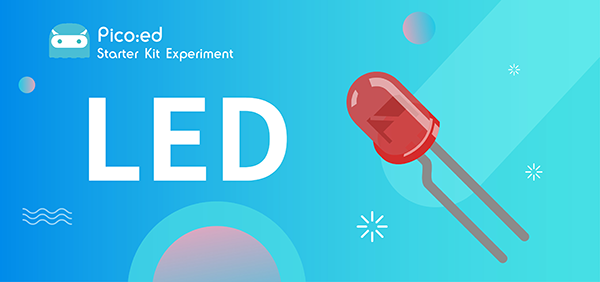
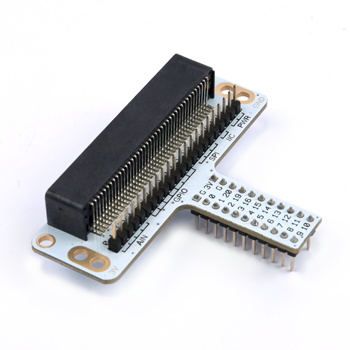
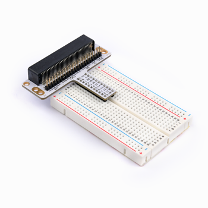
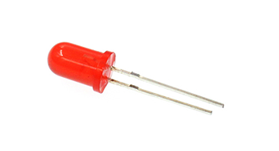
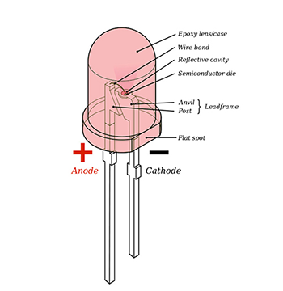
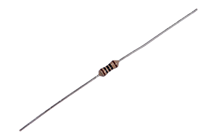
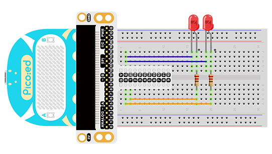
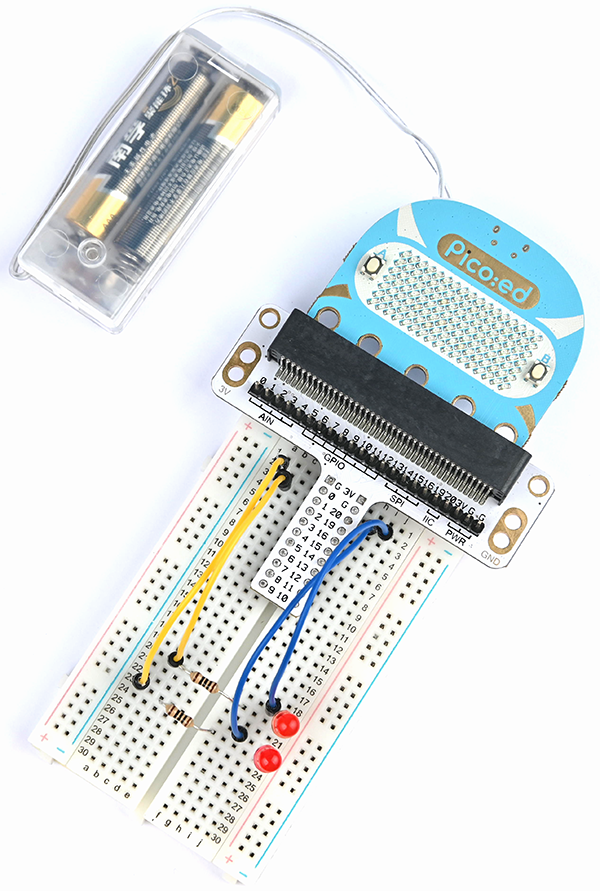

# Case 01:LED



## Introduction

LED lights are an important part of urban construction, such as traffic lights at traffic intersections, billboards in stores, park sign lights, shopping mall corridor lights, etc., and their applications are very extensive. In this lesson, we will use [Pico:ed](https://shop.elecfreaks.com/products/elecfreaks-pico-ed-v2?_pos=2&_sid=e7433427a&_ss=r) to control 2 LED lights to achieve the alternate blinking effect.

## Products Link

[ELECFREAKS Pico:ed Starter Kit](https://shop.elecfreaks.com/products/elecfreaks-pico-ed-starter-kit-with-pico-ed-board?_pos=3&_sid=e7433427a&_ss=r) 

## Components List:
### Hardware:

1 × [Pico:ed](https://shop.elecfreaks.com/products/elecfreaks-pico-ed-v2?_pos=2&_sid=e7433427a&_ss=r)

1 × USB Cable

1 × Breadboard Adapter

1 × Transparent Breadboard - 83 * 55 mm

2 × LED

2 × 100 Ohm Resistors

n x Breadboard jumper wire 65pcs pack


## Major Components Introduction
### Breadboard Adapter

The breadboard Adapter can extend all pins of  [Pico:ed](https://shop.elecfreaks.com/products/elecfreaks-pico-ed-v2?_pos=2&_sid=e7433427a&_ss=r) , so that we can create a simple circuit on a breadboard.



This picture shows how [Pico:ed](https://shop.elecfreaks.com/products/elecfreaks-pico-ed-v2?_pos=2&_sid=e7433427a&_ss=r) Breadboard Adapter is plugged into the breadboard. It is suitable for all kinds of breadboards.



### LED
LED is the abbreviation of Light Emitting Diode. It is a kind of semiconductor diode and can convert electricity into light(When the current passes, it will light on)





If you check the LED with the care you would notice two features: one is that the legs are of different lengths, and another is that on one side of the LED, instead of it being cylindrical, it is flattened. These are indicators to show which leg is the Anode (Positive) and which is the Cathode (Negative). The longer leg gets connected to the Positive Supply (3.3v) and the leg with the flattened side goes to the Ground.

### Resistor
The resistor is a component of current control. It can limit the current of the circuit connected. And in our experiment, we use 100Ω resistance, if there is no current limit, the LED might be damaged.



Want to know resistor value by color circles? You can read this article: [How to Identify Color Circle Resistance Value](https://www.elecfreaks.com/blog/how-to-identify-color-circle-resistance-value.html/).
## Experimental Procedure
### Hardware Connection

Connect your components according to the picture below:
1.Connect the shorter leg with the GND.
2.Connect the longer leg with the P0 and P1 ports through the Resistor.



You would see as below after you finish the connection:



## Software Programming
For programming environment preparation, please refer to [Introduction to the programming environment](https://www.elecfreaks.com/learn-en/pico-ed/index.html)
### Program as the picture shows：
```python
# Import the modules that we need
import board
import digitalio
import time

# Set the LED light to connect the pins and the direction of the pin
led_0 = digitalio.DigitalInOut(board.P0_A0)
led_1 = digitalio.DigitalInOut(board.P1_A1)
led_0.direction = digitalio.Direction.OUTPUT
led_1.direction = digitalio.Direction.OUTPUT

# set two LED lights to switch between on and off
while True:
    led_0.value = True
    led_1.value = False
    time.sleep(1)
    led_0.value = False
    led_1.value = True
    time.sleep(1)
```
### Details for the code:

1.Support modules are required by the importer. The `board` module is a generic container for pin names. could use the `board` module to specify the pin to use. The `digitalio` module contains classes that provide access to basic digital IO. The `time` module contains functions for time settings.
```python
import board
import digitalio
import time
```

2.Set the pins to connect the 2 LED lights and the pin direction.
```python
led_0 = digitalio.DigitalInOut(board.P0_A0)
led_1 = digitalio.DigitalInOut(board.P1_A1)
led_0.direction = digitalio.Direction.OUTPUT
led_1.direction = digitalio.Direction.OUTPUT
```
If you are using pins other than P0_A0 and P1_A1, you can enter the following code in the shell window below the Thonny editor and press Enter to view the numbers of other pins.
```python
>>> import board
>>> help(board)
object <module 'board'> is of type module
  __name__ -- board
  board_id -- elecfreaks_picoed
  BUZZER_GP0 -- board.BUZZER_GP0
  I2C0_SDA -- board.BUZZER_GP0
  I2C0_SCL -- board.I2C0_SCL
  BUZZER -- board.BUZZER
  BUZZER_GP3 -- board.BUZZER
  P4 -- board.P4
  P5 -- board.P5
  ...
```

3.Use an infinite loop to set the status of 2 LED lights to be on and off. Which can be used `1`、`0` replace `True`、`False` set the status of the LED light to on or off.
```python
while True:
    led_0.value = True  # 1
    led_1.value = False  # 0
    time.sleep(1)
    led_0.value = False  # 0
    led_1.value = True  # 1
    time.sleep(1)
```
## Results
You can see two LED lights flash alternately. If not, please go back to the previous steps and check your actions.

<iframe width="560" height="315" src="https://www.youtube.com/embed/yznn3EPETdg" title="YouTube video player" frameborder="0" allow="accelerometer; autoplay; clipboard-write; encrypted-media; gyroscope; picture-in-picture" allowfullscreen></iframe>

## Exploration
If we want to control 3 led lights and let them achieve the effect of traffic lights at intersections, how do we design the circuit and program it?

## Common Question
## For more information, please visit：
[Elecfreaks official documentation](https://www.elecfreaks.com/learn-en/)
