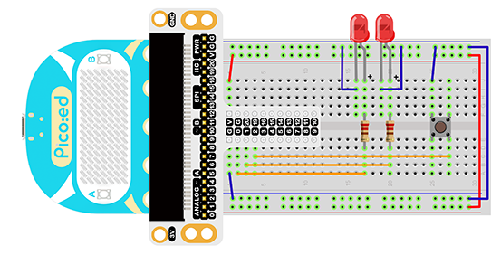

# Case 02:Button


## Introduction

Momentary pushbutton switches are ubiquitous electronic components used in daily life to connect and disconnect electrical circuits. In the previous lesson, we learned how to use [Pico:ed](https://www.elecfreaks.com/elecfreaks-pico-ed-v2.html) to control 2 LED lights to blink alternately. In this lesson, we will use a momentary push button switch to control the blinking of the 2 LED lights. When we press the button, the 2 LED lights will flash alternately; when we release the button, the LED lights will stop flashing.
## Components List:
### Hardware:
1 × [Pico:ed](https://www.elecfreaks.com/elecfreaks-pico-ed-v2.html)

1 × USB Cable

1 × Breadboard Adapter

1 × Transparent Breadboard - 83 * 55 mm

2 × LED

2 × 100 Ohm Resistors

1 x Momentary Pushbutton Switch

n x Breadboard jumper wire 65pcs pack


## Major Components Introduction

### Momentary Pushbutton Switch

This is a common component used to control electronic equipment. Most of it is used to connect or disconnect control circuits, so as to realize the control of motors or other electronic devices. Momentary pushbutton switches are normally left on. When it's pressed, the circuit is on; when it's popped, it jumps back to the unconnected state.


Momentary push button switches have 4 pins. The 4 pins can be divided into 2 groups: pin 1 shorted to pin 2, pin 3 shorted to pin 4.


## Experimental Procedure

### Hardware Connection

Connect your components according to the picture below:

1. Connect the shorter leg with the GND.
2. Connect the longer leg with the P0 and P1 ports through the Resistor.
3. Connect the Momentary Pushbutton to the P2 port.




### Software Programming

Click to open [Microsoft  Makecode](https://makecode.microbit.org/), and write the following code in the editor. [Introduction to the programming environment](https://www.yuque.com/elecfreaks-learn/picoed/er7nuh)
### Code Example：
```python
# Import the modules required by the program
import board
import digitalio
import time

# Set the pin and pin direction of the LED light
led_0 = digitalio.DigitalInOut(board.P0_A0)
led_1 = digitalio.DigitalInOut(board.P1_A1)
led_0.direction = digitalio.Direction.OUTPUT
led_1.direction = digitalio.Direction.OUTPUT

# Set the pin and pull-up mode of the button
button = digitalio.DigitalInOut(board.P2_A2)
button.direction = digitalio.Direction.INPUT
button.pull = digitalio.Pull.UP

# Set the button state to change the state of the LED light
while True:
    if button.value == False:
        led_0.value = True
        led_1.value = False
        time.sleep(1)
        led_0.value = False
        led_1.value = True
        time.sleep(1)
```
### 代码详解：

1. Import the support modules required by the program. The `board ` module is a generic container for pin names, can use this `board` module to specify the pin that we need, the `digitalio` module included a class that provides access to basic digital IO. the `time` module contains functions for time settings.
```python
import board
import digitalio
import time
```

2. Set the pins used by the breadboard shield to connect the LEDs and the pin orientation.
```python
led_0 = digitalio.DigitalInOut(board.P0_A0)
led_1 = digitalio.DigitalInOut(board.P1_A1)
led_0.direction = digitalio.Direction.OUTPUT
led_1.direction = digitalio.Direction.OUTPUT
```

3. Set the pin and pull-up mode of the button.
```python
button = digitalio.DigitalInOut(board.P2_A2)
button.direction = digitalio.Direction.INPUT
button.pull = digitalio.Pull.UP
```
If the pins you are using are not P0_A0, P1_A1, P2_A2, you can enter the following code in the shell window below the Thonny editor and press Enter to view the numbers of other pins.
```python
>>> import board
>>> help(board)
object <module 'board'> is of type module
  __name__ -- board
  board_id -- elecfreaks_picoed
  BUZZER_GP0 -- board.BUZZER_GP0
  I2C0_SDA -- board.BUZZER_GP0
  I2C0_SCL -- board.I2C0_SCL
  BUZZER -- board.BUZZER
  BUZZER_GP3 -- board.BUZZER
  P4 -- board.P4
  P5 -- board.P5
  ...
```

4. Set the button state to change the state of the LED light.
```python
while True:
    if button.value == False:
        led_0.value = True
        led_1.value = False
        time.sleep(1)
        led_0.value = False
        led_1.value = True
        time.sleep(1)
```
## Result

When you press the button, you can see the two LED lights flash alternately; release the button, and the two LED lights stop flashing. If this is not the case, go back to the previous steps and check your actions.

<iframe width="560" height="315" src="https://www.youtube.com/embed/eQfMHythMo8" title="YouTube video player" frameborder="0" allow="accelerometer; autoplay; clipboard-write; encrypted-media; gyroscope; picture-in-picture" allowfullscreen></iframe>

## Exploration

If we want to press the button to turn on the red LED, release the button to turn on the green LED. then how do we program it?
## Common Question

## For more information, please visit：
[Elecfreaks official documentation](https://www.elecfreaks.com/learn-en/)

