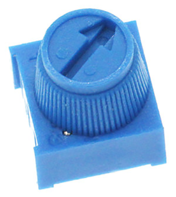
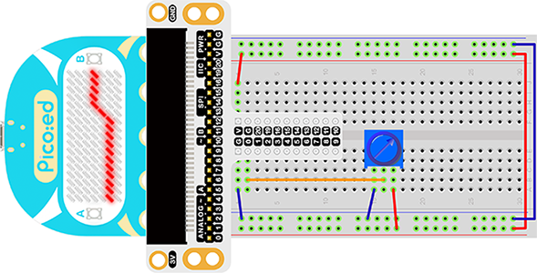

# Case 03:Trimpot


## Introduction

Trimpot is an adjustable electronic component. It consists of a resistive body and a rotating or sliding system. When a voltage is applied between the two fixed contacts of the resistor body, the position of the contacts on the resistor body is changed by a rotating or sliding system, and a position corresponding to the moving contact can be obtained between the moving contact and the fixed contact voltage in a certain relationship. It is mostly used as a voltage divider, where the Trimpot is a four-terminal element. In the following lessons, we are going to read the output voltage on the Trimpotr and display it on the LED screen of the [Pico:ed](https://www.elecfreaks.com/elecfreaks-pico-ed-v2.html) 7*17 with a wavy line.
## Components List

### Hardware:
1 × [Pico:ed](https://www.elecfreaks.com/elecfreaks-pico-ed-v2.html)

1 × USB Cable

1 ×Breadboard Adapter

1 ×Transparent Breadboard - 83 * 55 mm

1 × 10KΩ10K Trimpot

n x Breadborad jumper wire 65pcs pack


## Major Components Introduction

### Trimpot

Trimpot is a kind of adjustable electronic component. It consists of a resistor and a knob or slide system. When adding an external voltage to the two fixed contact points of the resistor, by using a knob or sliding system to change the position of the contact point on the resistor, a voltage with a special relationship to the position of the movable contact is placed on the movable contact. point and two fixed contacts are formed. Most of the time, it works like a voltage divider.



### Hardware Connection

Connect your components according to the picture below:



This is what it looks like after the connection is complete:

Rotate the button of the Trimpot, then the output voltage will vary between 0V and 3V as the button is rotated.

## Software Programming
For programming environment preparation, please refer to [Introduction to the programming environment](https://www.yuque.com/elecfreaks-learn/picoed/er7nuh)
### Program as the picture shows：
```python
# Import the modules that we need
import board
import picoed
import analogio
import time

# Set the pin used by the potentiometer
poten = analogio.AnalogIn(board.P0_A0)

# Initialize the data list, store the value of the potentiometer, so as to set the brightness of the Pico:ed screen LED according to the value of the data list
data = [0, 0, 0, 0, 0, 0, 0, 0, 0, 0, 0, 0, 0, 0, 0, 0, 0]
for i in range(picoed.display.width):
    data[i] = int(poten.value / 9363)
    

# To cycle converts the value of the potentiometer to the Y coordinate of the LED in the 17th column of the Pico:ed LED screen, and scrolls to the left in turn
while True:
    
    # pin analog value（0-65535）map to the height of the lattice（0-7）
    data[16] = int(poten.value / 9363)
    for i in range(len(data)):
        picoed.display.pixel(i, data[i] - 1, 0)
        if i != 16:
            data[i] = data[i+1]
        picoed.display.pixel(i, data[i] - 1, 30)
        picoed.display.pixel(16, data[16] - 1, 0)
        time.sleep(0.01)
```
### Details for the code:

1. Support modules are required by the importer. The `board ` module is a generic container for pin names. could use the `board` module to specify the pin to use. The `digitalio` module contains classes that provide access to basic digital IO. The `time` module contains functions for time settings.
```python
import board
import picoed
import analogio
import time
```

2. Set the pin used by the Trimpot, we are using P0_A0.
```python
poten = analogio.AnalogIn(board.P0_A0)
```
If you are using pins other than P0_A0 and P1_A1, you can enter the following code in the shell window below the Thonny editor and press Enter to view the numbers of other pins.
```python
>>> import board
>>> help(board)
object <module 'board'> is of type module
  __name__ -- board
  board_id -- elecfreaks_picoed
  BUZZER_GP0 -- board.BUZZER_GP0
  I2C0_SDA -- board.BUZZER_GP0
  I2C0_SCL -- board.I2C0_SCL
  BUZZER -- board.BUZZER
  BUZZER_GP3 -- board.BUZZER
  P4 -- board.P4
  P5 -- board.P5
  ...
```

3. Initialize the data list and store the value of the Trimpot to set the brightness of the [Pico:ed](https://www.elecfreaks.com/elecfreaks-pico-ed-v2.html) screen LED according to the value from the data list.
```python
data = [0, 0, 0, 0, 0, 0, 0, 0, 0, 0, 0, 0, 0, 0, 0, 0, 0]
for i in range(picoed.display.width):
    data[i] = int(poten.value / 7000)
    
```

4. The loop converts the value of the Trimpot to the Y coordinate of the LED in the 17th column of the LED screen on the [Pico:ed](https://www.elecfreaks.com/elecfreaks-pico-ed-v2.html), and scrolls to the left in turn.
```python
while True:
    data[16] = int(poten.value / 7000)
    for i in range(len(data)):
        picoed.display.pixel(i, data[i] - 1, 0)
        if i != 16:
            data[i] = data[i+1]
        picoed.display.pixel(i, data[i] - 1, 30)
        picoed.display.pixel(16, data[16] - 1, 0)
        time.sleep(0.01)
```
## Experimental results
Turn the Trimpot, and the voltage value will be displayed on the 7*17 LED screen of [Pico:ed](https://www.elecfreaks.com/elecfreaks-pico-ed-v2.html) in the form of a wavy line.

<iframe width="560" height="315" src="https://www.youtube.com/embed/SvQEmOVG6_Y" title="YouTube video player" frameborder="0" allow="accelerometer; autoplay; clipboard-write; encrypted-media; gyroscope; picture-in-picture" allowfullscreen></iframe>

## Exploration
If we want to use a Trimpot to adjust the brightness of an LED light, how do we design the circuit and program it? Feel free to discuss with us further or leave us a comment.
## Common Question
## For more information, please visit：

[Elecfreaks official documentation](https://www.elecfreaks.com/learn-en/)
