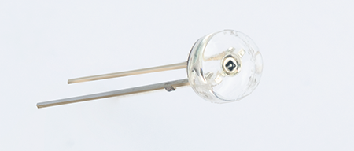
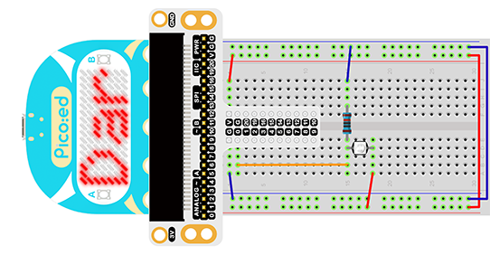
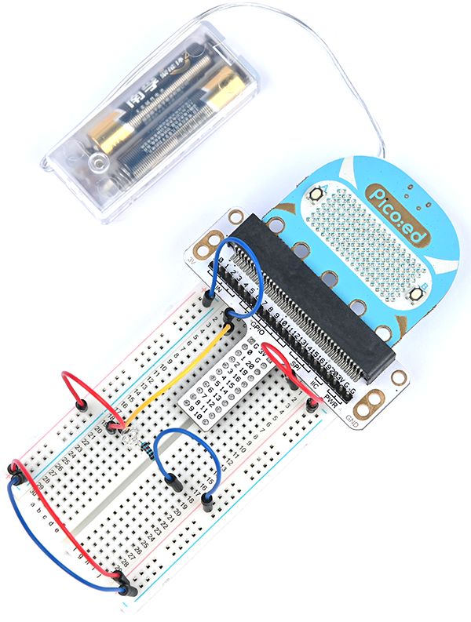

# Case 04:Photocell


## Introduction

Photocell is a kind of special resistor based on semiconductor materials. Its electrical conductivity varies with light intensity. Using this feature, photodiodes of different shapes and light-receiving areas are made. The stronger the light, the lower the resistance value, and the light-controlled switch usually uses a photodiode as the core component. Photodiodes are widely used in toys, lamps, cameras, and other industries. In this lesson, we will display different information on [Pico:ed](https://www.elecfreaks.com/elecfreaks-pico-ed-v2.html) depending on the light intensity received by the photodiode.

## Components List:

### Hardware:

1 × [Pico:ed](https://www.elecfreaks.com/elecfreaks-pico-ed-v2.html)

1 × USB Cable

1 × Breadboard Adapter

1 x Transparent Breadboard - 83 * 55 mm

1 x Photocell

1 x 10kΩ Resistors

n x Breadborad jumper wire 65pcs pack


## Major Components Introduction

### Photocell

Photocell is a kind of special resistor made of semi-conductor materials like Cds or CdSe based on the internal photoelectric effect. The brighter the light is, the lower the value of the resistance will be. with the intensity of light increasing, its resistance value decreased sharply, and the minimum light-resistant value can drop down to below 1KΩ. Photocell is very sensitive to light. When there is no light, its resistant value arrives at its maximum and its dark resistant value usually can reach 1.5MΩ at max.



### Hardware Connection

Connect your components according to the picture below:

1. Connect the photocell and the P0 port.
1. Connect the 10kΩ resistor with the Photocell in parallel.



You would see as below after you finish the connection:



### Software Programming

For programming environment preparation, please refer to [Introduction to the programming environment](https://www.yuque.com/elecfreaks-learn/picoed/er7nuh)
### Program as the picture shows：
```python
# Import the modules that we need
import board
import picoed
import analogio
import time

# Set the pin to which the photoresistor is connected and read the analog voltage as a reference for brightness
light = analogio.AnalogIn(board.P0_A0)
light_value = light.value

# Determine whether the analog voltage value of the real-time photoresistor is less than the reference value, and display different effects according to the judgment result
while True:
    light_new = light.value
    if light_new < light_value:
        picoed.display.scroll("Dark")
    else:
        picoed.display.scroll("Bright")
```
### Details for the code:

1. Support modules are required by the importer. The `board` module is a generic container for pin names. could use the `board` module to specify the pin to use. The `digitalio` module contains classes that provide access to basic digital IO. The `time` module contains functions for time settings.
```python
import board
import picoed
import analogio
import time
```

2. Set the pin to which the photocell is connected and read the analog voltage as a reference for brightness
```python
light = analogio.AnalogIn(board.P0_A0)
light_value = light.value
```

3. Determine whether the analog voltage value of the real-time photocell is less than the reference value, and display "Bright" or "Dark" according to the judgment result.
```python
while True:
    light_new = light.value
    if light_new < light_value:
        picoed.display.scroll("Dark")
    else:
        picoed.display.scroll("Bright")
```
## Result

Turn on the light, the [Pico:ed](https://www.elecfreaks.com/elecfreaks-pico-ed-v2.html) LED screen shows "Bright", and when the light is turned off, the screen shows "Dark".

<iframe width="560" height="315" src="https://www.youtube.com/embed/02Bz21brbX0" title="YouTube video player" frameborder="0" allow="accelerometer; autoplay; clipboard-write; encrypted-media; gyroscope; picture-in-picture" allowfullscreen></iframe>

## Exploration
If we want to use a photocell to turn an LED on and off, how do we design the circuit and program it?
## Common Question
## For more information, please visit：
[Elecfreaks official documentation](https://www.elecfreaks.com/learn-en/)
