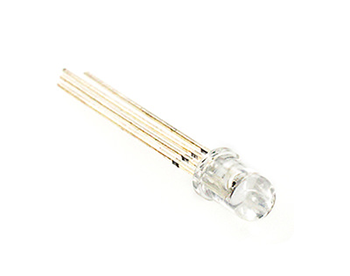
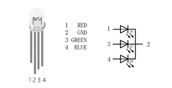
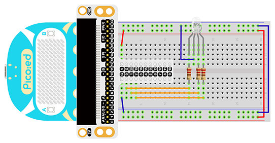
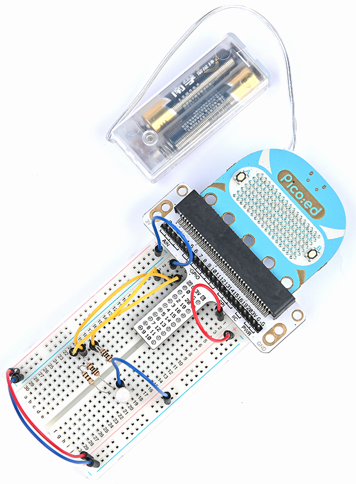

# Case 05:RGB-LED


## Introduction

RGB LED is a kind of LED that can emit light in three different colors: red, green and blue. In this lesson, we are going to make RGB LED shifts its light among the three different colors gradually.
## Components List:
### Hardware:
1 × [Pico:ed](https://www.elecfreaks.com/elecfreaks-pico-ed-v2.html) 

1 × USB Cable

1 × Breadboard Adapter

1 × Transparent Breadboard - 83 * 55 mm

1 × RGB LED

3 × 100 Ohm Resistors

n x Breadboard jumper wire 65pcs pack


## Major Components Introduction
### RGB LED 
RGB LED is a kind of LED, which combines red LED, green LED, and blue LED into one component, which is RGB LED. We all know that the three primary colors of light are red, green, and blue. Using these three colors to combine different components can synthesize all the colors of everything. Likewise, RGB LEDs can be combined with different brightness to create an infinite number of colors.






There are two types of RGB LEDs, namely common cathode and common anode: the common terminal of RGB LED with common cathode is connected to GND; the common terminal of RGB LED with common anode is connected to VCC. In this experiment, we choose a common cathode tricolor LED.
## Experimental Procedure
### Hardware Connection
Connect your components according to the picture below:
1. Connect the RGB signal pins of the led light to the P0, P1, and P2 ports of the expansion board respectively, and connect a 100Ω resistor.
2. Connect the GND to the expansion board's GND through the breadboard.



You would see as below after you finish the connection:



## Software Programming
For programming environment preparation, please refer to [Introduction to the programming environment](https://www.yuque.com/elecfreaks-learn/picoed/er7nuh)
### Program as the picture shows：
```python
# Import the modules that we need
import board
import digitalio
import time
from picoed import button_a, button_b

# Set the pin and pin orientation of the tricolor LED
led_0 = digitalio.DigitalInOut(board.P0)
led_1 = digitalio.DigitalInOut(board.P1)
led_2 = digitalio.DigitalInOut(board.P2)
led_0.direction = digitalio.Direction.OUTPUT
led_1.direction = digitalio.Direction.OUTPUT
led_2.direction = digitalio.Direction.OUTPUT

# Determine whether the A\B button is pressed and the operation performed
while True:
    if button_a.is_pressed() and button_b.is_pressed():
        led_0.value = False
        led_1.value = False
        led_2.value = True
    elif button_a.is_pressed():
        led_0.value = True
        led_1.value = False
        led_2.value = False
    elif button_b.is_pressed():
        led_0.value = False
        led_1.value = True
        led_2.value = False
    else:
        led_0.value = True
        led_1.value = True
        led_2.value = True
    time.sleep(0.1)
```
### Details for the code:

1. Support modules are required by the importer. The `board` module is a generic container for pin names. could use the `board` module to specify the pin to use. The `digitalio` module contains classes that provide access to basic digital IO. The `time` module contains functions for time settings.
```python
import board
import digitalio
import time
from picoed import button_a, button_b
```

2. Set the pins used by the breadboard shield to connect the LEDs and the pin orientation.
```python
led_0 = digitalio.DigitalInOut(board.P0)
led_1 = digitalio.DigitalInOut(board.P1)
led_2 = digitalio.DigitalInOut(board.P2)
led_0.direction = digitalio.Direction.OUTPUT
led_1.direction = digitalio.Direction.OUTPUT
led_2.direction = digitalio.Direction.OUTPUT
```
If you are using pins other than P0_A0 and P1_A1, you can enter the following code in the shell window below the Thonny editor and press Enter to view the numbers of other pins.
```python
>>> import board
>>> help(board)
object <module 'board'> is of type module
  __name__ -- board
  board_id -- elecfreaks_picoed
  BUZZER_GP0 -- board.BUZZER_GP0
  I2C0_SDA -- board.BUZZER_GP0
  I2C0_SCL -- board.I2C0_SCL
  BUZZER -- board.BUZZER
  BUZZER_GP3 -- board.BUZZER
  P4 -- board.P4
  P5 -- board.P5
  ...
```

3. Determine whether the A\B button is pressed and the operation performed. When A is pressed, set led_0 to value `True` , led_1 和 led_2 为`False`，In the same way, when B is pressed, the code when A+B is pressed is as follows.
```python
while True:
    if button_a.is_pressed() and button_b.is_pressed():
        led_0.value = False
        led_1.value = False
        led_2.value = True
    elif button_a.is_pressed():
        led_0.value = True
        led_1.value = False
        led_2.value = False
    elif button_b.is_pressed():
        led_0.value = False
        led_1.value = True
        led_2.value = False
    else:
        led_0.value = True
        led_1.value = True
        led_2.value = True
    time.sleep(0.1)
```
## Results
When button A is pressed, the LED glows red, when button B is pressed, the LED glows green, and when buttons A and B are pressed simultaneously, the LED glows blue.

<iframe width="560" height="315" src="https://www.youtube.com/embed/8d5d0vw2Sjw" title="YouTube video player" frameborder="0" allow="accelerometer; autoplay; clipboard-write; encrypted-media; gyroscope; picture-in-picture" allowfullscreen></iframe>

## Exploration
If you want to use RGB LED to emit cyan, magenta, and yellow light, how do you design and program the circuit?
## For more information, please visit：
## Common Question
[Elecfreaks official documentation](https://www.elecfreaks.com/learn-en/)
