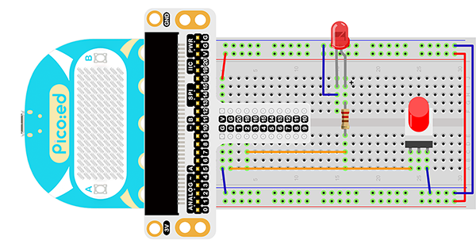

# Case 06:Self-Lock Switch


## Introduction

The self-lock switch is a kind of common button switch. When we press the button for the first time, the switch is connected and remains in that status, which is called “self-lock”. When we press the button for the second time, the switch is disconnected. At the same time, the button will bounce back to its initial place. In this lesson, we are going to use the self-lock switch to control the LED light.

## Products Link

[ELECFREAKS Pico:ed Starter Kit](https://www.elecfreaks.com/elecfreaks-pico-ed-starter-kit.html) 


## Component List

### Hardware：

1 × [Pico:ed](https://www.elecfreaks.com/elecfreaks-pico-ed-v2.html)

1 × USB Cable

1 × Breadboard Adapter

1 × Transparent Breadboard - 83 * 55 mm

1 × Self-lock Switch

1 × LED

1 × 100 Ohm Resistors

n x Breadboard jumper wire 65pcs pack


## Major Components Introduction

### Self-lock Switch

The self-locking switch generally refers to the switch with its own mechanical locking function. After pressing it, the button will not jump up completely after letting go. It is in a locked state and needs to be pressed again to unlock it and jump up completely. It's called a self-locking switch. This type of switch was used in early TVs and monitors that were directly powered off.


***Note：*** This self-locking switch consists of two sets of pole double throw switches, only one of which is used in this test, so the common pins of one of them are cut off.

## Experimental Procedure

### Hardware Connection

Connect them as the picture shows:
1.Connect the self-lock switch to the P0 port of the breadboard adapter.
2.Connect the LED to the P2 port of the breadboard through 100Ω resistor.



You would see as below after you finish the connection:


## Software Programming
For programming environment preparation, please refer to [Introduction to the programming environment](https://www.yuque.com/elecfreaks-learn/picoed/er7nuh)
### Program as the picture shows：

```python
# Import the modules that we need
import board
from digitalio import *

# Set the pin and pin orientation of the tricolor LED
led = DigitalInOut(board.P2_A2)
led.direction = Direction.OUTPUT

# Determine whether the A\B button is pressed and the operation performed
locking = DigitalInOut(board.P0_A0)
locking.direction = Direction.INPUT
locking.switch_to_input(pull=Pull.UP)

# Determine the state of the self-locking switch to change the state of the LED light
while True:
    led.value = locking.value
```
### Details for the code:

1. Support modules are required by the importer. The `board` module is a generic container for pin names. could use the `board` module to specify the pin to use. The `digitalio` module contains classes that provide access to basic digital IO. The `time` module contains functions for time settings.
```python
import board
from digitalio import *
```

2. Set the pins used by the breadboard shield to connect the LEDs and the pin orientation.
```python
led = DigitalInOut(board.P2_A2)
led.direction = Direction.OUTPUT
```

3. Set the pins used by the breadboard expansion board to connect the self-lock switch and the pin direction.
```python
locking = DigitalInOut(board.P0_A0)
locking.direction = Direction.INPUT
locking.switch_to_input(pull=Pull.UP)
```
If you are using pins other than P0_A0 and P1_A1, you can enter the following code in the shell window below the Thonny editor and press Enter to view the numbers of other pins.
```python
>>> import board
>>> help(board)
object <module 'board'> is of type module
  __name__ -- board
  board_id -- elecfreaks_picoed
  BUZZER_GP0 -- board.BUZZER_GP0
  I2C0_SDA -- board.BUZZER_GP0
  I2C0_SCL -- board.I2C0_SCL
  BUZZER -- board.BUZZER
  BUZZER_GP3 -- board.BUZZER
  P4 -- board.P4
  P5 -- board.P5
  ...
```

4. Use an infinite loop to set the state of the LED light to the state of the self-lock switch. Pressing and pressing the self-locking switch will change the state, as will the state of the LED light.
```python
while True:
    led.value = locking.value
```
## Results
Press the self-locking switch, the LED light is on; press it again, and the LED is off.

<iframe width="560" height="315" src="https://www.youtube.com/embed/zPNeZOR0sn8" title="YouTube video player" frameborder="0" allow="accelerometer; autoplay; clipboard-write; encrypted-media; gyroscope; picture-in-picture" allowfullscreen></iframe>

## Exploration
The stair light is usually realized with a single-pole double-throw switch. You can turn on the light upstairs and turn off the light downstairs. You can also turn on the light downstairs and turn off the light upstairs. If I want to use two self-locking buttons to realize the stair light function, how to design the circuit and program it?
## Common Question
## For more information, please visit：
[Elecfreaks official documentation](https://www.elecfreaks.com/learn-en/)
